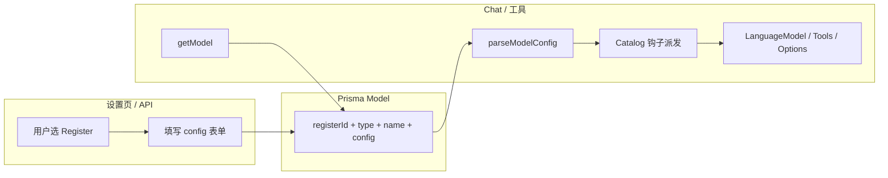

# Register 系统开发备忘录

**读者**：接手本仓库的 Agent 与人类开发者。
**目标**：在未读具体业务代码的前提下，建立对 **Register 是什么、不负责什么、改哪里** 的共同心智模型。
**非目标**：本文**不**用于记录「当前哪条分支还没迁完」类实现债；实现状态以代码与计划为准。

---

## 1. 一句话

**Register** 是「一种可上架的模型 SKU」在代码里的 **插件定义**：负责 **配置形状（Zod）** 与 **该 SKU 特有的运行时行为**（如怎样创建 `LanguageModel`、怎样调某家生图 API）。
**Kernel（宿主）** 只处理 **会话、存储、Agent 工具协议** 等共性；**从不**在核心路径上写死某厂商的 URL、请求体或响应解析。
**Catalog（静态注册表）** 把 `registerId` 映射到元数据 + schema +（可选）运行时钩子——这是 **唯一应当存在的「全量 SKU 列表」**。

---

## 2. 为什么要 Register

- **多厂商、多 SKU**：每个档位（如某 OpenAI 兼容网关、某 DashScope 模型名、某 Seedream 请求模型）差异大，用 DB 枚举列硬扩会很快失控。
- **统一存储**：数据库里只存用户选中的实例：`type` + **`registerId`** + 用户标签 **`name`** + **`config`（Json，对 DB 不透明）**。
- **单一校验入口**：应用层用 `parseModelConfig(registerId, rawConfig)` 选 schema 并解析；**禁止**在 DB 层对 `config` 做 JSON Schema。

---

## 3. 核心名词

| 名词                 | 含义                                                                                                                                           |
| -------------------- | ---------------------------------------------------------------------------------------------------------------------------------------------- |
| **registerId**       | 稳定字符串 SKU id（如 `openai/official`、`volcengine/seedream`），与 DB `Model.registerId`、Catalog 一致；**不是**用户改的展示名。             |
| **Model（表行）**    | 用户配置的一条记录：`id`、`type`（`LLM` \| `IMAGE` \| `SEARCH`）、`registerId`、`name`、`config`。                                             |
| **Register（插件）** | 对应某 `registerId` 的一套 **源码模块**：schema + 类型 +（按类型）工厂/执行逻辑。逻辑上「一个 SKU 一户」。                                     |
| **Catalog**          | `register-config.ts`（schema 目录）与 `registry.ts`（元数据、`buildLanguageModel` 派发等）等组成的 **静态聚合**：枚举所有 SKU，不写具体 HTTP。 |
| **Kernel**           | Agent 运行时、会话、图像落库、通用工具、`parseModelConfig` 等 **不与单一厂商耦合** 的部分。边界细则见下文。                                    |

---

## 4. 数据怎么流动

1. **配置入库**：`/api/register-metadata` 列出某 `modelType` 下可选 Register；POST `/api/models` 写入 `registerId` 与 **`config`**（形状由对应 Register 的 Zod 定义）。
2. **运行时**：读出 `Model` 行 → 用 **`registerId`** 从 Catalog 解析 config、取得 LLM 工厂或其它钩子 → Kernel 拼装 Agent，**不写厂商细节**。

---

## 5. Hook 系统（设计与术语）

为实现 Kernel 与 Register **彻底解耦**，静态 Catalog 上为每条 SKU 提供 **类型化的可选钩子**（如 LLM 的 `chatProviderOptions`、IMAGE 的 `tool`/`execution`、SEARCH 的 `tools`）；Kernel **只派发、不维持 `registerId` 名单**。文字规范与能力 ID 表见：**[`docs/superpowers/specs/2026-05-08-register-hook-system-design.md`](../superpowers/specs/2026-05-08-register-hook-system-design.md)**。

---

## 6. 按类型的能力标准

同一种 `registerId` **只属于一种 `ModelType`**。各类型插件 **应** 具备的接口如下（新项目向此看齐；条目愈全，Kernel 愈瘦）。

### 6.1 LLM

- **必须**：与用户可见配置对应的 **Zod schema**；能通过 Catalog 挂载 **`buildLanguageModel(modelRow)`**，返回 AI SDK **`LanguageModel`**。
- **可选**：与聊天相关的 **`ProviderOptions`**（若某 SKU 需在请求级注入 thinking 等），宜以 Register 侧能力表达，而非在 Kernel 维护 `registerId` 白名单数组。

### 6.2 IMAGE

- **必须**：`config` schema（含 `requestModel`、`apiKey`、能力枚举如 `supportedSizes` 等与该 SKU 合同一致）。
- **目标标准**：该 SKU 的 **HTTP、响应抽取、超时与错误语义** 由 Register（或其后端私有模块）实现；Kernel 只管 **conversation 归属、reference 图像校验、落盘、`Image` 行**。
- **工具层**：对用户暴露的工具名可由 Kernel 编排，但 **工具内部执行**应对应 Register 的实现或工厂。

### 6.3 SEARCH

- **必须**：schema（例如 API Key）。
- **目标标准**：具体搜索 REST 应由 Register 提供的工具构建块实现，Kernel 只做「绑定会话 → 挂载工具」。

---

## 7. 边界（必须遵守）

### 7.1 Register **应当**

- 把 **仅本 SKU 成立** 的常量、URL 形态、JSON 字段路径、鉴权头约定写在本插件或本插件目录内。
- 通过 **共享 vendor 模块**（如 `alibaba-dashscope-shared`）或 **`lib/providers/_internals/`** 复用代码，避免两条 SKU 互相 `import` 对方的 **整条 Register 入口文件**。
- 满足 **「一户一地」**：每个 `registerId` 对应 `lib/providers/registers/` 下 **唯一目录前缀**（或经论证的单一 `.ts`），见 [插件定性标准](../superpowers/specs/2026-05-08-register-as-plugin-qualitative-standard.md)。

### 7.2 Register **不应当**

- 依赖 **另一条 Register 的 SKU 定义文件** 作为库（易隐式耦合与环依赖）。
- 在 **Catalog 以外** 再维护一份「平行 SKU 清单」而不登记。

### 7.3 Kernel **应当**

- 只识别 **`registerId` + type + 已通过 `parseModelConfig` 的配置**。
- 通过 **Catalog / 钩子**调用 Register，而不是 `switch (registerId)` 里写 POST body。

### 7.4 Catalog **应当 / 不应当**

- **应当**：唯一静态列举所有 SKU；挂载 `schema`；对 LLM 挂载 `buildLanguageModel`（及未来其它类型的钩子）。
- **不应当**：内联具体 `fetch`、`extractXxxUrl`——应委托 Register 模块。

---

## 8. 必读代码锚点

| 主题                                                                                   | 路径                                                                                 |
| -------------------------------------------------------------------------------------- | ------------------------------------------------------------------------------------ |
| 聚合 Catalog（schema + 元数据基础表）                                                  | `lib/providers/register-config.ts`                                                   |
| 元数据列表 + LLM `buildLanguageModel` 映射                                             | `lib/providers/registry.ts`                                                          |
| DB 校验 registerId 与 type                                                             | `lib/db/models.ts`                                                                   |
| 读配置 API                                                                             | `app/api/register-metadata/route.ts`                                                 |
| LLM 入口（Model 行 → LanguageModel）                                                   | `lib/providers/runtime/build-llm-from-model.ts`                                      |
| Register 源码目录（`lib/providers/registers/` 已按 SKU 分目录；共享模块在 `_shared/`） | `lib/providers/register-metadata.ts`（客户端安全元数据）、各 SKU 目录见 `registers/` |
| 共享内核（非 SKU）                                                                     | `lib/providers/_internals/`                                                          |
| 权威数据模型                                                                           | `prisma/schema.prisma` · `Model`                                                     |

---

## 9. 新增一条 Register（操作顺序）

用于 Code Review / 自检；顺序不宜颠倒。

1. 选定 **`registerId`**（稳定、全局唯一、`type` 唯一）。
2. 在 `lib/providers/registers/` 下建立 **一户一地** 模块（目录 + `index.ts` 或单文件，见定性标准）。
3. 导出 **Zod schema**（与「设置页可调字段」一致），并确保 **可被 `REGISTER_CONFIG_CATALOG` 引用**。
4. 在 **`register-config.ts`** 增加一行：元数据 + `registerId` + `schema`。
5. 在 **`registry.ts`**（及必要的 runtime）登记 **LLM 的 `buildLanguageModel`** 或其它类型钩子（随类型而定）。
6. **设置 UI**：`Add*ModelForm` / 懒加载表单与 `register-metadata` 对齐；**不要**在 UI 里手写第二套 config 形状。
7. **测试**：至少覆盖 `parseModelConfig`、以及该 Register 关键工厂或执行路径（视类型而定）。
8. **Kernel**：若发现必须改 `tool-registry` / `image-provider-factory` 才支持新 `registerId`，优先评估是否应 **把分支下沉为 Register 钩子**，避免堆积新的 `if (registerId === '…')`。（正式能力 ID 见 [Hook 系统设计](../superpowers/specs/2026-05-08-register-hook-system-design.md)。）

---

## 10. 延伸阅读（规范与历史）

- 架构总 SPEC（目标 G1–G7）：[`docs/superpowers/specs/2026-05-07-provider-register-architecture-spec.md`](../superpowers/specs/2026-05-07-provider-register-architecture-spec.md)
- **Register Hook 系统（术语与能力表）**：[`docs/superpowers/specs/2026-05-08-register-hook-system-design.md`](../superpowers/specs/2026-05-08-register-hook-system-design.md)
- 插件定性 + 布局 + 自检表：[`docs/superpowers/specs/2026-05-08-register-as-plugin-qualitative-standard.md`](../superpowers/specs/2026-05-08-register-as-plugin-qualitative-standard.md)
- 计划族索引：[`docs/superpowers/plans/2026-05-07-provider-register-plans-overview.md`](../superpowers/plans/2026-05-07-provider-register-plans-overview.md)
- 与 `registerId` 相关的 compound 简述：[`docs/solutions/architecture-patterns/model-registerid-config-register-metadata-2026-05-07.md`](../solutions/architecture-patterns/model-registerid-config-register-metadata-2026-05-07.md)

---

## 修订记录

| 日期       | 说明                                                           |
| ---------- | -------------------------------------------------------------- |
| 2026-05-08 | 初版：面向 Agent 的 Register 系统说明与开发清单                |
| 2026-05-08 | 增补 §5 Hook 系统、延伸阅读与编号调整；对齐 Hook 系统设计 SPEC |
