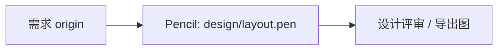

# feat（设计）：对话式 Agent 主界面 — Pencil 稿与设计规格

## 本计划边界（必读）

**本文件仅描述：在 Pencil（类 Figma 的 UI 设计工具）中交付什么、设计评审如何验收。**  
**本文件不指派、不验收、不编排任何编程任务**——包括但不限于：Next.js、React、路由、样式代码、构建命令、Prisma、AI SDK、单测或 E2E。

工程实现（把稿变成可运行产品）须 **单独另立「工程实现计划」** 或在 issue/里程碑中跟踪；**不得**与本设计计划混在同一套交付单元里。

**色表与令牌名**（如 base-100、primary）仅供 **Pencil / Figma 吸色与标注**，不是对工程师的指令；工程如何消费这些令牌由工程计划定义。

---

## Overview

在 **`design/layout.pen`** 中交付 **agent-image 对话主界面** 的 **线框级设计稿**（非营销插画）：覆盖 **窄侧栏、主工作区、三档模型选择、**当前对话 LLM 上下文**圆环 + **hover 详情**（有则显 / 无则隐；非 Provider 总账单）、消息与时间线、可折叠工具步骤、生图前确认（R15）、工具失败可见（R16）、Provider / Search 设置入口（F1 / R17）** 等信息的 **布局、层级与关键状态**。  
全文案面向 **中文** 用户，可用占位句。

设计语言的书面锚点见 **`docs/design-language.md`**（其中 **实现相关** 段落供工程侧另文跟进，**不属本设计计划交付**）。

---

## Problem Frame

单机玩具级产品需要「类 Cursor」的 **多步可见** 对话体验。用户须在 **对话视图** 中完成 **LLM / 主生图 / 可选次生图** 选择（R3）、在 **有数据时** 看到 **本对话 LLM 上下文占用**（R6）、在 **生图前** 通过简明 **「是否允许 …」** 确认（R15）、并 **看到工具失败**（R16）。  
设计稿须让 **未参与工程** 的审阅者也能理解 **信息架构与关键状态**，无需阅读源码。(see origin: `docs/brainstorms/2026-04-23-agent-image-requirements.md`)

---

## UI 设计简报

### 1. Visual thesis

**操作台 / 终端工具** 气质：**冷静、信息密度中等、少装饰**。**无衬线** 正文 + **等宽** 用于工具名与步骤感 copy。**主题**：默认偏 **浅色**、并准备 **深色** 一套对比稿（见 **设计稿用色**）。建议 **深色画板** 定主视觉气质，**浅色画板** 做可读性抽检。

### 2. Content plan（分区顺序）

1. **窄侧栏**：会话列表（含新建、选中态）、**Provider / 设置** 入口（F1）。
2. **主栏顶部**：**无**独立上下文条；R6 以 **圆环图标**（外径对齐 pill 内 **文字行高**，无默认文字）置于 **输入区上方、模型 pill 行最前**（`LLM` 前）；**仅 hover** 以 **文字提示** 展示详情（例：`50% · 100k / 200k context usage`）。**非** Provider 维度；无数据则圆环 **不显**（稿中可各做一帧说明）。**三档模型选择**不在全局顶栏。
3. **主栏中部**：用户消息与助手消息 **一律左对齐**（不做左右对聊气泡）；用 **不同背景色** 区分 user input 与 agent output；**可折叠工具步骤**（工具名 + 进行中 / 成功 / 失败）：**入参/出参仅一个 `toolParams` 容器，内嵌单行文本组件**；行首 ▸ / ▾ 与 JSON 在同一组件内切换（收敛超长省略 / 展开全量），**不**再拆成两个并列文本节点；**不**用 LLM 摘要；**对话内图片占位**（R18：稿中用矩形/示意即可）。
4. **主栏底部**：**输入区上方一行** **LLM | 主生图 | 次生图（可空）**；其下为输入区、主发送动作；**R3 门闸**：未选齐 LLM + 主生图时 **发送不可用** + 一句说明；附件入口占位（R5：**不要**画「参考图张数上限」配置项）。
5. **工具卡内联**：**R15** 确认出现在 **对应工具调用卡片内**（非弹窗/非全屏遮罩）：主操作「允许」、次要「拒绝或跳过」、**无倒计时**；**R16** 仍在工具步骤 **内联** 可见，不依赖「仅靠全局 toast」的暗示。

### 3. Interaction & motion（标注级）

1. **发送**：从不可用到可用时，稿上标注 **短暂强调**（如透明度/描边变化意向）。
2. **工具步骤**：展开/收起 **有过渡**（标「有过渡」即可）。
3. **R15**：卡片内 **主操作获焦点**；批准后焦点仍留在对话时间线/卡片内合理位置（无障碍意向，稿上可文字标注；**非**模态关闭回传）。

---

## Requirements Trace（设计稿须能对照的需求）

| 来源 | 设计稿中如何体现 |
| ---- | ---------------- |
| R3 | 三选择器、新会话空选态、发送门闸帧 |
| R6 | 本对话 **LLM 上下文** **圆环**（附 **hover 详情**）「有数据帧」与「无数据 / 隐藏帧」（非 Provider 总用量） |
| R15 | 工具调用卡片 **内联**：文案槽 + 双动作；独立画板仅作评审示意（非弹窗） |
| R16 | 工具步骤 **错误** 态；可与时间线并列 |
| R13 | `task_complete` **低调区分**（徽章或系统行，无需用户操作） |
| F1 / R17 | 设置视图：LLM / 生图 / Search 分区；Search 可区分 web / image |
| F2 | 多工具步骤在时间线上 **可读、可扫** |
| R17 / R18 | Search 区域占位；对话内多图占位（不要求稿中写 URL 规则） |

**Origin actors:** A1（终端用户）, A2（Agent，间接体现）  
**Origin flows:** F1（配置）, F2（对话与工具）, F3（确认与失败）  
**Origin acceptance examples:** 设计评审时优先核对 **AE3、AE4、AE5、AE6、AE7** 的 **可视形态**（非 API 行为）。

---

## Scope Boundaries

### In scope（本计划）

- **`design/layout.pen`** 的线框、填色、关键状态、窄屏与桌面画板。
- 本文中的 **设计稿用色** 表（供 Pencil 吸色）。
- 与 **`docs/design-language.md`** 的 **设计原则** 对齐；若仅改「给设计师的说明」、不动工程段落，可随评审小幅修订该文档。

### Out of scope（本计划明确不做）

- 任何 **代码、配置、依赖、路由、构建** 的修改或任务分解。
- AI SDK、Prisma、服务端工具协议、自动化测试 **策划与验收**。
- 将设计稿 **自动同步** 为前端实现（人工读稿实现属工程计划）。

### Deferred / separate（产品或工程另文）

- **工程实现计划**：壳布局、对话页、设置页的可运行版本。
- Origin 中的 Compact、专业图像编辑 v1 外、Prompt 终稿等（见 `docs/brainstorms/2026-04-23-agent-image-requirements.md`）。

---

## Context（背景只读）

- **`design/layout.pen`**：当前可能仅为空壳 JSON；本计划交付 **须** 充实为可评审稿。
- **`docs/design-language.md`**：工程与设计的 **混合说明**；本计划 **只保证** 设计侧（色板、原则、Pencil 填色指向）一致。
- **`docs/solutions/`**：暂无必须继承的条目。

### External References

- [daisyUI Colors / Themes](https://daisyui.com/docs/colors/) — 仅作 **色名与 OKLCH** 来源说明，**不是**本计划要执行的工程步骤。

---

## Key Design Decisions

1. **工具**：定稿在 **Pencil** 的 **`design/layout.pen`**，与 Figma 类工具同理：**画图、分组、标注**，不涉及仓库构建。
2. **色**：采用本文 **daisyUI 5.5.19 内置 light/dark** OKLCH 表，便于与产品后续工程主题 **同名对齐**（工程何时落地不在本文）。
3. **R15**：稿面表现为 **工具卡内联面板**（与 `image.generate` 等步骤同卡），**两枚按钮** 语义清晰；**禁止**弹窗/遮罩层方案；禁止稿面出现「倒计时自动点」。
4. **窄屏**：至少一帧展示 **侧栏意图**（图标条、抽屉或折叠 — 稿上 **注释** 即可）。

---

## 设计稿用色：内置 light / dark（`daisyui@5.5.19`）

以下数值与 **daisyUI 5.5.19** 内置 **light / dark** 一致，供 **Pencil 等设计工具** 吸色或填入。若升级设计参考包版本，请重核官方内置表并更新本段。

### light

| 语义 | OKLCH |
|------|--------|
| base-100 | `oklch(100% 0 0)` |
| base-200 | `oklch(98% 0 0)` |
| base-300 | `oklch(95% 0 0)` |
| base-content | `oklch(21% 0.006 285.885)` |
| primary | `oklch(45% 0.24 277.023)` |
| primary-content | `oklch(93% 0.034 272.788)` |
| secondary | `oklch(65% 0.241 354.308)` |
| secondary-content | `oklch(94% 0.028 342.258)` |
| accent | `oklch(77% 0.152 181.912)` |
| accent-content | `oklch(38% 0.063 188.416)` |
| neutral | `oklch(14% 0.005 285.823)` |
| neutral-content | `oklch(92% 0.004 286.32)` |
| info | `oklch(74% 0.16 232.661)` |
| info-content | `oklch(29% 0.066 243.157)` |
| success | `oklch(76% 0.177 163.223)` |
| success-content | `oklch(37% 0.077 168.94)` |
| warning | `oklch(82% 0.189 84.429)` |
| warning-content | `oklch(41% 0.112 45.904)` |
| error | `oklch(71% 0.194 13.428)` |
| error-content | `oklch(27% 0.105 12.094)` |

### dark

| 语义 | OKLCH |
|------|--------|
| base-100 | `oklch(25.33% 0.016 252.42)` |
| base-200 | `oklch(23.26% 0.014 253.1)` |
| base-300 | `oklch(21.15% 0.012 254.09)` |
| base-content | `oklch(97.807% 0.029 256.847)` |
| primary | `oklch(58% 0.233 277.117)` |
| primary-content | `oklch(96% 0.018 272.314)` |
| secondary | `oklch(65% 0.241 354.308)` |
| secondary-content | `oklch(94% 0.028 342.258)` |
| accent | `oklch(77% 0.152 181.912)` |
| accent-content | `oklch(38% 0.063 188.416)` |
| neutral | `oklch(14% 0.005 285.823)` |
| neutral-content | `oklch(92% 0.004 286.32)` |
| info | `oklch(74% 0.16 232.661)` |
| info-content | `oklch(29% 0.066 243.157)` |
| success | `oklch(76% 0.177 163.223)` |
| success-content | `oklch(37% 0.077 168.94)` |
| warning | `oklch(82% 0.189 84.429)` |
| warning-content | `oklch(41% 0.112 45.904)` |
| error | `oklch(71% 0.194 13.428)` |
| error-content | `oklch(27% 0.105 12.094)` |

**画板建议：** 至少 **一帧 light** + **一帧 dark**（或主稿 dark + light 抽检帧）。

---

## High-Level Design Flow

> *供评审理解设计交付与工程的关系；**不是**实现规格。工程计划不得把下图当作任务分解依据。*

工程实现：**单独计划**，**人工读** 评审通过的稿面与本文简报。

---

## Design Deliverables（设计交付单元）

- [x] **D1. 对话主界面线框与关键状态（`design/layout.pen`）**

**Goal：** 在 Pencil 中完成可评审的 **桌面 + 窄屏** 稿；覆盖 **UI 设计简报** 中的五类分区与 **R15 / R16 / R3 门闸 / R6 有与无** 等状态；填色遵循 **设计稿用色** 表。

**Requirements：** 上表 Requirements Trace；简报 §2–§3。

**Dependencies：** 无。

**涉及文件（设计资产）：**

- Modify: `design/layout.pen`

**Approach：**

- 使用 **画板/帧** 组织：默认对话、选择器未齐、工具展开、R15 内联待批准、工具失败、用量隐藏、用量显示、窄屏侧栏方案（注释）。
- **图层命名**：中文或产品语言即可；**禁止** 在稿内标注「对应某源码路径 / 某框架组件」。
- 设置视图可 **独立画板** 或与主界面 **同文件多帧**。

**Test expectation:** none — 设计资产，无自动化测试。

**评审场景（手动）：**

- Happy path：审阅者能指出 **侧栏、时间线、输入区上（上下文圆环 + 三档模型）、R15（工具卡内联）** 等区域。
- Edge case：窄屏 **侧栏意图** 有注释或第二帧。
- Edge case：**R6** 「无上下文数据」与「有上下文数据」至少一种对比呈现。
- Covers AE5：R15 **两动作**、无倒计时示意。
- Covers AE7：工具失败 **附着于步骤** 的可读布局。

**Verification：** `design/layout.pen` 在 Pencil 可打开；可选附 **导出 PNG/PDF** 供 PR 或存档。

---

## Open Questions

### 设计侧可延后

- 品牌色是否要 **偏离** 内置表：若偏离，仅在 **新设计决策** 中增补丁色板，仍建议保留 light/dark 两套。

### 须由工程计划回答（本文不展开）

- 流式事件与工具 ID 映射、持久化字段、图片域名策略等 — 见 origin **Outstanding**。

---

## Risks

| 风险 | 缓解 |
|------|------|
| Pencil 环境不可用 | 用 **本简报 + 色表 + 白板/文字线框** 先评审，后补 `.pen` |
| 设计与工程同名令牌不一致 | 工程计划 **显式引用** 本文色表版本号（5.5.19） |

---

## Sources & References

- **Origin:** [docs/brainstorms/2026-04-23-agent-image-requirements.md](../brainstorms/2026-04-23-agent-image-requirements.md)
- **Playbook:** [docs/brainstorms/2026-04-23-agent-image-agent-playbook.md](../brainstorms/2026-04-23-agent-image-agent-playbook.md)
- **设计语言（含工程混合说明）:** [docs/design-language.md](../design-language.md)
- **设计稿文件:** [design/layout.pen](../../design/layout.pen)
- **协作说明:** [AGENTS.md](../../AGENTS.md)

---

## 执行后检查清单（仅设计）

1. `design/layout.pen` 含 **桌面与窄屏** 与 **关键状态**。
2. 填色与 **本文 OKLCH 表** 一致（或刻意偏离处已 **批注**）。
3. 需求表 **R3 / R6 / R13 / R15 / R16 / F1 / F2** 在稿中 **可指出对应区域**。
4. **未** 在本计划文中新增任何 **工程任务** 或 **构建命令**。

Plan written to `docs/plans/2026-04-23-001-feat-chat-ui-shell-plan.md`
