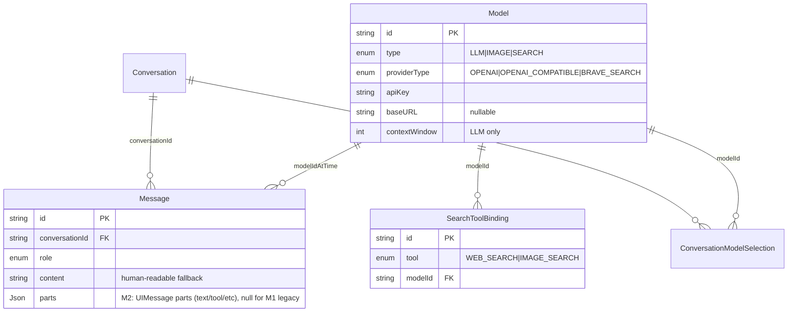

# feat: agent-image M2 — Agent 工具循环 + 服务端工具集 + 中断 / 失败可视化

## 本计划边界（必读）

本计划是 v1 工程实现的 **M2 切片**：在已交付的 M1 纯文本对话通路之上，让 Agent 长出工具能力 + 中断能力 + 失败可见性。

**M2 完成后用户应当可以**：

- 在设置页配置一条 Brave Search Model 记录，并把 web-search / image-search 两类工具分别绑定到 Search Model（可绑同一条，也可绑不同条）
- 在对话中触发 Agent 多步工具循环：例如「找几张可爱的柯基照片」会触发 image-search → 在结果中再 fetch 详情；「最近 AI SDK 6 有什么变化」会触发 web-search → web-fetch 抓取详情后总结
- 任意时刻按发送区按钮（此时形态切为「停止」）中断当前轮次，正在跑的工具会被取消并以「用户中断」失败语义回传给 Agent
- 看到时间线上工具调用块按状态演化：参数生成中 → 正在执行 → 成功（结果 inline）/ 失败（错误信息 inline）
- 一条工具调用失败后，Agent 自主决定继续重试 / 改方案 / 放弃并文本告知用户（不在产品层硬编码）
- 撞 LLM 上下文窗口时拿到清晰的错误反馈，由 Agent 用文本说明「上下文已满，建议开新对话」

**M2 不包括**（留 M3 由后续 `/ce-plan` 单独推进）：

- 生图 Model 与生图工具（R4 / R5 / R9 范围）
- R15 生图人工确认闸（M3 范围）
- R18 对话内图像存储（M3 范围；M2 的 image-search 仅返回 URL 列表，不下载落盘）
- 设置页生图子区段
- 系统 prompt 的最终稿（M2 写一版工具感知的版本，但措辞迭代留给后续）

---

## Overview

把仓库从 M1 的「能纯文本聊天」推进到 **「能跑工具循环、能中断、能可见失败」**：

- **Schema 扩展**：`ProviderType` 加 `BRAVE_SEARCH` 分支；`Message` 增 `parts Json?` 存 UIMessage parts（兼容 M1 旧消息）；新增 `SearchToolBinding` 表（全局映射 web-search/image-search → Search Model）
- **Search Model 设置子区段**：复用 `/settings` 页面，加 Search Model CRUD（Brave 字段分支）+ 工具绑定 UI（两个下拉：web-search 用哪条、image-search 用哪条）
- **服务端工具**：`web-search` / `image-search`（按各自绑定调用 Brave）+ `web-fetch`（任意 URL，无绑定，基础 SSRF 防护）；全部用 AI SDK `tool()` 封装，`abortSignal` 透传到 `fetch`
- **Agent 化 Route Handler**：把 `/api/chat` 从 M1 的裸 `streamText` 升级为 **`ToolLoopAgent` + `createAgentUIStreamResponse`**：per-request 实例化 Agent（注入当前对话的 LLM model + 运行时拼装的 tool 集合 + 工具感知 instructions）；`abortSignal: req.signal` 走 `createAgentUIStreamResponse`；用 `onStepFinish` 增量 upsert running 消息到 DB
- **类型端到端**：导出 `InferAgentUIMessage<typeof buildAgent>` 让 ChatPage 拿到带 tool part 类型字面量的 `UIMessage` 类型，工具增删时编译期感知
- **客户端升级**：ChatPage 渲染 `tool-<name>` parts 的四态（`input-streaming` / `input-available` / `output-available` / `output-error`）；输入区按钮按 status 切换发送 / 停止（R19）；错误状态用 daisyUI alert 类样式可视化（R16）
- **持久化模式（新）**：每个 step 完成时（`onStepFinish`）upsert 当前运行中的 assistant message（按本次请求生成的 `runId` 主键），把累积 parts 与累积 usage 写入 `Message.parts` / `Message.usage*`。中断时 DB 自然停在最后一个已完成 step；正常完成时 `onStepFinish` 在最终 step 写入完整结果。**取代** M1「等 onFinish 才写」的单点模式。

---

## Problem Frame

M1 已让单机自用的 agent-image 跑通「选 LLM → 文本对话 → 用量条」。但产品定位是「类 Cursor / Claude Code 的多步 Agent」，没有工具就不算 Agent。M2 是从「聊天框」到「Agent」的关键一跃。

同时，工具循环天然伴随两类新风险：**长跑** 与 **失败**。SPEC R19 / R16 把这两点都写进了硬性产品行为。M2 必须把它们一并交付，否则只有工具能跑、出问题用户束手无策的体验，比纯文本退步。

(see origin: `docs/brainstorms/2026-04-23-agent-image-requirements.md`)

---

## Requirements Trace

- **R7. 撞墙文本提示**：超窗口由 LLM API 报错经 Route Handler 流式 error part 回传客户端 → ChatPage 渲染为可见 alert；Agent 通过工具循环里的下一次生成（若仍在循环）或下一次用户输入产生「上下文已满」类文本回复。M2 不做本地裁剪 / compact（与 SPEC 一致）。→ U5（错误流透传）+ U6（错误可视化）
- **R8. 多步 + 工具调用**：Agent 形态升级为工具循环。→ U4（工具实现）+ U5（循环接入）+ U6（工具 UI 渲染）
- **R12. 服务端 BFF**：`web-fetch` 必须服务端跑，避免浏览器 CORS。Brave Search 同理（密钥不进 client）。→ U4 全部
- **R16. 工具失败可视化 + 回传 Agent**：execute 抛错 → AI SDK 自动转 `tool-<name>` part 的 `output-error` 状态 + 把错误结果作为 tool message feed 回 LLM，由模型自主续处理。→ U4（工具内显式抛错形态）+ U6（output-error 渲染）+ U5（onError stream part 不阻断循环）
- **R17. Search Model 抽象**：可插拔多 Search Model，`web-search` 与 `image-search` 可分别绑定不同 Model。M2 内置只有 Brave，但 schema 与代码层留 providerType 分支扩展点。Brave 密钥强制走 Search Model record（**禁止**环境变量 fallback）。→ U1（schema）+ U2（仓储+校验）+ U3（设置页）+ U4（执行）
- **R19. 用户中断（send/stop 同按钮）**：客户端 `useChat.stop()` → 中止 fetch → 服务端 `req.signal` 触发 → `createAgentUIStreamResponse({ ..., abortSignal: req.signal })` 透传到 `agent.stream` → 工具 `fetch` 全部取消 → 已完成 step 的 parts 通过 `onStepFinish` 已落库（无需 `onAbort`）→ AI SDK 自动把未结算的工具调用整理为中止错误（语义对齐 R19「正在跑的工具按工具失败处理」）。→ U5（abort 链路）+ U7（按钮形态切换）

**Origin actors:** A1（终端用户，配 Search Model + 触发对话）；A2（Agent，工具循环承担方）

**Origin flows:** F2（对话中生成与工具可见性）核心覆盖；F3（Agent 收束 / 失败恢复 / 中断）核心覆盖；F1（配置 Model）部分覆盖（仅 Search 类型新增）

**Origin acceptance examples:** AE6（工具失败 → UI 可见 → Agent 续处理）；AE7（多 Search Model + Brave 密钥来源）；AE9（撞窗口由 R16 链路回传）；AE10（web-fetch 服务端执行 + URL-only 不强制落盘）；AE11（R19 三态中断）。**不在 M2 范围**：AE1（多 LLM 切换 M1 已覆盖）、AE2 / AE4 / AE5 / AE8（生图相关，M3）。

---

## Scope Boundaries

- 不实现 SPEC 中 R4 / R5 / R9 / R15 / R18（M3 范围）——image-search 返回的图像 URL 仅在对话内以 URL 形态可读，不下载落盘
- 不做 Compact / 滑窗（与 SPEC R7 一致，永远 deferred）
- 不实现高级 SSRF 防护（DNS rebinding、内部网段穷举等）；M2 只做基础静态校验：拒绝非 http/https、拒绝 localhost / 私有网段 IP 字面量。toy 级单机自用场景能拦住误用即可
- 不实现 Brave 之外的 Search Provider（schema 与代码层留分支扩展点，但 M2 不写第二条 provider 的实现）
- 不做工具调用的并发执行优化（M2 串行即可，AI SDK 默认行为）
- 不实现「工具调用历史的搜索 / 过滤 / 折叠」UI（M2 全展开渲染即可）

### Deferred to Follow-Up Work

- **M3 plan**：生图 Model 完整支持 + R4 / R5 / R9 / R15 / R18；将基于本 plan 的工具循环基座（U5）与 ChatPage tool part 渲染（U6）扩展，不重写
- **设置页扩展**：M3 在 U3 基础上增加生图子区段（同一 `/settings` 页面分块）
- **第二篇 institutional learning**：M2 完成后建议在 `docs/solutions/` 沉淀「AI SDK 6 工具循环 + 中断链路 + Next 16 Route Handler 取消」一篇——非本 plan 强制交付，留给 ce-compound 触发
- **系统 prompt 终稿**：M2 写一版工具感知的占位版本，措辞迭代留给后续 prompt 调整 PR

---

## Context & Research

### Tech Stack（沿用 M1）

- Next.js 16.2.4 + React 19.2.5 + TypeScript 6.x（strict）
- AI SDK `ai@6.0.168` + `@ai-sdk/react` + `@ai-sdk/openai-compatible` + `@ai-sdk/openai`（M1 已装）
- Prisma 7.8.0 + `@prisma/adapter-better-sqlite3 7.8.0`
- Tailwind 4.2.4 + daisyUI 5.5.19
- Vitest 4.1.5 + Testing Library 16.3.2 + jsdom 29
- Bun + `@antfu/eslint-config 8.2.0`（4 空格缩进、无分号、单引号）

### M2 新增依赖

- 无新增 npm 依赖。Brave Search 用全局 `fetch`；URL 解析用内置 `URL`；私有网段判断用纯 TS（小工具，不引 `is-private-ip` 等）。

### Relevant Code and Patterns（M1 现状）

- `app/api/chat/route.ts`：纯文本 streamText + onFinish 落库 + messageMetadata 透传 usage——**M2 主要修改点**
- `app/conversations/[id]/ChatPage.tsx`：`useChat` + `DefaultChatTransport`，仅渲染 `text` part——**M2 增加 tool-\* part 渲染分支 + stop 按钮**
- `lib/llm-provider-factory.ts`：per-request 构造 `LanguageModelV1`——M2 不动
- `lib/db/models.ts`：仅 LLM CRUD——M2 扩展为 Search 友好
- `lib/db/messages.ts`：M1 的 `appendAssistantMessage(content, usage, modelId)` 一次性写入——M2 替换为 `upsertAssistantMessage({ id: runId, ... })`，配合 `onStepFinish` 增量写入；content 列从 parts 中 text 部分拼出
- `lib/db/selections.ts`：会话级三角色选择，M2 不动
- `lib/validation/llm-model-schema.ts`：仅 LLM zod——M2 拓为 discriminated union（type=LLM | SEARCH 分支）
- `app/settings/`：M1 仅 LLM CRUD——M2 加 Search Model CRUD + 工具绑定 UI
- `lib/chat-guard.ts`：`canSendMessage` / `getGateHint`——M2 扩展为接受 `isStreaming` 时按钮转 stop（语义不在 guard，移到 ChatPage 直接判断）

### Institutional Learnings

- `docs/solutions/`：仍为空（M1 完成后未补）。M2 完成后建议补「AI SDK 6 工具循环 + 中断链路」首篇。

### External References

- **AI SDK 工具相关 docs**（已读）：
    - `node_modules/ai/docs/03-ai-sdk-core/15-tools-and-tool-calling.mdx`：`tool()` 定义、`stopWhen: stepCountIs(N)`、`execute(args, { abortSignal, toolCallId, messages })`、`needsApproval`（**M2 不用**，留 M3 用于 R15）
    - `node_modules/ai/docs/03-agents/04-loop-control.mdx`：默认 20 步、`prepareStep`、`isLoopFinished()`
    - `node_modules/ai/docs/04-ai-sdk-ui/03-chatbot-tool-usage.mdx`：`tool-<name>` part 四态（`input-streaming` / `input-available` / `output-available` / `output-error`）+ `errorText`
    - `node_modules/ai/docs/03-ai-sdk-core/50-error-handling.mdx`：`onAbort({ steps })` 与 `onFinish` 互斥；fullStream 中的 `error` / `abort` / `tool-error` part
    - `node_modules/ai/docs/04-ai-sdk-ui/02-chatbot.mdx`：`useChat` 的 `stop()` + `status: 'streaming' | 'submitted'` + `onFinish({ isAbort, isDisconnect, isError })`
- **Brave Search API**：
    - Web search：`POST/GET https://api.search.brave.com/res/v1/web/search?q=...`，Header `X-Subscription-Token: <token>`
    - Image search：`https://api.search.brave.com/res/v1/images/search?q=...`，同 token
    - 单次最多 20 web results / 200 images；M2 默认 `count=10`
- **Next 16 Route Handler abort**：`req.signal` 是 `Request` 标准 AbortSignal，客户端关闭 / fetch abort 即触发；直接传给 `createAgentUIStreamResponse({ abortSignal })`，AI SDK 内部下传到 `agent.stream` → `streamText` → 工具 `execute`

### 关键 AI SDK API 速查（**directional**，实现以源码为准）

```text
// 服务端：per-request 实例化 Agent + 用 createAgentUIStreamResponse 起 Response
const agent = new ToolLoopAgent({
  model,
  instructions: buildSystemPrompt(...),
  tools,                                                       // 运行时拼装
  stopWhen: stepCountIs(20),                                   // SDK 默认值，显式写出便于读
  onStepFinish: async ({ stepNumber, toolCalls, toolResults, text, usage, finishReason }) => {
    // 增量累积 parts + usage，upsert running message
  },
  // 注：ToolLoopAgentSettings 不暴露 onAbort；中断时 onStepFinish 已落库到最后完成步骤
})
return createAgentUIStreamResponse({
  agent,
  uiMessages,
  abortSignal: req.signal,                                      // ← R19 链路：客户端 stop → fetch abort → 这里
  messageMetadata: ({ part }) => part.type === 'finish'
    ? { usage: ... }
    : undefined,
})

// 工具定义：execute 收到的 abortSignal 与上面 createAgentUIStreamResponse 的 abortSignal 同源
tool({
  description, inputSchema,
  execute: async (args, { abortSignal, toolCallId, messages }) => {
    return await fetch(url, { signal: abortSignal })            // 中断会传播
    // throw new Error(...) → AI SDK 自动转为 tool-error
  }
})

// 客户端：通过 InferAgentUIMessage 拿到带工具字面量的 UIMessage 类型
type AgentUIMessage = InferAgentUIMessage<typeof buildAgent>
// 等价于 UIMessage<MessageMetadata, never, { 'web-search': {...}, 'image-search': {...}, 'web-fetch': {...} }>

const { messages, sendMessage, status, stop } = useChat<AgentUIMessage>({...})
// status: 'submitted' | 'streaming' | 'ready' | 'error'
// 在 part 渲染分发时 part.type === 'tool-web-search' 等是字面量字符串，编译期可检查
```

---

## Key Technical Decisions

- **工具循环形态：采用 `ToolLoopAgent` + `createAgentUIStreamResponse`，per-request 实例化**。理由：(a) `.agents/skills/ai-sdk/SKILL.md` 明确「Always use the `ToolLoopAgent` pattern」；(b) `InferAgentUIMessage<typeof buildAgent>` 让 ChatPage 端到端类型推导（tool part 名字字面量保护）；(c) `createAgentUIStreamResponse({ agent, uiMessages, abortSignal })` 比手写 `streamText().toUIMessageStreamResponse()` 清晰；(d) per-request 实例化在本仓库是必须的（LLM 按对话切换 + 工具集按 binding 拼装），ToolLoopAgent 完全允许这种用法（`new ToolLoopAgent(...)` 没有禁止性约束，只是不是它「典型」用法），代价仅是每请求构造一个对象。`stopWhen: stepCountIs(20)`（沿用 AI SDK 默认值）。
- **工具暴露规则**：在 Route Handler 中根据 `SearchToolBinding` 表运行时构造 `tools` 对象——`web-search` 仅当存在绑定记录时暴露；`image-search` 同理；`web-fetch` 始终暴露（无绑定语义，纯 fetch 代理）。**与 SPEC R3 / R9 一致的产品行为**：能力缺失由 Agent 通过文本告知（非 UI 硬闸），M2 在 system prompt 里写明「若用户请求搜索 / 抓取但工具不可用，请文本告知用户先到设置页配置 Search Model」。
- **Message 持久化形态**：`Message.parts Json?` 新增列。新建 assistant message 始终写 `parts`（包含 text / tool-call / tool-result / step-start 等所有 part），同时把 `parts` 中所有 text part 拼接写入 `content` 列保留人可读 fallback。M1 旧消息 `parts=null`，渲染时降级为 content。`role=USER` 消息只写 content。删除 `MessageRole.SYSTEM` 写入路径（系统 prompt 不入库；M1 也未写入）。
- **持久化时机：`onStepFinish` 增量 upsert，取代 M1 的 `onFinish` 单点写**。每次请求开始时生成 `runId`（即将创建的 assistant Message id）；`onStepFinish` 每步触发时根据本步 `toolCalls` / `toolResults` / `text` / `usage` 把 step 转换为 part 序列追加到累积 parts 里，按 `runId` upsert 一次 `Message` 行（首次 INSERT，后续 UPDATE）。优势：(1) 中断时无需 `onAbort`（ToolLoopAgent 也不暴露），DB 自动停在最后完成 step；(2) 每步落库后即使进程崩溃也不丢中间状态；(3) 累积 usage 在每步可见，配合 `messageMetadata` 可视化更准确。
- **Search Model schema 分支**：`Model.type=SEARCH` 时 `providerType=BRAVE_SEARCH`，`baseURL` 不沿用（Brave 用固定 endpoint），`apiKey` 字段复用为 Subscription Token，`extraHeaders` / `capabilities` / `contextWindow` 全部为 null。zod 用 discriminated union 在 `type` 字段上分支：`{ type: 'LLM', providerType: 'OPENAI' | 'OPENAI_COMPATIBLE', ... }` vs `{ type: 'SEARCH', providerType: 'BRAVE_SEARCH', apiKey, ... }`。
- **工具绑定全局还是会话级**：**全局**。SPEC R3 只规定 LLM / 主生图 / 次生图三项是会话级切换；R17 的 web-search/image-search 绑定是「设置页配置」语义。新建独立小表 `SearchToolBinding(tool, modelId)` 单行单工具，UNIQUE(tool)，比挤进 `ConversationModelSelection` 干净。
- **R19 中断链路**：客户端 `useChat.stop()` → fetch abort → 服务端 `req.signal` 触发 → `createAgentUIStreamResponse({ ..., abortSignal: req.signal })` 透传到 `agent.stream()` → 内部 `streamText` 终止 → 工具 `execute` 收到的 `abortSignal`（同源）触发 → 工具内 `fetch(url, { signal: abortSignal })` 取消。**已完成 step 的 parts 通过 `onStepFinish` 已落库，无需 `onAbort` 兜底**。AI SDK 自动把正在跑的工具调用整理成中止错误（自动 → tool-error part），与 SPEC R19「正在跑的工具按工具失败处理」语义对齐，**无需手写代码**。
- **R16 工具失败链路**：工具 `execute` 抛 `Error` → AI SDK 自动转为 `tool-error` stream part + `output-error` UI part（带 `errorText`）+ 自动以 tool result 形式（含错误信息）feed 回 LLM 让其续处理（这是工具循环的标准行为，**无需手写代码**）。客户端只需在 ChatPage 渲染 `state === 'output-error'` 分支，使用 daisyUI `alert alert-error` 类样式。
- **R7 撞墙链路**：LLM API 返回 4xx/5xx → AI SDK 在 stream 中产生 `error` part → AI SDK 把 error 通过 UI message stream 传到客户端 → `useChat` 的 `error` 状态 / `onError` 回调感知 → ChatPage 顶部渲染 alert。**M2 不写**「检测窗口溢出 → 翻译为友好文案」的特化逻辑（属于过度工程；让 LLM 厂商错误原文显示即可，配合 system prompt 提示用户开新对话）。
- **system prompt 升级**：M1 占位 → M2 写一版工具感知版（中文，约 30-50 行），覆盖：(a) 当前可用工具列表（运行时拼装）；(b) 何时该调用 web-search / image-search / web-fetch；(c) 用户请求搜索但工具不可用时的文本告知模板；(d) R14 的四种意图模式简短提示；(e) 撞窗口错误后的引导文案。**不写**生图相关条款（M3）。
- **basic SSRF 防护（web-fetch）**：拒绝 protocol ∉ {http, https}；拒绝 hostname ∈ {localhost, 127.0.0.0/8, 10.0.0.0/8, 172.16.0.0/12, 192.168.0.0/16, ::1, fc00::/7, fe80::/10}；不做 DNS lookup 校验（toy 级，能拦字面量误用即可）。`fetch` 设置 `redirect: 'manual'` 避免 30x 跳到内网；超时 30s。
- **TDD 纪律**：feature-bearing 单元（U1 schema migration、U2 仓储 + zod、U4 工具内 Brave 调用 + SSRF 防护、U5 Route Handler 工具循环 + abort 链路）默认 test-first；U3 / U6 / U7 偏 UI 与脚手架，重点行为测（按钮形态切换、tool part 状态机渲染、错误分支）。
- **测试夹具**：工具单测内 `fetch` 用 `vi.spyOn(globalThis, 'fetch')` mock，不发真实网络；Route Handler 集成测用 AI SDK `MockLanguageModelV3` 编排带工具调用的 stream 序列。

---

## Open Questions

### Resolved During Planning

- **工具调用持久化形态**：`Message.parts Json?` 列承担，旧消息降级走 content（见 Key Technical Decisions「Message 持久化形态」）
- **Search Model 是会话级还是全局**：全局（独立 `SearchToolBinding` 表）
- **是否引入 `ToolLoopAgent` 抽象**：**引入**——遵循 `.agents/skills/ai-sdk/SKILL.md` 的「always use ToolLoopAgent」约定；per-request 实例化以适配多 LLM Model + 动态工具集合；获得 `InferAgentUIMessage` 端到端类型推导
- **Brave 之外的 Search Provider**：M2 不实现，schema / 代码层留分支扩展点（与用户决策一致）
- **R19 中断深度**：完整链路（客户端 stop → fetch abort → 服务端 req.signal → `createAgentUIStreamResponse` abortSignal → agent.stream → streamText → 工具 execute abortSignal → 工具内 fetch signal），AI SDK 6 已基本兜底，自写代码量小
- **持久化时机**：**`onStepFinish` 增量 upsert**（取代 M1 的 `onFinish` 单点）。原因：(1) ToolLoopAgent settings 不暴露 `onAbort`，无法在中断时触发额外回调；(2) 多步工具循环天然适合每步落库；(3) 中断 / 进程崩溃下 DB 状态自然停在最后完成 step
- **`needsApproval`（AI SDK 自带的工具批准机制）是否在 M2 用**：不用——它是 R15（生图确认）M3 范围的天然落点，M2 的工具不需要审批
- **SSRF 防护程度**：基础静态字面量黑名单 + redirect manual + 超时，不做 DNS / 主机解析

### Deferred to Implementation

- Agent `instructions`（即 system prompt）具体措辞：先写一版工具感知占位（覆盖 8 条核心准则），措辞与 R14 四模式细化由后续 prompt 迭代承担
- `Message.parts` 的精确 zod 形状：以 AI SDK 的 `UIMessagePart` 类型为准，DB 层不做强 schema（`Json?` 即可）；运行时由 SDK 类型守卫
- 测试中 mock LLM tool call 序列的具体形态：以 `MockLanguageModelV3` 实际 API 为准，实现时确定
- Brave Search 返回 schema：实现时按当时实际响应 + zod safeParse 提取关键字段（`title` / `url` / `description` / `thumbnail` 等），失败字段静默 fallback 空
- web-fetch 的响应处理：是否做 HTML → markdown 转换（toy 级倾向不做，原样返回前 N 字节文本，N 实现时定 ~ 50KB）；二进制响应是否拒绝（实现时按 content-type 决定）
- Tool error 的 user-facing 文案：渲染原始 `errorText`（来自工具 throw）即可，无须翻译

---

## Output Structure

```text
app/
├── api/
│   └── chat/
│       └── route.ts                          [大幅修改：ToolLoopAgent + createAgentUIStreamResponse + onStepFinish 持久化]
├── conversations/
│   └── [id]/
│       ├── page.tsx                          [小修：从 Message.parts 恢复 UIMessage]
│       └── ChatPage.tsx                      [大幅修改：tool-* parts 渲染 + send/stop 按钮 + 错误 alert]
├── settings/
│   ├── page.tsx                              [小修：插入 Search 子区段]
│   ├── AddLlmModelForm.tsx                   [保留]
│   ├── LlmModelActions.tsx                   [保留]
│   ├── LlmModelList.tsx                      [保留]
│   ├── AddSearchModelForm.tsx                [新建, 'use client']
│   ├── SearchModelList.tsx                   [新建, 'use client']
│   ├── SearchModelActions.tsx                [新建, 'use server']
│   ├── SearchToolBindingForm.tsx             [新建, 'use client'：两个下拉绑定 web/image-search]
│   └── SearchToolBindingActions.tsx          [新建, 'use server']

lib/
├── tools/
│   ├── web-search.ts                         [新建]
│   ├── image-search.ts                       [新建]
│   ├── web-fetch.ts                          [新建]
│   ├── ssrf-guard.ts                         [新建：URL 字面量黑名单]
│   └── tool-registry.ts                      [新建：根据 binding 状态拼装 tools 对象]
├── db/
│   ├── models.ts                             [小修：Search 类型支持]
│   ├── messages.ts                           [大幅修改：parts 列读写]
│   ├── selections.ts                         [保留]
│   ├── conversations.ts                      [保留]
│   └── search-tool-bindings.ts               [新建]
├── validation/
│   ├── llm-model-schema.ts                   [保留]
│   ├── search-model-schema.ts                [新建]
│   └── model-input-schema.ts                 [新建：discriminated union 入口]
├── ai/
│   ├── build-agent.ts                        [新建：ToolLoopAgent 工厂 + AgentUIMessage 类型导出]
│   ├── step-to-parts.ts                      [新建：onStepFinish event → UIMessage parts 转换]
│   └── system-prompt.ts                      [新建：工具感知 system prompt 拼装]
├── chat-guard.ts                             [小修：暴露 isStreaming 判断]
├── llm-provider-factory.ts                   [保留]
├── usage-calc.ts                             [保留]
├── prisma.ts                                 [保留]
└── cn.ts                                     [保留]

prisma/
├── schema.prisma                             [扩展：BRAVE_SEARCH + Message.parts + SearchToolBinding]
└── migrations/
    └── <ts>_m2_tools/                        [新建（migrate dev 自动产出）]

tests/
├── api/
│   └── chat/
│       └── route.test.ts                     [大幅扩展：工具循环 + abort + onFinish parts]
├── tools/
│   ├── web-search.test.ts                    [新建]
│   ├── image-search.test.ts                  [新建]
│   ├── web-fetch.test.ts                     [新建]
│   ├── ssrf-guard.test.ts                    [新建]
│   └── tool-registry.test.ts                 [新建]
├── db/
│   ├── messages.test.ts                      [扩展：parts 读写]
│   └── search-tool-bindings.test.ts          [新建]
├── validation/
│   ├── search-model-schema.test.ts           [新建]
│   └── model-input-schema.test.ts            [新建]
└── conversations/
    └── ChatPage.test.tsx                     [新建：tool-* part 渲染 + stop 按钮]
```

> **注：** Output Structure 是 scope 声明而非约束；实现时若发现更合适的层级（如 `lib/tools/` 进一步细分 by provider），可调整。每单元的 `Files:` 才是各 unit 的权威边界。

---

## High-Level Technical Design

> _本节图示意 M2 工具循环 + 中断的数据 / 控制流，是给 reviewer 验证方向的 directional guidance，不是实现规格。实现 agent 应当把它当 context、不要逐字对应代码。_

### 工具循环 + 中断链路

```mermaid
sequenceDiagram
    participant U as User
    participant CV as ChatPage<br/>(useChat&lt;AgentUIMessage&gt;)
    participant RH as POST /api/chat
    participant AG as ToolLoopAgent<br/>(per-request)
    participant T as image-search tool
    participant LLM as LLM API
    participant Brave as Brave API
    participant DB as SQLite

    U->>CV: 输入「找柯基照片」 → 发送
    CV->>RH: POST { conversationId } + req.signal
    RH->>DB: 读取 history + bindings + LLM model
    RH->>AG: new ToolLoopAgent({ model, instructions, tools, onStepFinish })
    RH->>AG: createAgentUIStreamResponse({ agent, uiMessages, abortSignal: req.signal })
    AG->>LLM: messages + tools schema
    LLM-->>AG: tool-call(image-search, { q: '柯基' })
    AG->>T: execute({ q }, { abortSignal })
    T->>Brave: fetch(url, { signal: abortSignal })

    alt 用户点「停止」
        U->>CV: stop()
        CV-->>RH: abort fetch
        RH-->>AG: req.signal.aborted = true
        AG-->>T: abortSignal triggers
        T-->>Brave: fetch cancel
        Note over AG,DB: 已完成 step 的 parts<br/>已通过 onStepFinish 落库
        RH-->>CV: stream closed
        CV->>U: 时间线停在最后 tool 调用<br/>该 tool part 状态为 output-error
    else 正常完成
        Brave-->>T: results
        T-->>AG: { items: [...] }
        AG->>RH: onStepFinish(step1) → upsert parts + usage
        RH->>DB: UPDATE Message (runId) SET parts, usage
        AG->>LLM: tool-result feedback
        LLM-->>AG: 文本总结 + finish
        AG->>RH: onStepFinish(step2) → 追加 text part + 累积 usage
        RH->>DB: UPDATE Message (runId) SET parts, usage
        RH-->>CV: stream closed (含 messageMetadata.usage)
        CV->>U: 时间线显示工具结果 + 文本总结
    end
```

### Schema 关键扩展



**关键不变量**：

1. **AI SDK 已兜底两条核心链路**：R16 工具失败回传 + R19 中断从客户端到工具内 fetch；M2 大部分工作量是「让它正确拼起来」与「UI 渲染对应状态」，不是手写状态机
2. **per-request 实例化**——LLM 与 ToolLoopAgent 都按请求新建，不缓存（与 M1 LLM provider 模式一致）
3. **Search Model 完全独立于 LLM 选择**——在 Search 设置子区段配置一次，全对话共用
4. **R3 / R9 的「能力缺失靠 Agent 文本告知」语义在 M2 被首次激活**：当 SearchToolBinding 缺失时不暴露对应工具，由 system prompt 引导 Agent 文本告知（非 UI 硬闸）
5. **`onStepFinish` 增量 upsert 是单向真相源**——DB 中的 `Message.parts` 永远是「截至最后完成 step 的状态」，正常完成与中断走同一持久化路径

---

## Implementation Units

- [ ] U1. **Schema 扩展（providerType + Message.parts + SearchToolBinding）**

**Goal:** 把 M1 schema 推进到 M2 所需形态：`ProviderType` 加 `BRAVE_SEARCH`、`Message` 加 `parts Json?`、新增 `SearchToolBinding` 表与 `SearchTool` 枚举。

**Requirements:** R8, R12, R16, R17, R19

**Dependencies:** 无

**Files:**

- Modify: `prisma/schema.prisma`
- Create: `prisma/migrations/<ts>_m2_tools/...`（migrate dev 自动产出）
- Test: `tests/prisma/schema.test.ts`（M1 已有，扩展断言）

**Approach:**

- `ProviderType` 加值：`BRAVE_SEARCH`（保持 M1 现有 `OPENAI` / `OPENAI_COMPATIBLE`）
- `Message` 加列：`parts Json?`（nullable；M1 旧记录保持 null）
- 新增 enum `SearchTool`：`WEB_SEARCH | IMAGE_SEARCH`
- 新增 model `SearchToolBinding`：
    - `id String @id @default(cuid())`
    - `tool SearchTool` UNIQUE
    - `modelId String` (FK to Model, on delete CASCADE)
    - `createdAt DateTime`
    - 关系：`model Model @relation(fields: [modelId], references: [id], onDelete: Cascade)`
- `Model` 加反向关系：`searchBindings SearchToolBinding[]`
- 跑迁移：`bun --bun run prisma migrate dev --name m2_tools`

**Execution note:** characterization-first — 先扩展 schema 测试断言新表 / 新列 / 新 enum / 级联策略，再 generate + migrate

**Patterns to follow:**

- M1 schema 命名风格（PascalCase model、camelCase 字段、SCREAMING_SNAKE enum）
- 现有 `ConversationModelSelection` 的 onDelete CASCADE 模式

**Test scenarios:**

- Happy path：创建 Brave Search Model（`type=SEARCH`, `providerType=BRAVE_SEARCH`, `apiKey='BSA...'`）→ 创建 `SearchToolBinding(tool=WEB_SEARCH, modelId)` → 关联查询拿回 model + binding
- Happy path：assistant Message 写入 `parts: [{ type: 'text', text: '...' }, { type: 'tool-web-search', state: 'output-available', ... }]` → 读回 parts 字段为相同 JSON
- Edge case：M1 旧 Message（parts=null）保持读回 parts=null + content 不变
- Edge case：同一 `tool` 二次创建 `SearchToolBinding` → unique 约束抛错
- Edge case：删除 Model（type=SEARCH）→ 关联 SearchToolBinding 级联删除
- Edge case：删除 Model（type=LLM）→ 关联 Message.modelIdAtTime 设为 null（M1 已有，不变）
- Error path：写入非 enum SearchTool 值 → Prisma 抛错

**Verification:**

- `bun --bun run prisma migrate status` 显示新迁移已应用
- 迁移 SQL 包含 `ALTER TABLE Message ADD COLUMN parts`、`CREATE TABLE SearchToolBinding`、`ProviderType` 新值
- 上述 schema 测试 scenarios 全部通过

---

- [ ] U2. **服务端仓储 + zod 校验扩展**

**Goal:** 在 `lib/db/` 与 `lib/validation/` 提供 Search Model CRUD、SearchToolBinding CRUD、Message.parts 读写支持，并把 model input 校验改造为 type-discriminated union。

**Requirements:** R8, R16, R17

**Dependencies:** U1

**Files:**

- Modify: `lib/db/models.ts`、`lib/db/messages.ts`
- Create: `lib/db/search-tool-bindings.ts`
- Modify: `lib/validation/llm-model-schema.ts`（拆分或保留为子 schema）
- Create: `lib/validation/search-model-schema.ts`
- Create: `lib/validation/model-input-schema.ts`（discriminated union 入口）
- Test: `tests/db/models.test.ts`（扩展）、`tests/db/messages.test.ts`（扩展）、`tests/db/search-tool-bindings.test.ts`、`tests/validation/search-model-schema.test.ts`、`tests/validation/model-input-schema.test.ts`

**Approach:**

- `lib/db/models.ts`：加 `createSearchModel(input)` / `updateSearchModel(id, patch)`；`listModels(type?)` 已有；`deleteModel(id)` 复用
- `lib/db/messages.ts`：M1 的 `appendAssistantMessage(content, usage, modelId)` 替换为 **`upsertAssistantMessage({ id, conversationId, parts, usage, modelIdAtTime })`**：按 `id`（即 runId，由 Route Handler 在请求开始时生成）upsert——首次 INSERT、后续 UPDATE。内部从 parts 中所有 text 拼出 content fallback。`listMessages(conversationId)` 返回结构加上 parts 字段（M1 旧记录 parts=null 时调用方降级渲染）。`appendUserMessage` 沿用（仅 content）
- `lib/db/search-tool-bindings.ts`：`getBinding(tool)` / `setBinding(tool, modelId)`（upsert UNIQUE on tool）/ `clearBinding(tool)` / `getAllBindings()` → `{ WEB_SEARCH?, IMAGE_SEARCH? }`
- `lib/validation/search-model-schema.ts`：zod schema：`{ type: z.literal('SEARCH'), providerType: z.literal('BRAVE_SEARCH'), name: z.string().min(1), apiKey: z.string().min(1), extraHeaders: z.record(z.string()).optional() }`（baseURL / contextWindow 强制 omit）
- `lib/validation/model-input-schema.ts`：`z.discriminatedUnion('type', [llmModelInputSchema, searchModelInputSchema])`，`createLlmModel` / `createSearchModel` 各自 narrow 后调用

**Execution note:** test-first（CRUD + 聚合 + parts 序列化往返 + zod 分支边界）

**Patterns to follow:**

- M1 全 named export 风格
- 类型派生：`type SearchModelInput = z.infer<typeof searchModelInputSchema>`，单一来源
- M1 `lib/db/messages.ts` 现有的 `aggregateUsage(conversationId)` 不动（仍按 LLM usage 列累加）

**Test scenarios:**

- Happy path：`createSearchModel({ type:'SEARCH', providerType:'BRAVE_SEARCH', name:'Brave', apiKey:'BSA...' })` → `listModels('SEARCH')` 包含
- Happy path：`upsertAssistantMessage({ id:'run1', conversationId, parts:[text], usage:u1, modelIdAtTime })` 首次 → INSERT 一行；再调 `upsertAssistantMessage({ id:'run1', conversationId, parts:[text, tool-call, tool-result, text], usage:u2, modelIdAtTime })` → UPDATE 同一行，parts 与 usage 替换为新值；conversation 内只有 1 条 assistant 消息
- Happy path：upsert 写入后 DB 的 content 列等于 parts 中所有 text 部分按顺序拼接的字符串
- Happy path：`listMessages` 返回的旧 M1 消息 parts=null，新 M2 消息 parts=完整数组
- Happy path：`setBinding('WEB_SEARCH', modelId)` 两次 → 第二次替换前值（upsert 行为）
- Happy path：`getAllBindings()` 在两个 binding 都设置时返回两个键
- Edge case：upsert 用同一 runId 但不同 conversationId → 行为视实现选择（建议：抛错保护，避免跨会话误更新）
- Edge case：`upsertAssistantMessage(parts=[])` → content='' 而非 null（保持 NOT NULL）
- Edge case：parts 中含字符 `}` 等 JSON 边界 → 序列化往返保持等值
- Edge case：`setBinding(tool, modelId)` 中 modelId 指向 type=LLM 的记录 → zod / app 层拒绝（保证 binding.model.type === SEARCH）
- Error path：`createSearchModel({ type:'SEARCH', providerType:'OPENAI' })` → discriminated union 报错（providerType 不匹配 SEARCH 分支）
- Error path：`createLlmModel({ type:'LLM', apiKey:'' })` → M1 已覆盖，扩展为通过 model-input-schema 入口仍报错
- Error path：`createSearchModel({ apiKey:'' })` → zod 校验失败

**Verification:**

- 全部 db / validation 测试通过；`SearchModelInput` 与 `LlmModelInput` 完全由 zod 推断；`Message` 类型在 IDE 中 parts 字段为 `Prisma.JsonValue | null`

---

- [ ] U3. **设置页 Search 子区段（Search Model CRUD + 工具绑定 UI）**

**Goal:** 用户能在 `/settings` 里 CRUD 一条 Brave Search Model 并把 web-search / image-search 两类工具分别绑定到一条 Search Model（可同条可不同条）；提交即落库。

**Requirements:** R12, R17

**Dependencies:** U2

**Files:**

- Modify: `app/settings/page.tsx`（在 LLM 区段下增加 Search 区段 + Tool Binding 区段）
- Create: `app/settings/AddSearchModelForm.tsx`（'use client'）
- Create: `app/settings/SearchModelList.tsx`（'use client'）
- Create: `app/settings/SearchModelActions.tsx`（'use server'：create / update / delete）
- Create: `app/settings/SearchToolBindingForm.tsx`（'use client'：两个 select）
- Create: `app/settings/SearchToolBindingActions.tsx`（'use server'：set / clear）
- Test: `tests/settings/SearchModelForm.test.tsx`、`tests/settings/SearchToolBindingForm.test.tsx`、`tests/settings/SearchModelActions.test.ts`、`tests/settings/SearchToolBindingActions.test.ts`

**Approach:**

- `page.tsx`（server）并行 SSR 拉：`listModels('LLM')`（M1 已有）、`listModels('SEARCH')`、`getAllBindings()`，渲染三块：LLM 区（M1 沿用）→ Search Model 区 → Tool Binding 区
- Search Model 表单字段：`name`、`providerType`（M2 select 仅一项 `BRAVE_SEARCH`，固定显示「Brave Search」）、`apiKey`（password input，文案：「Brave Subscription Token」）；不显示 baseURL / contextWindow / extraHeaders（与 schema 分支一致）
- Tool Binding UI：两个 daisyUI `select`，label 分别为「网页搜索（web-search）」与「图像搜索（image-search）」，options 来自 `listModels('SEARCH')` + 一个「未绑定」选项；onChange 触发 `setBindingAction(tool, modelId)` / `clearBindingAction(tool)` server action + `revalidatePath('/settings')`
- React 19 Server Actions：所有写入路径用 `'use server'` 文件 + `useActionState` 接错误回显
- 中文文案 + daisyUI 语义类（`form-control` / `input` / `select` / `btn-primary` / `btn-error`）

**Execution note:** 行为测先行（表单验证 / 两次绑定不同 model 替换 / 删除已绑定的 Model 时 binding 自动失效观测）；UI 颗粒由实现把握

**Patterns to follow:**

- M1 现有 `AddLlmModelForm.tsx` / `LlmModelActions.tsx` / `LlmModelList.tsx` 同款风格
- daisyUI 语义色，禁裸 hex
- `cn()` 拼条件类

**Test scenarios:**

- Happy path：在 Search 区填写 Brave Token + 名称 → 提交 → list 多出一条
- Happy path：编辑现有 Search Model 改 token → 提交 → 数据库该列更新
- Happy path：删除 Search Model（同时是 web-search binding 的目标）→ binding 自动级联删除（U1 schema 保证）→ 设置页该 binding 显示为「未绑定」
- Happy path：把 web-search 与 image-search 都绑到同一条 Brave Model → `getAllBindings()` 返回两个键指向同一 modelId
- Happy path：把 web-search 切换到另一条 Brave Model → upsert 替换前值
- Edge case：尚无任何 Search Model 时，Tool Binding 的 select 显示「请先创建 Search Model」占位且 disabled
- Edge case：尝试把 binding 指向 type=LLM 的 modelId（前端不暴露此选项；后端 server action 兜底拒绝）→ inline error
- Error path：Search Model 表单 apiKey 留空 → zod 校验失败 → form inline 错误回显
- Error path：Search Model 表单 name 留空 → 同上
- Error path：server action 抛错（DB 故障）→ useActionState state 含错误 → UI 显示

**Verification:**

- 浏览器走查：在 `/settings` 完成「创建 Brave Search Model → 绑定到 web-search → 改绑到不同 Model → 删除原 Model 看 binding 状态」全流程
- 设置页保留 M1 的 LLM 区行为（不能因 M2 改造破坏 M1）

---

- [ ] U4. **服务端工具实现（web-search / image-search / web-fetch + SSRF 防护）**

**Goal:** 在 `lib/tools/` 提供三个 AI SDK `tool()` 工厂函数：`createWebSearchTool(apiKey)` / `createImageSearchTool(apiKey)` / `createWebFetchTool()`；前两个内调 Brave API、第三个直接 fetch 任意 http(s) URL（含基础 SSRF 字面量黑名单）；全部把 `abortSignal` 透传给 `fetch`，错误显式 throw（让 AI SDK 转 tool-error）。

**Requirements:** R8, R12, R16, R17, R19

**Dependencies:** U2（Search Model 类型来源）

**Files:**

- Create: `lib/tools/web-search.ts`、`lib/tools/image-search.ts`、`lib/tools/web-fetch.ts`、`lib/tools/ssrf-guard.ts`
- Test: `tests/tools/web-search.test.ts`、`tests/tools/image-search.test.ts`、`tests/tools/web-fetch.test.ts`、`tests/tools/ssrf-guard.test.ts`

**Approach:**

- 全部文件首行 `import 'server-only'`
- **`lib/tools/ssrf-guard.ts`**：函数 `assertPublicHttpUrl(input: string): URL`——
    - 解析失败 → throw `Error('invalid URL')`
    - protocol ∉ {http:, https:} → throw `Error('only http/https allowed')`
    - hostname ∈ 静态黑名单（`localhost`、IPv4 字面量在 `127.0.0.0/8` / `10.0.0.0/8` / `172.16.0.0/12` / `192.168.0.0/16` / `169.254.0.0/16` 内、IPv6 `::1` / `fc00::/7` / `fe80::/10` 起头）→ throw `Error('private network not allowed')`
    - 通过 → 返回 `URL` 实例
- **`lib/tools/web-search.ts`**：`createWebSearchTool(apiKey: string): Tool`——
    - description（中文）：「搜索互联网网页内容，返回标题/URL/简介列表。用于查找实时信息或核实事实。」
    - inputSchema：`z.object({ query: z.string().min(1).max(400), count: z.number().int().min(1).max(20).optional().default(10) })`
    - execute：`async ({ query, count }, { abortSignal }) => { const res = await fetch('https://api.search.brave.com/res/v1/web/search?q=...&count=...', { headers: { 'X-Subscription-Token': apiKey, Accept: 'application/json' }, signal: abortSignal, redirect: 'manual' }); if (!res.ok) throw new Error(\`Brave web-search ${res.status}: ...\`); const json = await res.json(); return { items: json.web?.results?.map(r => ({ title, url, description })) ?? [] } }`
    - 错误消息**不含 apiKey**
- **`lib/tools/image-search.ts`**：与 web-search 同形，endpoint 改 `/images/search`，结果字段映射 `{ title, source: page url, image: properties.url, thumbnail }`，count 上限 200
- **`lib/tools/web-fetch.ts`**：`createWebFetchTool(): Tool`——
    - description：「抓取指定 URL 的网页内容，返回原始文本（截断到约 50KB）。用于阅读搜索结果中的具体页面。仅支持 http/https 公网地址。」
    - inputSchema：`z.object({ url: z.string().url() })`
    - execute：`async ({ url }, { abortSignal }) => { const parsed = assertPublicHttpUrl(url); const res = await fetch(parsed, { signal: abortSignal, redirect: 'manual', headers: { 'User-Agent': 'agent-image/m2' } }); if (!res.ok) throw new Error(\`fetch ${res.status}\`); const text = await res.text(); return { url: parsed.toString(), status: res.status, contentType: res.headers.get('content-type') ?? '', text: text.slice(0, 50_000) } }`
    - 30s 超时通过 `AbortSignal.any([abortSignal, AbortSignal.timeout(30_000)])`（Node 20+ 内置）
- 自定义错误：所有工具内的 throw 用普通 `Error`（AI SDK 6 自动包装为 tool-error 并 feed 回 LLM）

**Execution note:** test-first — 每个工具先写 mock fetch 期望（query / headers / signal forwarded）再实现

**Patterns to follow:**

- ESM-only 命名导入；`server-only` 标记
- 类型由 zod 推断；不重复定义 input/output 类型

**Test scenarios:**

- **web-search**：
    - Happy path：mock fetch 返回 Brave web 响应 → execute 返回归一化 items 数组（断言 title/url/description 字段）
    - Happy path：abortSignal forward 到 fetch 的 `signal` 参数（用 spy 断言）
    - Edge case：Brave 返回 `web.results=[]` → execute 返回 `{ items: [] }`
    - Edge case：Brave 返回 200 但 body 缺字段 → 使用可选链兜底，不抛错
    - Error path：Brave 返回 401（token 错）→ execute throw 含 status；错误消息**不含 apiKey**（断言）
    - Error path：fetch 抛 AbortError（abort 触发）→ execute 透传抛出（让 AI SDK 转 tool-error）
- **image-search**：同结构 + 验证 endpoint 是 `/images/search` + count 上限 200
- **web-fetch**：
    - Happy path：mock fetch 公网 URL → 返回 `{ url, status, contentType, text }`，text 长度 ≤ 50_000
    - Happy path：text 长度 > 50_000 时被截断到 50_000
    - Happy path：abortSignal forward 到 fetch
    - Edge case：响应 status=404 → throw `fetch 404`
    - Error path：URL = `http://localhost/x` → 不发起 fetch，throw `private network not allowed`
    - Error path：URL = `file:///etc/passwd` → 不发起 fetch，throw `only http/https allowed`
    - Error path：URL = `http://10.0.0.1` → throw private network
    - Error path：URL 解析失败 → throw `invalid URL`
- **ssrf-guard**：穷举 v4 / v6 私有网段 + localhost + 127.x.x.x + 169.254.x.x + 非法 protocol 各一例的拒绝；公网 IP 字面量（如 `8.8.8.8`）通过

**Verification:**

- 单测全部通过；测试中无任何外部网络调用（fetch 全 mock）
- 错误消息不出现 apiKey 字串（grep 测试断言）

---

- [ ] U5. **Route Handler 切换到 ToolLoopAgent + 增量 onStepFinish 持久化 + system prompt 升级**

**Goal:** 把 `app/api/chat/route.ts` 从 M1「裸 `streamText`」升级到「per-request 实例化的 `ToolLoopAgent` + `createAgentUIStreamResponse`」：运行时按当前 SearchToolBinding 拼装 tools；abortSignal 经 `createAgentUIStreamResponse` 透传；`onStepFinish` 增量 upsert running message；导出 `AgentUIMessage` 类型供客户端使用。

**Requirements:** R7, R8, R12, R16, R17, R19

**Dependencies:** U2, U4

**Files:**

- Modify: `app/api/chat/route.ts`
- Create: `lib/ai/build-agent.ts`（导出 `buildAgent({ model, tools, instructions, onStepFinish })` 工厂 + `type AgentUIMessage = InferAgentUIMessage<ReturnType<typeof buildAgent>>` 给客户端用）
- Create: `lib/tools/tool-registry.ts`（按 binding 状态 + Search Model record 拼装 tools 对象）
- Create: `lib/ai/system-prompt.ts`（工具感知 prompt 拼装）
- Create: `lib/ai/step-to-parts.ts`（把 `OnStepFinishEvent` 转换为 UIMessage parts 序列）
- Modify: `tests/api/chat/route.test.ts`（M1 已有，扩展）
- Create: `tests/tools/tool-registry.test.ts`、`tests/ai/system-prompt.test.ts`、`tests/ai/step-to-parts.test.ts`

**Approach:**

- **`lib/tools/tool-registry.ts`**（**directional 伪代码**）：

    ```text
    buildAvailableTools(db): Promise<{ tools, descriptors }>
      bindings = await getAllBindings(db)
      tools = {}
      if bindings.WEB_SEARCH:
        tools['web-search'] = createWebSearchTool((await getModel(db, bindings.WEB_SEARCH)).apiKey)
      if bindings.IMAGE_SEARCH:
        tools['image-search'] = createImageSearchTool((await getModel(db, bindings.IMAGE_SEARCH)).apiKey)
      tools['web-fetch'] = createWebFetchTool()
      descriptors = ...                              // 给 system prompt 拼工具列表
      return { tools, descriptors }
    ```

- **`lib/ai/system-prompt.ts`**：导出 `buildSystemPrompt(descriptors)`，产出工具感知中文 prompt（覆盖 R14 四模式 + R3/R9 文本告知模板 + R7 撞墙引导 + 当前可用工具列表）。具体措辞实现时确定。

- **`lib/ai/step-to-parts.ts`**：导出 `appendStepToParts(prev: UIMessagePart[], step: OnStepFinishEvent): UIMessagePart[]`——把一个 step 的 `text` / `toolCalls` / `toolResults` 翻译成对应 part 序列（文本 part / `tool-<name>` 的 input-available + output-available/error），追加到 prev 后返回新数组。**纯函数，可单测**。

- **`lib/ai/build-agent.ts`**：

    ```text
    buildAgent({
      model,                                          // LanguageModel
      tools,                                          // 已拼装的 ToolSet
      instructions,                                   // system prompt
      onStepFinish,                                   // 调用方注入：用于持久化
    }) {
      return new ToolLoopAgent({
        model,
        instructions,
        tools,
        stopWhen: stepCountIs(20),                    // 显式写出，等于 SDK 默认值
        onStepFinish,
      })
    }

    // 端到端类型导出
    export type AgentUIMessage = InferAgentUIMessage<ReturnType<typeof buildAgent>>
    // 注意：ReturnType 的工具类型来自传入 tools 的精确字面量，因此在客户端使用时
    //      最准确做法是：route handler 内 const agent = buildAgent({...})；
    //      但客户端只关心 part 形态，因此这里可用「示例 tools 字典」让类型完整。
    //      实现时若上述形态导致类型推断不便，回退方案是显式声明
    //          UIMessage<MessageMetadata, never, { 'web-search': {...}, ... }>。
    ```

- **`app/api/chat/route.ts`** 升级（**directional 伪代码**）：

    ```text
    POST(req, ctx):
      body = parse(...)
      selection = await getSelection(db, conversationId, 'LLM')
      if !selection → 400

      llm = ctx.model ?? buildLlmModel(await getModel(db, selection.modelId))
      history = await listMessages(db, conversationId)
      uiMessages = mapToUIMessages(history)            // M1 parts=null 走 content fallback

      { tools, descriptors } = await buildAvailableTools(db)
      instructions = buildSystemPrompt(descriptors)

      runId = newCuid()                                 // assistant Message 即将创建的 id
      let runningParts: UIMessagePart[] = []
      let runningUsage = { inputTokens: 0, outputTokens: 0, totalTokens: 0 }

      const agent = buildAgent({
        model: llm,
        tools,
        instructions,
        onStepFinish: async (step) => {
          runningParts = appendStepToParts(runningParts, step)
          runningUsage = accumulate(runningUsage, step.usage)
          await upsertAssistantMessage(db, {
            id: runId,
            conversationId,
            parts: runningParts,
            usage: runningUsage,
            modelIdAtTime: selection.modelId,
          })
        },
      })

      return createAgentUIStreamResponse({
        agent,
        uiMessages,
        abortSignal: req.signal,                        // ← R19 链路接入点
        messageMetadata: ({ part }) =>
          part.type === 'finish'
            ? { usage: { inputTokens: part.totalUsage.inputTokens, outputTokens: part.totalUsage.outputTokens, totalTokens: part.totalUsage.totalTokens } }
            : undefined,
      })
    ```

- **system prompt 写入 `Message` 表**：不写入；仅在每次请求里临时拼装。

**Execution note:** test-first — 集成测先行（mock LLM 编排「工具成功 → 文本结束」「工具失败 → Agent 续处理」「执行中 abort」三条主路径，断言每步 onStepFinish 落库行为）

**Patterns to follow:**

- M1 `route.ts` 现有的 `RouteContext` 注入模式（测试可注入 `model` 与 `prisma`），M2 在此基础上保留扩展位允许测试注入 `toolsOverride` 隔离 tool-registry
- `import 'server-only'` 在 `lib/ai/*` 与 `lib/tools/*`
- `runId` 用 cuid（与 schema 默认 id 形态一致），由 Route Handler 显式生成而非依赖 default

**Test scenarios:**

- Covers AE10：mock LLM 单次 web-fetch tool 调用 → tool execute mock 返回 text → onStepFinish 触发 → DB 中按 runId 已 upsert 一行，parts 含 input-available + output-available；下一 step 文本完成 → 同一行 parts 追加 text part、usage 累积；conversation 末尾恰好 1 条 assistant 消息
- Covers AE11：mock LLM 工具调用执行中，client 触发 abort → tool execute 抛 AbortError → onStepFinish **不会** 在该未完成步骤触发；但**前面已完成步骤**的 parts 已经在 DB（用前置 step mock 验证）；客户端 stream 关闭
- Covers AE6：mock LLM 调用 web-fetch、execute 抛 `Error('fetch 500')` → AI SDK 自动转 tool-error → 该 step 的 onStepFinish 触发，parts 含 output-error；下一 step LLM 收到错误 result 后输出文本回复，再次 onStepFinish 追加 text part
- Covers AE9：mock LLM 抛超窗口错误 → stream 中产生 error part → 客户端 useChat.error 可观测（route 测：assert 响应 stream 含 error part；ChatPage 测在 U6 覆盖）
- Happy path：无任何 Search binding → buildAvailableTools 仅返回 `web-fetch`；agent 实例的 tools 字段只含一项；instructions 文本中工具列表只列 web-fetch
- Happy path：仅 WEB_SEARCH 绑定 → tools 含 `web-search` + `web-fetch`
- Happy path：两 binding 都设 → 三工具都暴露
- Happy path：mock LLM 持续 tool-call 触发 stopWhen → 最多到 20 步停下（MockLanguageModelV3 编排）
- Edge case：step.usage 字段缺失 → accumulate 用 0，DB 写入当前累计值（不归零）
- Edge case：history 含 M1 旧消息（parts=null）→ uiMessages 正确 fallback 重建 single text part
- Edge case：第一步就 abort（onStepFinish 一次都没触发）→ DB 中没有 assistant Message 行（用户在客户端看不到任何 assistant 残影；行为可接受）
- Error path：getModel 在 binding 指向的 Model 已被删时返回 null → buildAvailableTools 抛错 → route 返回 500（U1 级联删除已防此情况，代码层兜底）
- Error path：req.json() 解析失败 → 400（M1 已覆盖）
- Integration：连续两次请求复用同一 runId 不应发生（runId 每请求重新生成）

**Verification:**

- 集成测全部通过
- 类型层验证：`AgentUIMessage` 在 ChatPage 中能让 `part.type === 'tool-web-search'` 字面量比较通过编译；`'tool-foo-bar'` 这种不存在的工具名会被 TS 报错（U6 测试覆盖）
- 手测：浏览器跑「找柯基照片」+「停止」+「访问 http://localhost」三个场景，行为符合预期

---

- [ ] U6. **ChatPage 工具调用渲染 + R16 失败可视化 + 撞墙错误展示**

**Goal:** 升级 `ChatPage.tsx`：render `tool-<name>` parts 的四态、渲染 step-start 边界、错误状态用 daisyUI alert 风格、撞墙等流式错误用顶部 banner。

**Requirements:** R7, R8, R16

**Dependencies:** U5

**Files:**

- Modify: `app/conversations/[id]/ChatPage.tsx`
- Modify: `app/conversations/[id]/page.tsx`（SSR 把 Message.parts 转 UIMessage initialMessages）
- Test: `tests/conversations/ChatPage.test.tsx`（新建）

**Approach:**

- **类型注入**：从 `lib/ai/build-agent.ts` 导入 `type AgentUIMessage`；`useChat<AgentUIMessage>(...)`，使后续 `part.type` 比较拿到字面量字符串保护
- **part 类型分发**（**directional 伪代码**）：

    ```text
    switch (part.type)
      case 'text': render text bubble
      case 'tool-web-search': render <ToolCallBlock toolName='web-search' part={part} />
      case 'tool-image-search': same
      case 'tool-web-fetch': same
      case 'step-start': optional small divider
      default: null  // 编译期：穷尽性检查可借助 never 守卫
    ```

- **`<ToolCallBlock>`** 状态机：
    - `input-streaming` / `input-available`：daisyUI `card card-compact` + spinner + 工具名 + 已知输入参数（input.query 等）
    - `output-available`：同 card + 折叠面板（`collapse collapse-arrow`）展示返回结果摘要（web-search → 列表前 3 项标题 + URL；image-search → 缩略图网格；web-fetch → 状态码 + 内容前 200 字符）
    - `output-error`：daisyUI `alert alert-error` 风格，显示 `errorText`
- **顶部错误 banner**：`useChat` 的 `error` 字段非空 → `alert alert-error` 顶部一行 + 「重试」按钮调 `regenerate()`
- **SSR 恢复**：`page.tsx` 中 `listMessages` 返回的每条 message 转 UIMessage：
    - role=USER：`{ id, role:'user', parts: [{ type:'text', text: content }] }`
    - role=ASSISTANT 且 parts != null：`{ id, role:'assistant', parts: parts as UIMessagePart[] }`
    - role=ASSISTANT 且 parts == null（M1 旧消息）：`{ id, role:'assistant', parts: [{ type:'text', text: content }] }`
- **工具名展示**：直接用内部 tool 名（与 SPEC R8 已定稿一致）：`web-search` / `image-search` / `web-fetch`
- daisyUI 语义类 + `cn()` + 中文文案

**Execution note:** test-first（行为关键点：四态渲染分支 + 错误 banner + SSR 恢复旧消息 fallback）

**Patterns to follow:**

- AI SDK docs 03-chatbot-tool-usage 的 `part.state` switch 模式
- M1 ChatPage 现有的 `messages.map → parts.map` 结构，保持人 readable
- daisyUI `collapse` / `card` / `alert`

**Test scenarios:**

- Covers AE10：assistant message parts 含 `[text, tool-web-fetch(output-available), text]` → 渲染出文本 + 工具卡片（含返回内容前 200 字符）+ 后续文本
- Covers AE6：assistant message 含 `tool-web-search(output-error)` → 渲染 alert-error 风格的卡片，显示 errorText
- Covers AE9：useChat.error 非空 → 顶部 banner 显示 + 「重试」按钮可点
- Happy path：tool-call 处于 `input-streaming` → 显示 spinner + 部分输入
- Happy path：tool-call 转 `input-available` → 显示完整输入 query
- Happy path：tool-call 转 `output-available` → 折叠面板可展开看完整返回
- Edge case：M1 旧 assistant 消息 parts=null → fallback 渲染 content 为单 text bubble
- Edge case：assistant message 有多个连续 tool-call（模型一次产出多工具）→ 全部渲染、按顺序排列
- Edge case：image-search 返回结果含中文 / 特殊字符的 title / URL → 不破坏渲染
- Error path：part.type 是新版 SDK 引入的未知类型 → 静默跳过不崩溃（default 分支返回 null）
- 类型测（编译期）：`part.type === 'tool-foo-bar'`（不存在的工具）应触发 TS 报错（用 `tsc --noEmit` 在测试目录加一份故意错误的 fixture 验证 / 或在 spec 中以 `// @ts-expect-error` 注释断言）

**Verification:**

- 浏览器走查：跑「画一只猫」（M2 无生图工具，应文本告知）+ 「找几张柯基」+「访问 https://example.com」三个场景，看时间线
- 切到旧 M1 对话查看仍能正常显示

---

- [ ] U7. **send/stop 同按钮 + R19 中断完整客户端链路**

**Goal:** ChatPage 输入区按钮按 status 切换：`ready` / `error` 时为「发送」（提交 sendMessage）；`submitted` / `streaming` 时为「停止」（调 useChat.stop）；停止后客户端立即落到 ready 状态准备下一条；onFinish 中观测 isAbort 做轻量提示。

**Requirements:** R19

**Dependencies:** U5, U6

**Files:**

- Modify: `app/conversations/[id]/ChatPage.tsx`
- Modify: `lib/chat-guard.ts`（暴露按钮形态判断小函数 `getSubmitButtonState({ isStreaming, isSubmitted, llmSelected, inputEmpty })`）
- Test: `tests/conversations/ChatPage.test.tsx`（扩展）、`tests/lib/chat-guard.test.ts`（扩展）

**Approach:**

- **`getSubmitButtonState`** 返回 discriminated union：

    ```text
    type SubmitButtonState =
      | { kind: 'send', disabled: boolean }   // ready/error
      | { kind: 'stop' }                      // submitted/streaming
    ```

- **ChatPage** 输入区：
    - 按 `getSubmitButtonState(...)` 渲染按钮文案 + `onClick`：kind=send → submit form 调 sendMessage；kind=stop → onClick={() => stop()}
    - 输入框在 streaming 时**仍可输入**下一条（M1 是 disabled，M2 改为可输入但提交按钮已是 stop——避免用户被卡住打字）
    - 中断后 (`onFinish` with `isAbort: true`)：在最后一条 assistant 气泡尾部加一行小灰字「（已停止）」（不打断时间线，仅提示）
- **键盘**：Enter 提交（kind=send）/ 触发 stop（kind=stop）；Esc 在 streaming 时也触发 stop（一个加分项，行为简单）
- **不持久化「已停止」标记**：通过观察 DB 中 `Message.parts` 末尾是否含 finish 类 part 即可判断（中断时最后一个 step 完成但全局 stream 未自然结束 → 末尾不会有 finish part）；M2 不加额外字段

**Execution note:** test-first（按钮形态切换 + stop 调用 + 中断后 UI 状态）

**Patterns to follow:**

- M1 `chat-guard.ts` 的纯函数风格
- AI SDK docs 02-chatbot 的 `stop` + `status` 模式

**Test scenarios:**

- Covers AE11：status=streaming 时按钮文案是「停止」、点击调 useChat.stop（spy 断言）
- Covers AE11：mock 中断后 onFinish 触发 isAbort=true → 最后 assistant 气泡尾部出现「（已停止）」小字
- Covers AE11：中断后用户能立即在同一输入框输入新消息并发送（status 回到 ready）
- Happy path：status=ready + input 非空 → 按钮「发送」可点
- Happy path：status=ready + input 空 → 按钮「发送」disabled
- Happy path：status=submitted（已发但未流） → 按钮已是「停止」、点击 stop
- Happy path：未选 LLM → 输入框 placeholder 与 M1 一致提示选 LLM、按钮 disabled（M1 行为不变）
- Edge case：status=error → 按钮回到「发送」可点（与 ready 同；用户可重发或修改输入）
- Edge case：streaming 中按 Esc → stop 触发
- Edge case：streaming 中按 Enter（输入框聚焦）→ stop 触发，不发送当前 input 内容（避免误发）
- Integration：完整一轮：send → 看到 streaming → 立刻 stop → 看到「（已停止）」 → 输入新消息再 send → 第二轮正常

**Verification:**

- 浏览器走查：连续触发 5 次「发送→立刻停止」，每次 UI 行为一致；DB 中每次都有部分 parts 落库（U5 已确保）
- M1 旧对话切回看不受影响（按钮形态规则向后兼容）

---

## System-Wide Impact

- **Interaction graph**：
    - ChatPage `useChat<AgentUIMessage>` ↔ `/api/chat` Route Handler ↔ per-request `ToolLoopAgent`（内部 streamText）↔ LLM API + Brave API + 任意 web-fetch 目标 ↔ Prisma DB
    - 设置页 server actions（CRUD Search Model + 设置 binding）→ Prisma → revalidatePath('/settings')
    - Sidebar 不变（M1 行为）
- **Error propagation**：
    - 工具失败：execute throw → AI SDK 自动转 tool-error stream part → UI `output-error` 渲染 + LLM 收到 tool result（含错误 text）→ Agent 自主续处理
    - LLM API 失败（含撞窗口）：streamText 中 error stream part → `useChat.error` → ChatPage 顶部 alert + 「重试」按钮 调 regenerate
    - Server action 异常：useActionState state 携带错误回显
- **State lifecycle risks**：
    - **`onStepFinish` 单一持久化路径**：每步 upsert 同一 runId 行；首步 INSERT、后续 UPDATE；正常完成与中断走完全相同的写入路径（差异只在最后一次 upsert 是否发生），不存在 M1 「单点 onFinish 写」失败时丢全状态的风险
    - **中断时 parts 不完整**：parts 末尾可能停在 `tool-call`（输入完整，等待执行）或 `tool-result(error)`；渲染时合法（part 状态机能识别）；usage 仅累加到上一完成 step，DB 列允许 null
    - **第一步未完成即中断**：`onStepFinish` 一次都没触发 → DB 中没有该轮 assistant Message 行 → 客户端时间线只剩 user 消息；行为可接受（用户重新发送即可），不做特殊处理
    - **`ConversationModelSelection` 引用的 LLM Model 被删**：M1 已用 onDelete CASCADE 处理；M2 不引入新风险
    - **`SearchToolBinding` 引用的 Search Model 被删**：U1 onDelete CASCADE 处理；UI 该 binding 显示「未绑定」、Route Handler `buildAvailableTools` 不暴露该工具
    - **stream 中途客户端断网（非主动 stop）**：`req.signal.aborted` 同样触发 → 同一中断路径走通；`useChat.onFinish` 收到 `isDisconnect: true`（与 isAbort 区分），M2 视作中断不做特殊重试
- **API surface parity**：
    - 仍只有一个 Route Handler `/api/chat`；server actions 散布在 `app/settings/`；每条 zod 输入校验
    - 无新增 client-only 入口；所有外部 API 调用经服务端
- **Integration coverage**：
    - U5 集成测必须覆盖「工具调用 → 成功 → 文本」「工具调用 → 失败 → Agent 续处理」「工具调用 → abort」三条主路径（用 MockLanguageModelV3 编排）
    - U6 / U7 的 ChatPage 集成测在 jsdom 下用 RTL，mock useChat 的 messages / status / stop 即可；不需要真 streamText
- **Unchanged invariants**：
    - R1 玩具级 / 明文密钥落库（M1 决策）→ M2 沿用，Brave token 也明文
    - R7 不做 compact / 滑窗 → 撞墙仅靠流式 error 透传
    - R11 Prisma 持久化 → M2 仅扩列 / 加表，不改 ORM
    - SPEC 术语「Model」一以贯之，代码中只有 `providerType` 字段名沿用 M1
    - M1 路由命名 `app/conversations/[id]`（非 plan 中的 `app/chat/[id]`）→ M2 不改，沿用现有命名
    - `lib/cn.ts` / `lib/prisma.ts` / `lib/llm-provider-factory.ts` / `lib/usage-calc.ts`：M2 全部不动
    - `app/layout.tsx` / 设置页 LLM 区段 / 侧栏 / page.tsx 重定向：M2 全部不动
    - M1 `aggregateUsage` 公式不变（按 Message.usage\* 列累加，工具不消耗 LLM token）

---

## Risks & Dependencies

| 风险                                                                           | 缓解                                                                                                                                                                                                         |
| ------------------------------------------------------------------------------ | ------------------------------------------------------------------------------------------------------------------------------------------------------------------------------------------------------------ |
| `ToolLoopAgentSettings` 不暴露 `onAbort`，无法在中断时触发回调                 | 改用 `onStepFinish` 增量 upsert：每步完成即落库，DB 状态自然在中断时停在最后完成 step；正常完成时最后一步 onStepFinish 写入终态。U5 集成测覆盖「中断时 DB 与最后完成 step 一致」                             |
| `onStepFinish` 累积 parts / usage 在多步中漂移（每步本地变量未线程安全等问题） | Route Handler 闭包内本地 `let runningParts` / `runningUsage` 由单一 stream 顺序调用，无并发；`upsertAssistantMessage` 用 runId 做主键幂等；测试中模拟连续三步验证最终状态等同直接拼装的 parts                |
| `InferAgentUIMessage` 在 per-request 工具集动态变化时类型不稳                  | 客户端 `AgentUIMessage` 类型基于「示例完整工具集」（三个工具都存在）派生，作为类型层上界；运行时若某工具未暴露，相应 part 简单不出现在消息流中——客户端代码已写有 fallback default 分支。验证方式见 U6 类型测 |
| `Message.parts` Json 列大小：长对话 + 长工具结果可能膨胀                       | web-fetch 已截断 50KB；image-search 结果含 thumbnail data url 风险——M2 仅存 URL（不存 base64）；单 message 大小预期 < 200KB；SQLite 单 row 上限 ~1GB，余量充足；超大场景 deferred 到 M3 之后                 |
| Brave API rate limit（50 QPS）超限                                             | 玩具级单机自用，并发 ≤ 1，不会触达；超限时 429 → 工具 throw → tool-error 反馈给 Agent → Agent 文本告知                                                                                                       |
| AI SDK 工具循环 + abortSignal 实际行为与文档不一致                             | U5 集成测必跑真实 ToolLoopAgent + `createAgentUIStreamResponse` 路径（用 MockLanguageModelV3 + mock fetch）；测试中 spy 验证工具 execute 收到的 abortSignal 与 req.signal 同源                               |
| 旧 M1 assistant 消息（parts=null）在 SSR 恢复时出错                            | U6 在 page.tsx 显式 fallback 到 content；U2 db 层 listMessages 类型保留 parts \| null；ChatPage 不假设 parts 一定存在                                                                                        |
| SSRF 防护漏过 DNS rebinding（公网域名解析到内网 IP）                           | M2 不做 DNS 校验（toy 级接受残留风险）；记录到 Risk 表，未来如外部访问需求增加再加 `dns.lookup` 校验                                                                                                         |
| system prompt 措辞影响 R3 / R9 的「能力缺失文本告知」准确度                    | U5 写入一版可读的中文 prompt + 在 U5 测试中验证「无 image-search 时 LLM 收到的 system prompt 不含 image-search 工具描述」                                                                                    |
| `useChat` 状态机在中断 + 立刻新发的边缘情况下 race                             | U7 集成测连续 5 轮 send→stop→send 验证；浏览器手测兜底                                                                                                                                                       |
| Brave Search 返回 schema 变化导致 parsing 失败                                 | 工具内用可选链 + 默认值兜底，不抛 schema error；返回字段 fallback 为空字符串而非错误                                                                                                                         |
| Prisma migration 在已有 M1 数据上加 `Message.parts` 列 → SQLite 默认值需明确   | `parts Json?`（nullable）天然 default null，不需 backfill；migration 测试在已有 M1 fixture 上跑通                                                                                                            |

---

## Documentation / Operational Notes

- 本 plan 完成后**强烈建议**在 `docs/solutions/` 补一篇「AI SDK 6 工具循环 + 中断链路 + Next 16 Route Handler 取消」作为 institutional learning（非本 plan 强制交付，留给 ce-compound 触发）
- M3 plan 的 origin 仍是同一份 SPEC；M3 启动时只需读 SPEC + 读本 plan「Deferred to Follow-Up Work」节看 M2 已交付边界
- `data.db` 已在 `.gitignore`；`prisma/migrations/<ts>_m2_tools/` **应该提交**（按 prisma 最佳实践）
- **手测清单**（M2 验收时）：
    1. 配 Brave Token，绑 web-search → 问「最近 AI SDK 6 有什么新的 changelog」→ 看到 web-search 调用 + 文本总结
    2. 绑 image-search → 问「找几张柯基照片」→ 看到 image-search 调用 + 缩略图列表
    3. 不绑任何 search → 问同一句 → Agent 文本告知「请先到设置页配置 Search Model」
    4. 长任务发送后 1 秒内点停止 → 时间线显示已完成步骤 + tool 调用为 output-error → 输入新消息能继续
    5. web-fetch `http://localhost:3000` → 工具 output-error 显示 `private network not allowed`
    6. 用一个 contextWindow 极小的 LLM（如设 1000）撞墙 → 顶部 alert 显示 LLM API 错误

---

## Sources & References

- **Origin document:** [docs/brainstorms/2026-04-23-agent-image-requirements.md](../brainstorms/2026-04-23-agent-image-requirements.md)
- **Playbook（推荐性）:** [docs/brainstorms/2026-04-23-agent-image-agent-playbook.md](../brainstorms/2026-04-23-agent-image-agent-playbook.md)
- **M1 plan（前置交付边界）:** [docs/plans/2026-04-29-001-feat-chat-shell-m1-engineering-plan.md](./2026-04-29-001-feat-chat-shell-m1-engineering-plan.md)
- **设计 plan:** [docs/plans/2026-04-23-001-feat-chat-ui-shell-plan.md](./2026-04-23-001-feat-chat-ui-shell-plan.md)
- **协作说明:** [AGENTS.md](../../AGENTS.md)
- **Skills:** `.agents/skills/ai-sdk/SKILL.md`、`.agents/skills/next-best-practices/`
- **AI SDK docs（已读）:**
    - `node_modules/ai/docs/03-ai-sdk-core/15-tools-and-tool-calling.mdx`（tools / stopWhen / abortSignal / needsApproval）
    - `node_modules/ai/docs/03-agents/04-loop-control.mdx`（stepCountIs / prepareStep）
    - `node_modules/ai/docs/03-ai-sdk-core/50-error-handling.mdx`（onAbort / tool-error / abort stream parts）
    - `node_modules/ai/docs/04-ai-sdk-ui/02-chatbot.mdx`（status / stop / onFinish flags）
    - `node_modules/ai/docs/04-ai-sdk-ui/03-chatbot-tool-usage.mdx`（tool-\* part 四态）
- **Brave Search API:** https://api-dashboard.search.brave.com/app/documentation/web-search/query, https://api-dashboard.search.brave.com/app/documentation/image-search/guides
- **Prisma 规则:** `.cursor/plugins/cache/cursor-public/prisma/.../rules/migration-best-practices.mdc`、`schema-conventions.mdc`
