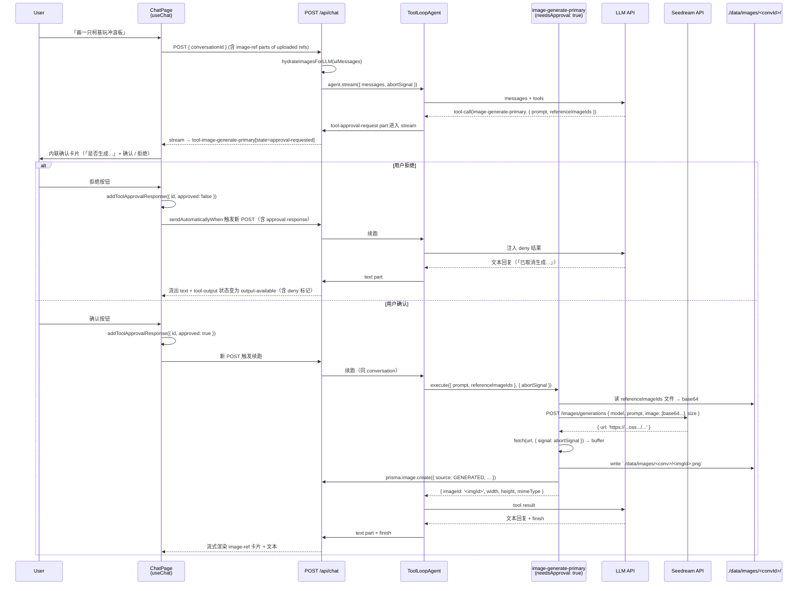
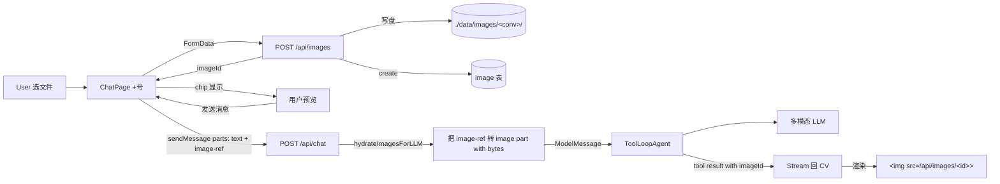
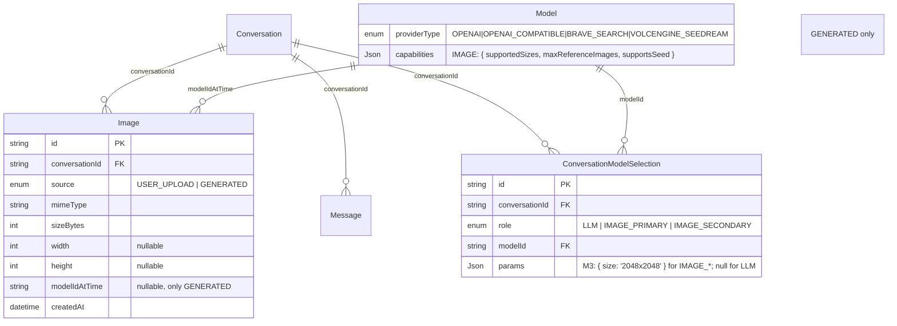

# feat: agent-image M3 — 生图能力闭环 + R15 人工确认 + R18 图像存储

## 本计划边界（必读）

本计划是 v1 工程实现的 **M3 切片**：在已交付的 M1（纯文本对话）+ M2（搜索/抓取工具循环 + 中断 + 失败可视化）之上，把 agent-image 推进到 **「能让 Agent 调用生图工具产出图像，并把图像作为对话第一公民流转」** 的产品形态。

**M3 完成后用户应当可以**：

- 在设置页配置一条 Seedream（火山方舟）生图 Model 记录，含分辨率枚举与最大参考图张数等 capabilities
- 在对话页顶部分别选择 **主生图** 与 **次生图** Model（任一可不选）；在选 Model 的同区域选当前对话使用的分辨率（R4）
- 在输入区粘贴 / 拖拽 / 点击 +号 上传图片作为参考图（M3 简化路径：仅文件上传，剪贴板 / 拖拽留 polish）
- 跑「画一只柯基玩冲浪板的卡通插画」一类任务：Agent 调用 image-generate-primary 工具 → 时间线立刻出现「确认 / 拒绝」内联卡片（R15）→ 用户确认后才发起 Seedream 调用 → 拒绝即不调用 API、把「用户未批准」语义回传 Agent
- 在结果中看到生成图（已落盘到 `./data/images/<convId>/<imageId>.<ext>`）；删除整条对话时本地图随之清理（R18 级联）
- 跑「找 3 张柯基照片，参考第二张画一只」组合任务：Agent 串联 image-search → 用户上传/选定参考图 → image-generate（参考图作为 input） → 多模态 LLM 看图总结
- 当未配置主生图时，Agent 通过文本告知「请先到设置页配置主生图 Model」（R3 + R9 + R14 联动），**不**伪装已生图

**M3 不包括**（Outside this product's identity 与 v1 已 deferred 的能力，永远不做或后置）：

- 生图编辑（inpaint / 局部重绘 / 精确改字）独立管线 —— SPEC v1 范围明确不强制（SPEC Scope Boundaries）
- Compact / 滑窗（与 R7 / M1 / M2 一致，永远 deferred）
- 多 Provider 生图（仅 Seedream，schema / 代码层留 ProviderType 分支扩展点；其他厂商接入是后置 PR）
- daisyUI 主题切换 UI
- 「图像编辑」专业工作流（Inpainting / 风格迁移 / Img2img 链式工具）
- 用户对生图参数的细粒度调节 UI（除 R4 分辨率与 R15 确认前的最小可读摘要外，不做 prompt 编辑器、guidance scale、step 等暴露）

---

## Overview

把仓库从 M2「会用工具循环 + 能中断」推进到 **「能产出第一公民图像 + 二阶段确认 + 完整图像生命周期」**：

- **Schema 扩展**：`ProviderType` 加 `VOLCENGINE_SEEDREAM`；新增 `Image` 表（id / conversationId / source: USER_UPLOAD | GENERATED / mimeType / sizeBytes / width / height / modelIdAtTime / createdAt）；`Conversation` 反向关系到 Image。`SelectionRole.IMAGE_PRIMARY/SECONDARY`（M1 占位）首次写入。
- **会话级分辨率 / 生图参数**：在 `ConversationModelSelection` 加 `params Json?` 列存「绑该 Model 时这条会话用的分辨率等参数」（R4 控件位置：与 Model 选择同区域同流程）
- **本地图像服务**：`POST /api/images`（上传，FormData multipart，回 imageId）+ `GET /api/images/[id]`（按 conv 维护的本地文件 stream 回 binary）。本地落盘根目录 `./data/images/`（已 gitignore）。
- **Seedream Provider 工厂**：与 `lib/llm-provider-factory.ts` 同形态，per-request 实例化，直接 HTTP 调用（不经 AI SDK 图像生成抽象，与 SPEC Key Decisions 一致）；返回 URL 必落盘 → 转为 imageId 引用。
- **生图工具 with `needsApproval`**：`image-generate-primary` / `image-generate-secondary` 两个工具，`needsApproval: true`；input schema 由 `Model.capabilities` 动态生成（size 来自 supportedSizes 枚举、`referenceImageIds` 在 maxReferenceImages > 0 时出现且数量上限受 zod max 约束——R5 服务端兜底）；执行体内 = 把 `referenceImageIds` 解析为本地文件 → 转 base64 注入 Seedream 请求 → 拿响应 URL 下载入库 → 返回 `{ imageId, width, height }`。
- **`tool-registry.ts` 升级**：按 `getSelection(conv, IMAGE_PRIMARY/SECONDARY)` 决定暴露主/次生图工具（R9）；按 selection.params.size 把分辨率 dispatch 进 capabilities 校验。
- **ChatPage 升级**：`tool-image-generate-*` part 的 `approval-requested` / `executing` / `output-available` / `output-error` 状态机渲染；输入区 +上传按钮 + 已上传 chip 列表 + sendMessage 时把 imageIds 作为消息 attachment；`sendAutomaticallyWhen: lastAssistantMessageIsCompleteWithApprovalResponses` 让 R15 确认后自动续跑。
- **多模态 hydrate**：Route Handler 把 history + 当前 user message 中的 `image-ref` 自定义 part 在喂给 LLM 前转为 AI SDK 标准 `image` part（读本地文件 → buffer），让支持 Vision 的 LLM 能看到图（R18 + Dependencies「LLM Vision 假设」）。
- **R3 / R9 能力缺失文本告知**：system prompt 升级新增条款；M2 已搭好的「按 binding 决定工具暴露」机制天然兼容。

---

## Problem Frame

agent-image 产品定位是「图像生成与编排为默认任务」的 Agent。M1/M2 都没生图——也就是说**从产品价值角度**，现在才到「主线」。但生图带来三类全新风险：

1. **不可逆 / 计费**：调一次生图 API 是真实付费 + 真实算力。SPEC R15 把「调用前确认」写成硬性产品行为，M3 必须正确实现这条。
2. **图像生命周期**：图像不是临时数据。用户上传与生图产出都需要持久化、引用、级联清理（R18）。这是 M1/M2 都没有的 lifecycle 维度。
3. **多模态序列化**：Agent 自检产出 / 阅读用户上传 / 引用搜索结果，需要把图作为 LLM 输入。这个 hydrate 链路触及 AI SDK message 协议、文件 IO、Vision 模型差异。

(see origin: `docs/brainstorms/2026-04-23-agent-image-requirements.md`)

M3 把这三条同时做对，加 R3 / R9 的「能力缺失文本告知」最后一环（M2 已为 search 写过，M3 把生图也接进同一机制）。

---

## Requirements Trace

- **R3 LLM-必选 + 主/次生图**：M1 已实现 LLM 必选；M3 把 IMAGE_PRIMARY / IMAGE_SECONDARY 选择器从「占位」激活，以及未选主生图时 Agent 通过文本告知能力缺失。→ U1（schema 已就绪、激活写入路径）+ U5（对话页选择器）+ U7（system prompt 升级 + tool-registry 按 binding 暴露）
- **R4 分辨率作为生图自选项**：可选值来自 Model 声明的 supportedSizes；控件位置在「选择主/次生图模型的同一区域或流程」中。→ U1（`ConversationModelSelection.params Json?`）+ U4（设置页 Model 表单声明 supportedSizes）+ U5（对话页选 Model 时同区显示分辨率下拉）+ U7（生图工具 input schema 用此枚举）
- **R5 不提供「参考图张数上限」配置项**：上限来自 Model.capabilities.maxReferenceImages；超限 UI 调用前阻塞。M3 双端校验：客户端 +号上传时阻塞 + 服务端工具 input zod max 兜底。→ U4（capabilities 字段录入）+ U7（zod max）+ U8（上传 UI 阻塞）
- **R9 主/次生图工具暴露规则**：未配主→不暴露；仅主→暴露主；主次都配→暴露主、次。input schema 随绑定 Model 能力变化。→ U7（tool-registry 按 selection 暴露 + 动态 schema）
- **R15 生图人工确认（UI 内联 + 「确认/拒绝」二元 + 一次工具调用一次确认）**：用 AI SDK `needsApproval: true` 实现。拒绝 = 「用户未批准」语义回传 Agent，**不**调用 Seedream API。一次工具调用对应一次确认，不论该次产出几张图（Seedream 单次返回单图，与粒度天然一致；如未来多图返回也不影响）。**不**主要靠 system prompt 扛闸。→ U7（needsApproval 配置）+ U8（approval-requested 状态二元按钮）
- **R18 对话内图像引用与存储**：用户上传 + 生图返回都落盘到 `./data/images/<convId>/<imageId>.<ext>`；Image 表存元数据（含 source 区分）；URL-only 来源（M2 image-search 结果）**不**下载，仅在对话内以 URL 字符串可读；删除对话时级联清理本地图像文件 + DB 行；URL-only 不动。→ U1 schema + U2 仓储 + U3 服务路由 + U6 生图后落盘 + U8 上传 UI
- **R14 意图内化（图像维度补丁）**：M2 已写工具感知 system prompt；M3 加生图相关条款（何时该调用 generate、参考图选择策略、能力缺失文本告知模板）。→ U7（system prompt 升级）

**Origin actors:** A1（终端用户：配 Seedream Model + 选择主/次 + 上传参考图 + 确认 / 拒绝生图）；A2（Agent：在工具循环中决定何时调主 / 次生图、阅读已生成与已上传图）

**Origin flows:** F1（配置 Model）覆盖生图分支；F2（对话中生成与工具可见性）核心覆盖；F3（Agent 收束 / 失败恢复 / 中断）M3 增量覆盖 R15 拒绝路径

**Origin acceptance examples:**

- AE2（分辨率枚举来自 Model + 参考图按 Model 上限不暴露用户「张数上限」配置项）→ U4 + U7
- AE4（Agent 在一次任务中先 search 再调用主/次生图工具，结果可见）→ U7 + U8
- AE5（R15 内联确认；拒绝 = 不调 API；多张图仍只一次确认）→ U7 + U8
- AE8（仅 LLM、未配生图，「画一只猫」不触发任何生图 API，Agent 文本告知）→ U7 system prompt + tool-registry
- AE10（R12 web-fetch + R18：URL-only 来源不强制落盘；删除对话不需清理 URL-only）→ M2 已实现，M3 不破坏
- AE11（R19 三态中断；M3 范围内：R15 等待确认时被 stop → 视作未批准）→ U8 接 stop 路径

---

## Scope Boundaries

- 不实现 R4 / R5 / R9 / R15 / R18 之外的生图增量（如 inpaint、img2img 链式管线、风格迁移）—— SPEC v1 已声明编辑能力非硬性
- 不实现 Seedream 之外的生图 Provider（保留 ProviderType 分支扩展点）
- 不实现「拖拽上传 / 剪贴板粘贴」高级输入形态（M3 仅 +号 button → input[type=file] multiple；拖拽 / paste 留 polish 后置）
- 不实现「Conversation 标题自动总结」（M2 仍 deferred；M3 同样不做）
- 不实现图像「重新生成 / 编辑参数后再跑」按钮（用户重发消息即可，符合「外科手术式修改」原则）
- 不实现图像缩略图懒加载 / 虚拟列表（toy 级单机自用，不必）
- 不实现按 conversation 检索 / 过滤图像（M3 直接在时间线里看就够）
- 不实现 R15 拒绝时的「自由文本理由」字段（SPEC 提到「含可选的自由文本理由」是可选项；M3 走最简——拒绝就是 deny，不带理由）

### Deferred to Follow-Up Work

- **多 Provider 生图（OpenAI gpt-image-1、Gemini imagen 等）**：以同一 ProviderType 分支模式实现，可能伴随 capabilities schema 微调；后续 PR
- **图像编辑链式工具（inpaint / img2img）**：作为新 Tool family，仍走 needsApproval；后续 PR
- **第三篇 institutional learning**：M3 完成后建议补「AI SDK 6 needsApproval + 二阶段执行 + 多模态 hydrate + 本地图像生命周期」一篇沉淀，留给 ce-compound 触发
- **拖拽 / 剪贴板上传**：作为输入区 polish 后续单独 PR
- **图像 EXIF / metadata 清理 / 安全扫描**：toy 级不做；如未来公网部署再加
- **Storage abstraction**：当前直接走本地文件系统；如未来要换 S3 / OSS 再抽出 IFS 接口

---

## Context & Research

### Tech Stack（沿用 M1 / M2）

- Next.js 16.2.4 + React 19.2.5 + TypeScript 6.x（strict）
- AI SDK `ai@6.0.168` + `@ai-sdk/react` + `@ai-sdk/openai-compatible` + `@ai-sdk/openai`（M1/M2 已装；M3 **无新增** AI SDK provider）
- Prisma 7.8.0 + `@prisma/adapter-better-sqlite3 7.8.0`
- Tailwind 4.2.4 + daisyUI 5.5.19
- Vitest 4.1.5 + Testing Library 16.3.2 + jsdom 29
- Bun + `@antfu/eslint-config 8.2.0`

### M3 新增依赖

- 无新增 npm 依赖
- Seedream 调用走全局 `fetch`；图像下载走 `fetch + arrayBuffer`；图像类型探测走原生 `Buffer` 检 magic bytes（小工具，不引 `file-type`）；MIME → 扩展名映射手写小表（`image/png` → `.png` 等）

### Relevant Code and Patterns（M2 已就绪）

- `app/api/chat/route.ts`：M2 已用 `ToolLoopAgent` + `createAgentUIStreamResponse` + `onStepFinish` 增量落库——M3 在此之上**插入多模态 hydrate**（uiMessages → 含 image part 的 ModelMessage）+ **传递 selection params**（分辨率）到 tool-registry
- `lib/tools/tool-registry.ts`：M2 按 binding 动态拼工具，**M3 加生图工具拼装路径**
- `lib/tools/web-fetch.ts` / `web-search.ts` / `image-search.ts`：M2 工具 throw → AI SDK 转 tool-error 模式直接复用到 M3 生图工具
- `lib/llm-provider-factory.ts`：per-request 工厂模板，**M3 复制为 `lib/image-provider-factory.ts`**
- `lib/db/messages.ts` `upsertAssistantMessage`：M2 已支持 parts 增量；M3 不动写入路径，仅扩展 parts 类型识别
- `lib/db/selections.ts`：M2 仅写 LLM；M3 写 IMAGE_PRIMARY / IMAGE_SECONDARY；新增 `params Json?` 列 + `setSelectionParams(conv, role, params)` helper
- `lib/validation/model-input-schema.ts`：M2 已用 discriminatedUnion；**M3 加 IMAGE 分支**
- `app/settings/`：M2 已有 LLM + Search 区段，M3 加 Image 子区段（同模式）
- `app/conversations/[id]/ChatPage.tsx`：M2 已渲染 tool-\* parts 四态 + send/stop 同按钮；**M3 加 approval-requested 二元按钮 + 上传 UI + image part 渲染**
- `lib/ai/system-prompt.ts`：M2 工具感知 prompt；M3 加生图条款 + R3/R9 生图能力缺失模板

### Institutional Learnings

- `docs/solutions/`：仍为空（M2 未补）。M3 完成后**强烈建议**首次沉淀（首篇主题：AI SDK 6 needsApproval + 多模态 hydrate）

### External References

- **AI SDK approval docs（已读）**：
    - `node_modules/ai/docs/03-ai-sdk-core/15-tools-and-tool-calling.mdx`：`needsApproval: true` / 动态 `needsApproval: async (input) => ...`；返回 `tool-approval-request` parts；客户端用 `addToolApprovalResponse({ id, approved })`；服务端 stream 自然支持二阶段执行；`sendAutomaticallyWhen: lastAssistantMessageIsCompleteWithApprovalResponses` 续跑
    - `node_modules/ai/docs/04-ai-sdk-ui/03-chatbot-tool-usage.mdx`（# Tool Execution Approval 节）：`tool-<name>` part 状态机加 `approval-requested`；按钮 → `addToolApprovalResponse`；与 `output-available` / `output-error` 共存
- **Seedream API**：
    - Endpoint：`POST https://operator.las.cn-beijing.volces.com/api/v1/online/images/generations`
    - Auth：`Authorization: Bearer <api_key>`
    - 必填：`model`（如 `doubao-seedream-4-5-251128`）、`prompt`
    - 可选：`image`（URL 或 base64，单图或多图，最多 14 张；jpeg/png/webp/bmp/tiff/gif；≤10MB；≤6000×6000）、`size`（默认 2048x2048；5.0-lite 支持 2K/3K）、`seed`（仅 3.0-t2i）
    - 响应：JSON 含一个或多个图像 URL（OSS 链接，时效性短）
    - 没有 negativePrompt 字段
- **AI SDK 多模态 part 类型**：UIMessage parts 支持 `text` / `tool-<name>` / `step-start`；ModelMessage（喂给 LLM 的）支持 `text` / `image` / `file`，其中 `image` 接受 `Uint8Array` / data URL / 远程 URL（取决于 provider）。OpenAI / openai-compatible 接受 base64 data URL 形态最稳。

### M2 既有不变量（M3 不破坏）

- M1 路由命名 `app/conversations/[id]`（不是 `app/chat/[id]`）
- M1 / M2 `lib/cn.ts` / `lib/prisma.ts` / `lib/usage-calc.ts` / 侧栏 / page.tsx 重定向不动
- M2 `lib/llm-provider-factory.ts` / `lib/db/conversations.ts` / 现有 zod LLM/Search schema 不动（仅扩展 entry schema）
- M2 工具循环走 `ToolLoopAgent` + `createAgentUIStreamResponse` 路径；M3 沿用，不切换抽象
- M1/M2 `Message` 列结构不动（parts Json? 列承担生图相关 part；不再加列）

---

## Key Technical Decisions

- **生图调用不经 AI SDK 图像抽象**（与 SPEC Key Decisions 一致）：直接 fetch Seedream HTTP API。理由：AI SDK 图像生成抽象不支持参考图、负向 prompt 等扩展参数；自行封装更灵活。
- **R15 用 AI SDK `needsApproval: true`**：而非自定义工具批准机制。理由：与 M2 工具循环路径完全兼容（`createAgentUIStreamResponse` 自动处理二阶段）；UI 状态 `approval-requested` 内置；与 SPEC R15「内联工具块 + 二元按钮」语义对齐；需在客户端补 `addToolApprovalResponse` 与 `sendAutomaticallyWhen: lastAssistantMessageIsCompleteWithApprovalResponses`。
- **生图工具 input schema 动态生成**：`createImageGenerateTool({ model, params })` 工厂函数读 `Model.capabilities`（supportedSizes 数组、maxReferenceImages 数字、supportsSeed 布尔）+ 当前对话的 `selection.params.size`，**动态构造** zod schema：
    - `prompt: z.string().min(1).max(2000)`（Seedream 建议 ≤300 中文字符 / 600 英文字符；M3 放宽到 2000，由模型自截断）
    - `referenceImageIds: z.array(z.string().cuid()).max(maxReferenceImages)`（仅当 maxReferenceImages > 0 才出现在 schema）
    - **不在 schema 暴露 size**（size 由会话级 `selection.params.size` 注入，Agent 无控制权——避免每次 Agent 自己挑分辨率与 R4「与选 Model 同区域」的产品语义冲突）
    - **不暴露 seed / negativePrompt**（Seedream 5.0 不支持 negativePrompt；seed 仅 3.0-t2i 支持，作为 toy 级 v1 不暴露给 Agent）
    - 生成 description（中文）：「调用主生图模型生成图像。需要用户确认。」
- **会话级生图参数存哪**：`ConversationModelSelection.params Json?` 新增列。upsertSelection 时 params 一起写。**不用** SPEC 顶栏分离的「分辨率控件」——R4 已定稿「在选择主/次生图模型的同一区域或流程中调整即可」。
- **图像存储路径**：`./data/images/<conversationId>/<imageId>.<ext>`，相对仓库根。`./data/` 加进 `.gitignore`（可能已有，确认）。`<imageId>` 与 `Image.id` 同（cuid）。`<ext>` 由 mimeType 映射（map：`image/png`→`.png`, `image/jpeg`→`.jpg`, `image/webp`→`.webp`, 其他 → `.bin` 兜底；上传时拒绝 `.bin` 路径）。
- **图像服务路由**：`GET /api/images/[id]`（server-side 读 `Image` 表 → 拼路径 → `fs.createReadStream` + 设 Content-Type）；`POST /api/images`（FormData 解析 → 写盘 → 创建 Image 行 → 返回 `{ id, mimeType, sizeBytes, width, height }`）。两条均 server-only。
- **Image 表不挂 `Conversation` 外键级联** vs **挂 CASCADE**：M3 选 **CASCADE**——`Image.conversationId` FK on Conversation, on delete CASCADE。删除对话时 DB 行自动删；本地文件 unlink 由 `deleteConversation()` 在事务前先列出 + 文件系统层 unlink（best-effort，错误 console.error 但不阻断 DB 删除）。
- **多模态 hydrate 时机**：仅在 Route Handler 把 history + 当前 user message 转 ModelMessage 时执行（即 `convertToModelMessages` 之前的预处理），不在持久化层 hydrate。理由：DB 与客户端只需要 `{ type: 'image-ref', imageId }` 这种轻量 part；只有在传给 LLM 时才读盘转 base64。客户端渲染图同样走 `">` 而非 base64（避免 React 重渲染时 base64 大字符串）。
- **`image-ref` part 类型**：UI 自定义 part，不是 AI SDK 标准 part。在 ChatPage 渲染分支直接识别 `part.type === 'image-ref'`；持久化为 `Message.parts` JSON 字段一员；hydrate 时映射为 AI SDK `image` part with bytes。M3 在 `lib/ai/hydrate-images.ts` 实现。
- **生图工具内的图像下载**：响应 URL → `fetch(url)` → `arrayBuffer` → 探测 magic bytes 决定 mimeType → `fs.writeFile(path, buffer)` → `prisma.image.create({ source: 'GENERATED', ... })` → 返回 `{ imageId, width, height, mimeType }`。下载 30s 超时。下载失败 → throw → AI SDK 转 tool-error。
- **R5 双端阻塞**：客户端在 +号上传 / 已选 chip 计数超 `selectedImageModel.capabilities.maxReferenceImages` 时禁用上传按钮 + 文案提示；服务端工具 input zod `.max(maxReferenceImages)` 兜底。
- **生图工具的 `needsApproval` 配置**：静态 `needsApproval: true`（不用动态 fn）。理由：SPEC R15「确认粒度=一次工具调用」永远成立。
- **拒绝时的工具结果语义**：AI SDK 在 user 拒绝时自动给 LLM feed 「approval denied」类 tool result；M3 不需写 deny 文案。但 system prompt 加一条：「若用户拒绝某次生图调用，请尊重用户意图——不要立即换参数重试同一意图，先用文本与用户对话理解原因，除非用户明示要换参数再试」（与 SPEC R15 推荐一致 + AI SDK docs Note 的「don't retry」建议一致）。
- **system prompt 升级**：M2 工具感知 prompt 之上新增三条：(a) 当前生图工具状态（运行时拼装：「主生图：可用 / 不可用」「次生图：可用 / 不可用」）；(b) 生图工作流提示（「调用前会经用户确认——这是产品行为，不是你的责任，请放心调用」）；(c) R3/R9 文本告知模板：「未配置主生图 Model 时，若用户表达生图意图，请回复：『目前未配置主生图 Model，请先到设置页配置或在对话顶部选择』，**不**要伪装已生成。」
- **`sendAutomaticallyWhen` 升级**：客户端从 M2 的（不需要——server-side execute 自动跑完）变更为 M3 需要 `lastAssistantMessageIsCompleteWithApprovalResponses`——确认后自动续跑。`addToolApprovalResponse` 与 `addToolOutput` 不同；M3 不需要客户端工具，因此不引入 `lastAssistantMessageIsCompleteWithToolCalls`。
- **TDD 纪律**：feature-bearing 单元（U1 schema、U2 仓储+落盘、U3 image routes、U6 Seedream provider+download、U7 工具+hydrate）默认 test-first。U4 / U5 / U8 偏 UI 与脚手架，行为关键点测（form 校验、approval 按钮触发 addToolApprovalResponse、上传超限阻塞）。

---

## Open Questions

### Resolved During Planning

- **R15 用 AI SDK `needsApproval` 还是自写**：用 SDK 内置（理由见 Key Technical Decisions）
- **生图工具 input schema 是否暴露 size**：否——size 由会话级 selection.params 注入（与 R4 控件位置一致）
- **图像存储位置**：`./data/images/<convId>/<imageId>.<ext>`，本地文件 + Image 表
- **生图返回 URL 是否落盘**：必须落盘（Seedream OSS URL 有时效性，与 R18「持久化」一致）
- **多模态 hydrate 时机**：仅 Route Handler 入参时；持久化与 UI 渲染保留 `image-ref` 轻量 part
- **Image 表是否挂 Conversation FK CASCADE**：是（理由见 Key Technical Decisions）
- **R5 阻塞位置**：双端（UI 阻止超张数 + 服务端工具 zod max 兜底）
- **拒绝时的 deny 文案**：交给 AI SDK 自动注入；system prompt 加「不要立即换参数重试」一条
- **是否暴露拒绝时的「自由文本理由」字段**：M3 不做（最简二元按钮，与 SPEC「按钮形态二元」语义对齐）
- **图像 UI 渲染是 base64 还是 URL**：URL（`">`）
- **生图工具命名**：`image-generate-primary` / `image-generate-secondary`（snake-case 风格沿用 M2 `web-search` / `image-search` / `web-fetch`）
- **Provider 数量**：仅 Seedream（用户决策）

### Deferred to Implementation

- **Seedream 响应 schema 的精确字段名**：实现时按真实响应 + zod safeParse 兜底，URL 提取路径 deferred
- **Seedream 单次响应可能多张图的处理**：实测决定——单图返回时 `{ imageId }` 一项；多图时 `{ imageIds: string[] }`，UI 渲染分支按数组处理。Tool 工具结果 schema 用 `z.union([single, array])` 兜底
- **图像宽高获取**：写盘后用 magic bytes 解（PNG IHDR、JPEG SOF、WEBP VP8X 块）OR 写盘前 `image-size` 包。倾向手写 PNG/JPEG/WEBP 解析（toy 级 + 不引依赖）；实现时若觉得太麻烦可换为只存 mimeType + sizeBytes，width/height 留 null
- **客户端 imageId 注入到 sendMessage 的精确 part 形态**：以 AI SDK 类型为准——可能是 `parts: [{ type: 'text', text: ... }, { type: 'image-ref', imageId }]` 直接发 OR 用 `attachments`/files API 的标准形态。实现时按 AI SDK 6 的 `useChat.sendMessage(...)` 签名探测决定
- **Seedream model 列表是否硬编码**：M3 的 `Model.name` 字段就是 model id（与 LLM 同模式）；用户在设置页自填 `doubao-seedream-4-5-251128` 等。supportedSizes / maxReferenceImages 也用户自填（toy 级；未来可加预设）
- **system prompt 措辞具体行**：实现时按 R3/R9/R14/R15 写 30-50 行中文，措辞迭代不在 plan 内
- **磁盘空间用尽 / 写盘失败**：toy 级——失败 → throw → AI SDK 转 tool-error 即可；不做主动空间检查
- **超大上传的边界**：客户端 `<input accept>` 限制 + 服务端 multipart 解析时按 size 校验（实现时定具体阈值，例如 20MB），超限拒绝 + 错误回显

---

## Output Structure

```text
app/
├── api/
│   ├── chat/
│   │   └── route.ts                          [小修：调用 hydrateImagesForLLM(uiMessages) + 注入 selection.params 到 tool-registry]
│   └── images/
│       ├── route.ts                          [新建：POST 上传 multipart]
│       └── [id]/
│           └── route.ts                      [新建：GET 流式返回本地文件]
├── conversations/
│   └── [id]/
│       ├── page.tsx                          [小修：SSR 拉取 IMAGE_PRIMARY/SECONDARY selection + Image 元数据]
│       └── ChatPage.tsx                      [大幅修改：approval-requested 二元按钮 + 上传 UI + image-ref part 渲染 + sendAutomaticallyWhen]
├── settings/
│   ├── page.tsx                              [小修：插入 Image 子区段]
│   ├── AddImageModelForm.tsx                 [新建, 'use client']
│   ├── ImageModelList.tsx                    [新建, 'use client']
│   └── ImageModelActions.tsx                 [新建, 'use server']

lib/
├── tools/
│   ├── image-generate.ts                     [新建：createImageGenerateTool({ model, params, role: 'PRIMARY'|'SECONDARY' })]
│   └── tool-registry.ts                      [小修：按 IMAGE_PRIMARY/SECONDARY selection 暴露生图工具]
├── images/
│   ├── storage.ts                            [新建：本地落盘 / unlink / 路径拼装]
│   ├── mime.ts                               [新建：mimeType ↔ ext map + magic bytes 探测]
│   └── dimensions.ts                         [新建：可选——PNG/JPEG/WEBP 宽高解析（toy 级；失败返 null）]
├── db/
│   ├── images.ts                             [新建：CRUD + 级联清理]
│   ├── selections.ts                         [小修：params Json? 列读写 + setSelectionParams]
│   ├── conversations.ts                      [小修：deleteConversation 中 unlink 本地图]
│   └── messages.ts                           [保留]
├── validation/
│   ├── image-model-schema.ts                 [新建：Seedream 分支 zod]
│   ├── image-upload-schema.ts                [新建：上传 multipart 校验]
│   └── model-input-schema.ts                 [小修：discriminatedUnion 加 IMAGE 分支]
├── ai/
│   ├── system-prompt.ts                      [小修：加生图相关条款]
│   └── hydrate-images.ts                     [新建：UIMessage with image-ref → ModelMessage with image bytes]
├── image-provider-factory.ts                 [新建：Seedream HTTP 调用 + URL 下载落盘]
├── llm-provider-factory.ts                   [保留]
├── chat-guard.ts                             [小修：上传按钮可用条件]
├── prisma.ts                                 [保留]
├── cn.ts                                     [保留]
└── usage-calc.ts                             [保留]

prisma/
├── schema.prisma                             [扩展：VOLCENGINE_SEEDREAM + Image 表 + ConversationModelSelection.params]
└── migrations/
    └── <ts>_m3_images/                       [新建（migrate dev 自动产出）]

data/
└── images/                                   [运行时产生，已 gitignore]

tests/
├── api/
│   ├── chat/route.test.ts                    [扩展：含 image-ref hydrate + needsApproval 二阶段路径]
│   └── images/
│       ├── upload.test.ts                    [新建]
│       └── get.test.ts                       [新建]
├── tools/
│   ├── image-generate.test.ts                [新建]
│   └── tool-registry.test.ts                 [扩展]
├── images/
│   ├── storage.test.ts                       [新建]
│   ├── mime.test.ts                          [新建]
│   └── dimensions.test.ts                    [新建（如选实现）]
├── db/
│   ├── images.test.ts                        [新建]
│   └── selections.test.ts                    [扩展：params 列]
├── validation/
│   ├── image-model-schema.test.ts            [新建]
│   ├── image-upload-schema.test.ts           [新建]
│   └── model-input-schema.test.ts            [扩展]
├── ai/
│   └── hydrate-images.test.ts                [新建]
├── image-provider-factory.test.ts            [新建]
├── conversations/ChatPage.test.tsx           [扩展：approval 状态 + 上传 UI]
└── settings/ImageModelForm.test.tsx          [新建]
```

> **注：** Output Structure 是 scope 声明而非约束；实现时若发现更合适的层级（如把 `lib/images/` 与 `lib/image-provider-factory.ts` 合并到 `lib/images/` 子目录），可调整。每单元 `Files:` 才是各 unit 的权威边界。

---

## High-Level Technical Design

> _本节图示意 M3 关键控制流，是给 reviewer 验证方向的 directional guidance，不是实现规格。实现 agent 应当把它当 context、不要逐字对应代码。_

### R15 二阶段确认 + 生图执行链路



### 用户上传 + 多模态 hydrate



### Schema 关键扩展



**关键不变量**：

1. **AI SDK needsApproval 兜底 R15 的二阶段语义**：M3 不写自定义 approval 状态机
2. **图像在 DB / UI 是轻量 imageId 引用**，仅在 Route Handler 入参 LLM 那一刻才读盘转 bytes（hydrate）
3. **生图返回 URL 必须落盘**——OSS 链接时效性短，与 R18 持久化一致
4. **R4 分辨率不在工具 input 暴露给 Agent**——由会话级 selection 静默注入，与「分辨率与选 Model 同区域」语义对齐
5. **R3 / R9 / R14 联动**：未配主生图时不暴露 generate 工具，由 system prompt 引导 Agent 文本告知；`tool-registry.ts` 的 by-binding 拼装机制 M2 已建好

---

## Implementation Units

- [ ] U1. **Schema 扩展（Image 表 + IMAGE provider + selection.params）**

**Goal:** 把 M2 schema 推进到 M3：`ProviderType` 加 `VOLCENGINE_SEEDREAM`，新增 `ImageSource` enum + `Image` 表，`ConversationModelSelection` 加 `params Json?` 列；跑迁移。

**Requirements:** R3, R4, R9, R18

**Dependencies:** 无

**Files:**

- Modify: `prisma/schema.prisma`
- Create: `prisma/migrations/<ts>_m3_images/...`（migrate dev 自动产出）
- Test: `tests/prisma/schema.test.ts`（M2 已有，扩展断言）

**Approach:**

- `ProviderType` 加值：`VOLCENGINE_SEEDREAM`
- 新增 enum `ImageSource`：`USER_UPLOAD | GENERATED`
- 新增 model `Image`：
    - `id String @id @default(cuid())`
    - `conversationId String` FK on Conversation, onDelete CASCADE
    - `source ImageSource`
    - `mimeType String`
    - `sizeBytes Int`
    - `width Int?`、`height Int?`
    - `modelIdAtTime String?` FK on Model, onDelete SetNull（仅 GENERATED 时填）
    - `createdAt DateTime @default(now())`
    - 反向：`Conversation.images Image[]`、`Model.generatedImages Image[]`
- `ConversationModelSelection` 加列：`params Json?`（M2 旧记录保持 null；M3 写 IMAGE\_\* 时 `{ size: '2048x2048' }` 形态）
- 跑迁移：`bun --bun run prisma migrate dev --name m3_images`
- `.gitignore` 确认含 `data/`（缺则补）

**Execution note:** characterization-first — 先扩展 schema 测试断言（新表 / 新列 / 新枚举 / 级联 / SetNull）+ 跑 migrate

**Patterns to follow:**

- M2 `SearchToolBinding` / `ProviderType` 加值的 schema 扩展模式
- M1 `Message.modelIdAtTime` 的 SetNull 模式（保历史）

**Test scenarios:**

- Happy path：创建 Conversation → 创建 USER_UPLOAD Image（不带 modelIdAtTime）→ 创建 GENERATED Image（带 modelIdAtTime）→ 关联查询拿回完整数据
- Happy path：写入 `ConversationModelSelection.params={ size: '2048x2048' }` → 读回相同 JSON
- Edge case：删除 Conversation → 关联 Image 行 CASCADE 删除（断言）
- Edge case：删除 Model（type=IMAGE）→ 关联 Image 的 modelIdAtTime 设为 null（保留历史 row）+ ConversationModelSelection 关联也按 M2 现有 CASCADE 删除
- Edge case：M2 旧 ConversationModelSelection 记录 params 字段为 null（不需 backfill）
- Error path：Image.source 字段写入非 enum 值 → Prisma 抛错
- Error path：ImageSource=USER_UPLOAD 时 modelIdAtTime 字段为 null（app 层不强制约束，schema 接受 null）；GENERATED 时 modelIdAtTime 应非 null（**app 层校验**，不在 schema）

**Verification:**

- `bun --bun run prisma migrate status` 显示新迁移已应用
- 迁移 SQL 含 `CREATE TABLE Image`、`ALTER TABLE ConversationModelSelection ADD COLUMN params`、`ProviderType` 新值
- `.gitignore` 含 `data/`

---

- [ ] U2. **Image 仓储 + 本地落盘 + 级联清理**

**Goal:** 在 `lib/db/images.ts` + `lib/images/storage.ts` + `lib/images/mime.ts` 提供 Image 完整 lifecycle：写盘 + DB row + 读取路径 + 删除清理；并把 `deleteConversation` 升级为先 unlink 本地图再删 DB。

**Requirements:** R18

**Dependencies:** U1

**Files:**

- Create: `lib/db/images.ts`、`lib/images/storage.ts`、`lib/images/mime.ts`、`lib/images/dimensions.ts`（可选）
- Modify: `lib/db/conversations.ts`（`deleteConversation` 升级）
- Test: `tests/db/images.test.ts`、`tests/images/storage.test.ts`、`tests/images/mime.test.ts`、`tests/images/dimensions.test.ts`（如实现）

**Approach:**

- `lib/images/mime.ts`：
    - `mimeToExt(mime: string): string`（map：image/png→.png, image/jpeg→.jpg, image/webp→.webp, image/bmp→.bmp, image/gif→.gif；其他 → throw）
    - `detectMime(buffer: Buffer): string | null`（检 magic bytes：PNG `89 50 4E 47`、JPEG `FF D8 FF`、WEBP RIFF...WEBP、GIF GIF87a/GIF89a、BMP BM）
    - `isAllowedMime(mime: string): boolean`（白名单：jpeg/png/webp/bmp/gif；与 Seedream 接受范围对齐）
- `lib/images/storage.ts`（首行 `import 'server-only'`）：
    - `imagePath(conversationId, imageId, mimeType): string`（拼装 `./data/images/<conv>/<id>.<ext>`，并确保目录存在）
    - `writeImage(conversationId, imageId, mimeType, buffer): Promise<void>`（mkdir -p + writeFile）
    - `readImageStream(conversationId, imageId, mimeType): ReadStream`
    - `deleteImage(conversationId, imageId, mimeType): Promise<void>`（unlink，文件不存在不报错）
    - `deleteConversationImages(conversationId): Promise<void>`（rm -rf 整个目录，best-effort）
- `lib/images/dimensions.ts`（可选，实现时按工作量判断；放弃则 width/height 一律 null）：
    - `parseDimensions(buffer: Buffer, mime: string): { width, height } | null`（仅 PNG/JPEG/WEBP，按各自二进制头解析）
- `lib/db/images.ts`（首行 `import 'server-only'`）：
    - `createImage({ conversationId, source, mimeType, sizeBytes, width?, height?, modelIdAtTime?, buffer }): Promise<Image>`（参数形态：内部先写盘再 prisma.create——保证「DB row 与本地文件强一致」语义；写盘失败 → 不创建 DB；DB 失败 → unlink 文件后 throw）
    - `getImage(id: string): Promise<Image | null>`
    - `listImages(conversationId: string): Promise<Image[]>`
    - `deleteImage(id: string): Promise<void>`（先读 row → unlink 文件 → prisma.delete）
- 修改 `lib/db/conversations.ts`：`deleteConversation(id)` 在 `prisma.conversation.delete` 之前先调 `deleteConversationImages(id)`（best-effort：unlink 错误 console.error 不阻断）

**Execution note:** test-first（写盘 + DB 一致性 + 级联清理 + magic bytes 探测）

**Patterns to follow:**

- M2 `lib/db/messages.ts` `upsertAssistantMessage` 的事务式写入风格
- M1 `import 'server-only'` 在 `lib/db/`、`lib/tools/`

**Test scenarios:**

- Happy path：`createImage(USER_UPLOAD, png buffer)` → 文件落盘 + DB row 创建 + `readImageStream` 能读回相同字节
- Happy path：`detectMime(png buffer)` 返回 `image/png`；同理 JPEG/WEBP/GIF/BMP
- Happy path：`mimeToExt('image/png')` 返回 `.png`
- Happy path：`deleteImage(id)` → 文件 unlink + DB row 删除
- Happy path：`deleteConversation(convId)` → 该 conv 所有 Image 行 CASCADE 删除（U1 schema 保证）+ 整个 `./data/images/<convId>/` 目录被删
- Edge case：`detectMime(text buffer)` 返回 null
- Edge case：`isAllowedMime('image/svg+xml')` 返回 false（SVG 不在白名单——XSS 风险）
- Edge case：删除已不存在的 Image 文件 → unlink 不报错
- Edge case：`deleteConversation` 时 `data/images/<convId>/` 目录已不存在 → 不报错
- Error path：写盘失败（fs.writeFile 抛 ENOSPC）→ DB row **不创建**；createImage throw
- Error path：DB create 失败（U1 FK 不存在的 conversationId）→ 已写盘文件被 unlink；createImage throw
- Error path：`mimeToExt('image/svg+xml')` throw
- Integration：上传 + 删除一整个对话路径 → 文件 + DB 都被清理

**Verification:**

- 全部测试通过；`./data/images/` 目录在测试中用临时路径（如 `os.tmpdir()`），测试间互不污染
- 「文件 + DB 强一致」不变量在所有测试场景中保持

---

- [ ] U3. **Image 上传 / 静态服务 Route Handler**

**Goal:** 提供 `POST /api/images`（multipart 上传）+ `GET /api/images/[id]`（流式返回），让客户端能上传参考图、把 Agent 时间线中的 imageId 引用渲染为 ``。

**Requirements:** R12, R18

**Dependencies:** U2

**Files:**

- Create: `app/api/images/route.ts`、`app/api/images/[id]/route.ts`
- Create: `lib/validation/image-upload-schema.ts`（zod：conversationId、文件大小上限、mimeType 白名单）
- Test: `tests/api/images/upload.test.ts`、`tests/api/images/get.test.ts`、`tests/validation/image-upload-schema.test.ts`

**Approach:**

- **`POST /api/images/route.ts`**：
    - 解析 multipart：`const formData = await req.formData()`，取 `file: File`、`conversationId: string`
    - zod 校验：file.size ≤ 20MB；file.type 在白名单（mime.ts isAllowedMime）；conversationId 存在且对应 Conversation 存在
    - 读 buffer → magic bytes 二次确认 mimeType（防 client 伪造）→ optional dimensions 解析 → `createImage({ source: USER_UPLOAD, ... })`
    - 返回 `{ id, mimeType, sizeBytes, width, height }`
- **`GET /api/images/[id]/route.ts`**：
    - `await params` 取 id（Next 16 异步 params）
    - `getImage(id)` → 拿 conversationId / mimeType
    - 用 `readImageStream` 返回 `Response` with `Content-Type` + `Cache-Control: private, max-age=31536000, immutable`（imageId 永久不变）
    - 404 if image 不存在
    - 不做 auth（玩具级）
- 错误统一 `NextResponse.json({ error }, { status })`；M2 模式

**Execution note:** test-first — 集成测先行（multipart 解析 + 落盘 + 读回字节）

**Patterns to follow:**

- M2 `app/api/chat/route.ts` 的 `RouteContext` 注入模式（测试可注入 prisma + storage stub）
- Next 16 `Request.formData()` 标准 API（无需 multer 等中间件）

**Test scenarios:**

- Covers AE10：用户在对话中上传 PNG → POST /api/images 返回 imageId → GET /api/images/[id] 返回相同字节 + Content-Type=image/png
- Happy path：上传 JPEG / WEBP / GIF / BMP 各一例 → 200 + 正确 mimeType
- Happy path：GET 已存在 imageId → 200 + 字节匹配 + Cache-Control 头正确
- Edge case：上传 0 字节文件 → 400「文件为空」
- Edge case：上传 21MB 文件 → 413「文件过大」
- Edge case：multipart 中无 conversationId → 400
- Edge case：conversationId 指向不存在的 conv → 400「对话不存在」
- Edge case：GET 不存在的 imageId → 404
- Error path：上传 SVG（mimeType=`image/svg+xml`）→ 400「不支持的图像类型」
- Error path：上传声称 image/png 但 magic bytes 是 JPEG → 服务端二次探测纠正为 image/jpeg 并以纠正后类型存（合法纠错路径）；OR 严格模式拒绝（实现时定，倾向纠错路径——上传更宽容）
- Error path：上传 EXE 文件伪装 png → magic bytes 不匹配任何允许类型 → 400
- Error path：FormData 解析失败 → 400

**Verification:**

- 集成测全部通过；浏览器手测 +号 → 选 PNG → 看到上传成功 + 后续 GET 路径能渲染图

---

- [ ] U4. **设置页生图子区段（Seedream Model CRUD）**

**Goal:** 用户能在 `/settings` 里 CRUD 一条 Seedream 生图 Model，含 capabilities（supportedSizes、maxReferenceImages、supportsSeed）；提交即落库。

**Requirements:** R2, R4, R5, R10, R17

**Dependencies:** U2

**Files:**

- Modify: `app/settings/page.tsx`（在 LLM / Search 区段下增加 Image 区段）
- Create: `app/settings/AddImageModelForm.tsx`、`app/settings/ImageModelList.tsx`、`app/settings/ImageModelActions.tsx`
- Create: `lib/validation/image-model-schema.ts`、`tests/validation/image-model-schema.test.ts`
- Modify: `lib/validation/model-input-schema.ts`（discriminated union 加 IMAGE 分支）+ test
- Test: `tests/settings/ImageModelForm.test.tsx`、`tests/settings/ImageModelActions.test.ts`

**Approach:**

- **`lib/validation/image-model-schema.ts`** zod：

    ```text
    imageModelInputSchema = z.object({
      type: z.literal('IMAGE'),
      providerType: z.literal('VOLCENGINE_SEEDREAM'),
      name: z.string().min(1),  // 即 model id，如 'doubao-seedream-4-5-251128'
      apiKey: z.string().min(1),
      capabilities: z.object({
        supportedSizes: z.array(z.string().regex(/^\d+x\d+$/)).min(1),  // 至少一项
        maxReferenceImages: z.number().int().min(0).max(14),
        supportsSeed: z.boolean().default(false),
      })
    })
    ```

- **`AddImageModelForm.tsx`**（'use client'）字段：
    - `name`（即 model id；输入提示「如 doubao-seedream-4-5-251128」）
    - `providerType`（select 仅一项 `VOLCENGINE_SEEDREAM`，固定显示「火山方舟 Seedream」）
    - `apiKey`（password input，提示「火山方舟 API Key」）
    - **capabilities 子段**：
        - `supportedSizes`：tag input（用户输入分辨率字符串如 `1024x1024`、`2048x2048`、`3072x3072`，按 Enter 添加；至少一项）
        - `maxReferenceImages`：number input（默认 0，建议提示「Seedream 4.5 / 5.0 lite 支持最多 14 张」）
        - `supportsSeed`：checkbox（默认 unchecked，提示「仅 doubao-seedream-3.0-t2i 支持」）
    - 中文文案 + daisyUI（form-control / input / select / btn-primary）+ `cn()`
- **`ImageModelActions.tsx`**（'use server'）：`createImageModelAction` / `updateImageModelAction` / `deleteImageModelAction` → zod safeParse → db helper → `revalidatePath('/settings')`
- **`ImageModelList.tsx`**：列出 type=IMAGE 的 Model，显示 name / supportedSizes / maxReferenceImages / 删除按钮
- 不做工具绑定（M2 的 Search Model 才需要 binding，因为 binding 是「全局 web/image-search → Model」；M3 主/次生图绑定是 conversation 级，在对话页选——不在设置页）

**Execution note:** 行为测先行（zod 边界 + 表单提交 + capabilities tag input）

**Patterns to follow:**

- M2 `AddSearchModelForm.tsx` / `SearchModelList.tsx` / `SearchModelActions.tsx` 的同款风格
- M1 `AddLlmModelForm.tsx` 的 zod 错误回显模式

**Test scenarios:**

- Happy path：填写 Seedream model id + apiKey + 三档分辨率 + maxReferenceImages=14 → 提交 → list 多出一条
- Happy path：编辑现有 Image Model 改 supportedSizes → list 刷新
- Happy path：删除 Image Model → list 该项消失
- Edge case：supportedSizes 为空（用户未添加任何分辨率）→ form inline 错误「至少一项分辨率」
- Edge case：maxReferenceImages=0 → 接受（即「不支持参考图」语义）
- Edge case：supportedSizes 含格式错误的项（如 `2k`）→ zod regex 失败 → form inline 错误
- Error path：apiKey 留空 → form inline 错误
- Error path：name 留空 → form inline 错误
- Error path：maxReferenceImages > 14 或 < 0 → form inline 错误
- Error path：discriminatedUnion 拒绝 `{ type: 'IMAGE', providerType: 'OPENAI' }`（错配）

**Verification:**

- 浏览器走查：在 `/settings` 完成「创建 Seedream Model → 编辑 supportedSizes → 删除」全流程；M1 LLM 区 / M2 Search 区行为不被破坏

---

- [ ] U5. **对话页主/次生图选择器 + 分辨率选择器**

**Goal:** 在对话页顶部把 IMAGE_PRIMARY / IMAGE_SECONDARY 选择器从 M2 的「无」激活；选 Model 同区域下显示分辨率（来自该 Model.capabilities.supportedSizes）；选择即写 selection 表 + selection.params。

**Requirements:** R3, R4

**Dependencies:** U1, U2, U4

**Files:**

- Modify: `app/conversations/[id]/page.tsx`（SSR 拉 IMAGE_PRIMARY/SECONDARY selection + listModels('IMAGE')）
- Modify: `app/conversations/[id]/ChatPage.tsx`（顶部三栏选择器；当前应只有 LLM）
- Create: `app/conversations/[id]/ImageModelPicker.tsx`（'use client'：单个 Model + size 双下拉的复用组件，by role）
- Modify: `lib/db/selections.ts`：`setSelectionParams(conversationId, role, params)` 与 `setSelection(...)` 合并为「upsert with params」
- Test: `tests/conversations/ImageModelPicker.test.tsx`、`tests/db/selections.test.ts`（扩展）

**Approach:**

- **`<ImageModelPicker>`** props：`{ conversationId, role: 'IMAGE_PRIMARY' | 'IMAGE_SECONDARY', currentModelId, currentParams, availableModels }`
- 渲染：
    - 第一个 select：「主生图 Model」/「次生图 Model」（label 按 role 切换）；options = availableModels（type=IMAGE）+ 一项「未选」
    - 第二个 select：「分辨率」；options = `selectedModel.capabilities.supportedSizes`；onChange 触发 `setSelectionParamsAction`
    - 当 currentModelId 为空时，分辨率 select disabled
- **server action**（'use server'）：`setImageSelectionAction(conversationId, role, modelId | null, size | null)`：
    - modelId === null → 清空 selection（删除该 role 的 selection 行）
    - 否则 upsert selection + params={ size }
    - revalidatePath(`/conversations/${id}`)
- ChatPage 顶部布局：横排三个 picker 块——LLM picker（M1 已有，沿用）+ IMAGE_PRIMARY picker + IMAGE_SECONDARY picker；窄屏可换行
- 当 user 把 IMAGE_PRIMARY 切到 null（取消）时，IMAGE_SECONDARY 不强制取消（SPEC 没规定主取消时次必须取消；产品层不写死）
- 当 user 切换 Model 时，分辨率自动重置为新 Model 的第一个 supportedSizes 项

**Execution note:** 行为测先行（双下拉联动 + selection 写入 + revalidate）

**Patterns to follow:**

- M1 LLM picker 的形态（dropdown + 当前选中标签 + server action）
- daisyUI `select` / `dropdown` + `cn()`

**Test scenarios:**

- Happy path：选 Image Model → params.size 自动设为该 Model 的 supportedSizes[0] → DB selection 写入
- Happy path：改分辨率下拉 → params.size 更新 → DB upsert
- Happy path：取消 Model（选「未选」）→ selection 行删除（DB null）
- Happy path：可同时选 PRIMARY 与 SECONDARY（两条独立 selection）
- Edge case：切到一个 supportedSizes 列表与原 Model 不交的 Model → 自动重置为新 Model 的第一项
- Edge case：可用 Image Model 列表为空 → picker 显示「请先到 /settings 添加 Image Model」+ 链接
- Edge case：切回旧对话恢复历史选择（IMAGE_PRIMARY = X、size=2048）→ picker 显示对应值（SSR 注入）
- Error path：`setSelection(IMAGE_PRIMARY, modelId)` 中 modelId 指向 type=LLM 的记录 → server action 拒绝 + inline error

**Verification:**

- 浏览器走查：全流程「未选 → 选 Primary → 改分辨率 → 选 Secondary → 切对话再切回保持选择」
- 设置页删除该 IMAGE Model → 对话页 picker 显示「未选」（schema CASCADE 保证）

---

- [ ] U6. **Seedream Provider 工厂 + 生图执行 + URL 下载落盘**

**Goal:** `lib/image-provider-factory.ts` 提供 `executeImageGeneration({ model, prompt, referenceImageIds, size, conversationId, abortSignal })`：构造 Seedream 请求 → 调用 → 下载返回 URL → 写盘 → 返回 imageId。

**Requirements:** R4, R5, R12, R18

**Dependencies:** U2

**Files:**

- Create: `lib/image-provider-factory.ts`
- Test: `tests/image-provider-factory.test.ts`

**Approach:**

- 文件首行 `import 'server-only'`
- 函数签名（**directional**）：

    ```text
    executeImageGeneration({
      model: ImageModelRecord,         // type=IMAGE
      prompt: string,
      referenceImageIds: string[],     // 从 Image 表读取 → base64 inline
      size: string,                    // 已由调用方校验属于 supportedSizes
      conversationId: string,          // 用于落盘路径
      abortSignal: AbortSignal,
    }): Promise<{ imageId, mimeType, width?, height?, sizeBytes }>
    ```

- 实现要点（dispatch by providerType）：

    ```text
    switch model.providerType
      case 'VOLCENGINE_SEEDREAM':
        // 1. 把 referenceImageIds 解析为 base64
        images = await Promise.all(referenceImageIds.map(async id => {
          const img = await getImage(id)
          const buffer = await fs.readFile(imagePath(img.conversationId, img.id, img.mimeType))
          return `data:${img.mimeType};base64,${buffer.toString('base64')}`
        }))

        // 2. POST Seedream
        const res = await fetch('https://operator.las.cn-beijing.volces.com/api/v1/online/images/generations', {
          method: 'POST',
          signal: abortSignal,
          headers: {
            'Authorization': `Bearer ${model.apiKey}`,
            'Content-Type': 'application/json',
          },
          body: JSON.stringify({
            model: model.name,
            prompt,
            ...(images.length > 0 && { image: images.length === 1 ? images[0] : images }),
            size,
          })
        })
        if (!res.ok) throw new Error(`Seedream ${res.status}: ${await res.text().catch(() => '')}`)
        const json = await res.json()

        // 3. 提取 URL（zod safeParse 兜底）
        const url = json.data?.[0]?.url ?? json.url ?? ...  // 实现时按真实响应
        if (!url) throw new Error('Seedream response missing image URL')

        // 4. 下载到 buffer
        const downloadRes = await fetch(url, { signal: abortSignal })
        if (!downloadRes.ok) throw new Error(`download ${downloadRes.status}`)
        const buffer = Buffer.from(await downloadRes.arrayBuffer())

        // 5. 探测 mimeType + 落盘 + DB
        const mimeType = detectMime(buffer) ?? 'image/png'
        const dimensions = parseDimensions(buffer, mimeType)
        const image = await createImage({
          conversationId, source: 'GENERATED',
          mimeType, sizeBytes: buffer.length,
          width: dimensions?.width ?? null, height: dimensions?.height ?? null,
          modelIdAtTime: model.id, buffer,
        })
        return { imageId: image.id, mimeType, ... }

      default: throw new Error(`unsupported image provider: ${model.providerType}`)
    ```

- **错误消息不含 apiKey**（测试断言）
- 30s 超时由 `AbortSignal.any([abortSignal, AbortSignal.timeout(30_000)])` 复合（fetch 调用 + 下载共一个超时）

**Execution note:** test-first — 先 mock fetch 期望（请求体形态、headers、abortSignal）再实现

**Patterns to follow:**

- M2 `lib/tools/web-search.ts` 的 mock fetch + abortSignal forward 测试形态
- M1 `lib/llm-provider-factory.ts` 的 per-request + dispatch by providerType 模式

**Test scenarios:**

- Happy path：mock Seedream 200 + URL → 模拟下载 mock 返回 PNG buffer → executeImageGeneration 写盘 + 创建 Image row（source=GENERATED, modelIdAtTime=model.id）+ 返回 `{ imageId, mimeType: 'image/png' }`
- Happy path：referenceImageIds=[A, B]（Image A/B 已落盘）→ Seedream 请求 body.image 是 base64 数组 [dataURL, dataURL]
- Happy path：referenceImageIds=[]（无参考图）→ Seedream 请求 body **无** image 字段（不传空数组、不传 null——遵循「不传比传空更安全」）
- Happy path：abortSignal forward 到两次 fetch（生成调用 + URL 下载）（spy 断言）
- Edge case：Seedream 返回响应有顶层不同字段名（如 `data: [{ url }]` vs `images: [...]`）→ 用可选链兜底，提取成功
- Edge case：下载到的 buffer magic bytes 是 JPEG → mimeType=image/jpeg、扩展名 `.jpg`
- Error path：Seedream 401（token 错）→ throw `Seedream 401: ...`；错误消息**不含 apiKey**（grep 断言）
- Error path：Seedream 200 但 body 缺 URL → throw `Seedream response missing image URL`
- Error path：URL 下载 404 → throw `download 404`
- Error path：abortSignal triggered（client stop）→ fetch throw AbortError → 透传抛出
- Error path：referenceImageIds 含不存在的 imageId → getImage 返 null → throw `reference image not found`
- Error path：providerType 不是 VOLCENGINE_SEEDREAM → throw（M3 仅一种）

**Verification:**

- 单测全部通过；测试中无任何外部网络调用（fetch 全 mock）
- 错误消息不出现 apiKey 字串

---

- [ ] U7. **生图工具 + Tool registry 扩展 + 多模态 hydrate + system prompt 升级**

**Goal:** 实现 `image-generate-primary` / `image-generate-secondary` 两个 AI SDK 工具（with `needsApproval: true` + 动态 input schema by capabilities）；扩展 `tool-registry.ts` 按 IMAGE_PRIMARY / IMAGE_SECONDARY selection 暴露生图工具；新增 `lib/ai/hydrate-images.ts` 把 UIMessage with image-ref → ModelMessage with image bytes；升级 system prompt。

**Requirements:** R3, R4, R5, R9, R14, R15, R18

**Dependencies:** U2, U6

**Files:**

- Create: `lib/tools/image-generate.ts`（导出 `createImageGenerateTool({ model, params, role, conversationId })`）
- Modify: `lib/tools/tool-registry.ts`
- Create: `lib/ai/hydrate-images.ts`
- Modify: `lib/ai/system-prompt.ts`
- Modify: `app/api/chat/route.ts`（接 hydrate + 把 conversationId / IMAGE selection 注入 tool-registry）
- Test: `tests/tools/image-generate.test.ts`、`tests/tools/tool-registry.test.ts`（扩展）、`tests/ai/hydrate-images.test.ts`、`tests/ai/system-prompt.test.ts`（扩展）、`tests/api/chat/route.test.ts`（扩展，含 needsApproval 二阶段）

**Approach:**

- **`createImageGenerateTool({ model, params, role, conversationId })`** 工厂：
    - description（中文）：根据 role 不同，主：「调用主生图模型生成图像。生成前必须经用户确认。」/ 次：「调用次生图模型生成图像。生成前必须经用户确认。」
    - inputSchema 动态构造（**directional**）：

        ```text
        const baseSchema = z.object({ prompt: z.string().min(1).max(2000) })
        const refsField = model.capabilities.maxReferenceImages > 0
          ? { referenceImageIds: z.array(z.string().cuid()).max(model.capabilities.maxReferenceImages).optional() }
          : {}
        const inputSchema = baseSchema.extend(refsField)
        ```

    - `needsApproval: true`（静态）
    - `execute({ prompt, referenceImageIds }, { abortSignal }) =>` 调 `executeImageGeneration({ model, prompt, referenceImageIds: referenceImageIds ?? [], size: params.size, conversationId, abortSignal })`，返回 tool result `{ imageId, mimeType, width, height }`

- **`tool-registry.ts`** 升级（**directional 伪代码**）：

    ```text
    buildAvailableTools(db, conversationId): Promise<{ tools, descriptors }>
      bindings = await getAllBindings(db)  // M2 已有：search 工具
      tools = { 'web-fetch': createWebFetchTool() }
      if bindings.WEB_SEARCH: tools['web-search'] = ...
      if bindings.IMAGE_SEARCH: tools['image-search'] = ...

      // M3 新增：
      primarySel = await getSelection(db, conversationId, 'IMAGE_PRIMARY')
      if primarySel:
        const primaryModel = await getModel(db, primarySel.modelId)
        if primaryModel:
          tools['image-generate-primary'] = createImageGenerateTool({
            model: primaryModel,
            params: primarySel.params ?? { size: primaryModel.capabilities.supportedSizes[0] },
            role: 'PRIMARY',
            conversationId,
          })
      secondarySel = ...  // 同模式

      descriptors = ...  // 给 system prompt
      return { tools, descriptors }
    ```

- **`lib/ai/hydrate-images.ts`**：`hydrateImagesForLLM(uiMessages, db): Promise<UIMessage[]>`——遍历每条消息的 parts，把 `{ type: 'image-ref', imageId }` 转成 AI SDK `image` part：

    ```text
    for each part in message.parts:
      if part.type === 'image-ref':
        img = await getImage(part.imageId)
        buffer = await readFile(imagePath(...))
        return { type: 'image', image: buffer, mimeType: img.mimeType }
      else: 保留原样
    ```

    返回新 UIMessage 数组（不 mutate 原数组）。**注意**：tool result parts 中含 imageId 的，**不**做 hydrate（让 LLM 看到 imageId 字符串即可——下一个 user message 中如果用户问「这张图怎么样？」由用户主动 attach 才 hydrate）。

- **system prompt 升级**：在 M2 prompt 上追加：

    ```text
    生图能力：
    - 主生图：可用 / 不可用（根据 descriptors 实际状态拼装）
    - 次生图：可用 / 不可用
    当用户表达生图意图但主生图不可用时，请回复「目前未配置主生图 Model，请先到设置页配置或在对话顶部选择主生图 Model」，不要伪装已生成。
    调用生图工具前会经用户确认——这是产品行为，不是你的责任，请放心调用。如果用户拒绝某次生图调用，请尊重用户意图，先用文本理解原因，不要立即换参数重试同一意图。
    分辨率由用户在对话顶部选定，你无须传 size 参数（已自动注入）。
    ```

- **Route Handler 修改**（`app/api/chat/route.ts`）：
    - `buildAvailableTools(db, conversationId)`（多传 conversationId 参数）
    - `await hydrateImagesForLLM(uiMessages, db)` → 把转换后的 messages 喂给 `createAgentUIStreamResponse`

**Execution note:** test-first（动态 schema by capabilities + needsApproval 流转 + hydrate 不破坏非 image part）

**Patterns to follow:**

- M2 `lib/tools/tool-registry.ts` 按 binding 拼装
- M2 `app/api/chat/route.ts` 的 toolsOverride / model 注入测试模式

**Test scenarios:**

- **image-generate.ts**：
    - Happy path：model.capabilities={ maxReferenceImages: 14 } → tool inputSchema 含 referenceImageIds（z.array max 14）
    - Happy path：model.capabilities={ maxReferenceImages: 0 } → tool inputSchema **不含** referenceImageIds 字段（zod parse 时 referenceImageIds 字段被忽略，不报错）
    - Happy path：tool.needsApproval === true（静态断言）
    - Happy path：execute 调 executeImageGeneration（spy）传入正确 size（来自 params.size）
    - Edge case：execute 收到 referenceImageIds.length 超 max → zod parse 失败（在 AI SDK 工具调用层抛错，转 tool-error）
    - Error path：execute 内 executeImageGeneration throw → 透传抛出（让 AI SDK 转 tool-error）
- **tool-registry.ts**（扩展）：
    - Happy path：IMAGE_PRIMARY 已选 + IMAGE_SECONDARY 未选 → tools 含 `image-generate-primary`，**不含** `image-generate-secondary`
    - Happy path：两 IMAGE selection 都设 → 两个 generate 工具都暴露
    - Happy path：均未设 → 不含任何 generate 工具
    - Happy path：IMAGE_PRIMARY 与 IMAGE_SECONDARY 指向同一 Model → 两个工具都暴露（两条独立 needsApproval 流）
    - Edge case：selection 指向已删除的 Model（理论由 CASCADE 防住，但代码兜底）→ 不暴露该工具
- **hydrate-images.ts**：
    - Happy path：UIMessage parts=[{ type: 'text', text: 'see this' }, { type: 'image-ref', imageId: 'abc' }] → hydrate 后 parts=[text, { type: 'image', image: Buffer<bytes>, mimeType: 'image/png' }]
    - Happy path：parts 中含 tool-\* part → 保留原样不动
    - Happy path：parts 中无 image-ref → 直接返回（无修改、无 IO）
    - Edge case：image-ref 指向已删除的 Image → 跳过该 part（不抛错；用 console.warn 记录）
- **system-prompt.ts**（扩展）：
    - Happy path：descriptors 含 image-generate-primary → prompt 文本含「主生图：可用」
    - Happy path：descriptors 不含 generate 工具 → prompt 文本含「主生图：不可用」+ 文本告知模板
    - Happy path：image-generate-primary 描述中含「需要用户确认」
- **route.ts**（扩展，集成测）：
    - Covers AE5：mock LLM 调 image-generate-primary → stream 出现 tool-image-generate-primary[state=approval-requested] part；execute **未被调用**（spy 断言）
    - Covers AE5：第二次请求带 approval-response approved=true → execute 被调用 → tool result 流出 → DB Image 表新增 GENERATED row
    - Covers AE5：第二次请求带 approval-response approved=false → execute **未被调用** → LLM 收到 deny → 文本回复
    - Covers AE5：mock LLM 一次产出多个 tool call（主生图调两次） → 两次独立 approval-request 流出（粒度对齐工具调用）
    - Covers AE8：未配 IMAGE_PRIMARY + 用户「画一只猫」 → tools 不含 generate → LLM（mock）输出文本告知（断言无任何 image-generate part）
    - Covers AE11：approval-request 流出后客户端 abort → req.signal triggers → AI SDK 整理为「未批准」语义（具体由 SDK 行为决定，实现时验证）
    - Happy path（hydrate）：history 含 user message with image-ref → ModelMessage 给到 mock LLM 时含 image part with bytes（spy 验证 LLM 收到的 messages）

**Verification:**

- 全部测试通过
- 浏览器手测：「画一只柯基」→ 看到内联确认卡 → 点确认 → 看到生成图 + 后续文本；点拒绝 → 看到 LLM 文本回复

---

- [ ] U8. **ChatPage 升级：approval 二元按钮 + 上传 UI + image-ref part 渲染 + sendAutomaticallyWhen**

**Goal:** ChatPage 渲染 `tool-image-generate-*` 的 `approval-requested` 状态（内联二元按钮）+ 用户图片上传 UI（+ 号 + 已选 chip）+ image-ref part 的 `` 渲染 + 接 `sendAutomaticallyWhen: lastAssistantMessageIsCompleteWithApprovalResponses`。

**Requirements:** R5, R15, R18, R19（中断时未批准 approval 走 SDK 自动语义）

**Dependencies:** U3, U7

**Files:**

- Modify: `app/conversations/[id]/ChatPage.tsx`
- Modify: `app/conversations/[id]/page.tsx`（SSR 把 user message 中既有 image-ref parts 与新一轮上传连接）
- Modify: `lib/chat-guard.ts`（新增 `canUploadMore({ count, max })`）
- Test: `tests/conversations/ChatPage.test.tsx`（扩展）、`tests/lib/chat-guard.test.ts`（扩展）

**Approach:**

- **ChatPage 三新增 UI 元素**：
    1. **Approval 卡片**（在现有 `tool-<name>` 状态机分发中加分支）：
        - `case 'tool-image-generate-primary' / 'tool-image-generate-secondary'`：
            - state='input-streaming' → spinner + 「准备调用主/次生图…」
            - state='input-available' → 显示工具名 + prompt 摘要 + 当前 size + 参考图 chip 列表
            - state='approval-requested' → 工具卡内嵌「确认」「拒绝」二元按钮（daisyUI `btn btn-primary` / `btn btn-ghost`）；onClick 调 `addToolApprovalResponse({ id: part.approval.id, approved })`；按钮按一次后变 disabled
            - state='executing' → 「生成中…」spinner
            - state='output-available' → 渲染生成图（`">`），点击放大（M3 极简：`onClick={ () => window.open(url) }`）
            - state='output-error' → daisyUI `alert alert-error` + errorText

    2. **上传 UI**（输入区 +号按钮）：
        - 输入框左侧 +号 button → 触发 `<input type="file" accept="image/*" multiple hidden>`
        - 选中文件后立即 POST /api/images（每个文件独立请求并行）→ 拿到 imageId list
        - 状态栏：input 上方一排 chip（缩略图 24×24 + ✕ 删除按钮）；删除时仅从本地 state 移除（不删 Image 表，避免误删；垃圾收集 deferred）
        - 按 R5：当 chip 数 ≥ `selectedPrimaryImageModel?.capabilities?.maxReferenceImages ?? Infinity` 时 +号按钮 disabled + tooltip「已达参考图上限 N」（按主生图 Model 决定上限；若未选主，按 Infinity，让用户随便上传，发送时由 LLM 决定是否有用）

    3. **image-ref part 渲染**（user 自己消息中、tool result 之外）：
        - `case 'image-ref'`：渲染 `" loading="lazy">` 缩略图

- **sendMessage 升级**：发送时把 `uploadedImageIds` 数组打入 `parts: [{ type: 'text', text: input }, ...uploadedImageIds.map(id => ({ type: 'image-ref', imageId: id }))]`；发送成功后清空 chip 列表
- **`useChat` 配置升级**：
    - `sendAutomaticallyWhen: lastAssistantMessageIsCompleteWithApprovalResponses`（新加）
    - 沿用 M2 的 stop 按钮 / status 状态机
- **`canUploadMore({ count, max })`**：纯函数 `count < max`；M3 在 chat-guard 中加该 helper
- **R19 中断时**：用户在 approval-requested 状态点 stop → AI SDK 的 abort 链路会把当前 stream 关掉；下一次发送（用户决定恢复）会以新 approval response 续跑或不续。M3 不加额外 cleanup（沿用 SDK 行为）。

**Execution note:** test-first（approval 状态分支 + 二元按钮 + 上传 chip 数限制 + image-ref 渲染）

**Patterns to follow:**

- M2 ChatPage 现有 tool-\* 四态 switch 模式（继续扩 case）
- AI SDK docs `addToolApprovalResponse` + `sendAutomaticallyWhen` 标准用法
- daisyUI `btn` / `card` / `chip` / `alert` / `loading`

**Test scenarios:**

- Covers AE5：assistant 消息含 `tool-image-generate-primary[state=approval-requested]` part → 渲染确认/拒绝两个按钮 + prompt 摘要
- Covers AE5：点确认 → addToolApprovalResponse spy 被调用 with `{ id, approved: true }`；按钮变 disabled
- Covers AE5：点拒绝 → addToolApprovalResponse spy 被调用 with `{ id, approved: false }`
- Covers AE5：状态变到 executing → 显示 spinner + 「生成中…」；output-available → 显示 ``
- Covers AE2：选了主生图 Model（maxReferenceImages=3）→ 上传 4 张时第四个 chip 不允许上传（+号 disabled）
- Covers AE2 + AE10：上传 2 张 PNG → input 上方显示 2 个 chip → 发送 → message.parts 含 [text, image-ref, image-ref]
- Covers AE8：mock LLM 在未配主生图情境下输出文本告知 → ChatPage 正常渲染该文本（无 image-generate part 出现）
- Happy path：删除 chip → 该 imageId 从待发送列表移除
- Happy path：发送成功后 chip 列表清空
- Happy path：image-ref part（在 user message 中）渲染 `">`
- Happy path：sendAutomaticallyWhen 配置后，addToolApprovalResponse 调用后会自动触发新一轮 sendMessage（用 mock 验证 useChat 行为）
- Edge case：approval-requested 状态被 stop 中断后，状态进入 useChat error 或 ready；UI 不卡死
- Edge case：上传中（loading）显示进度（spinner）；上传完成 chip 出现
- Error path：上传 POST 返回 400 → chip 不出现 + alert 提示「上传失败」
- Error path：在未选主生图时上传第 5 张图（无 max 上限）→ 允许（与方案一致——主未选时不限）

**Verification:**

- 浏览器走查：完成「上传两张参考图 → 发送『参考这两张画一个』 → 看到 approval 卡 → 点确认 → 看到生成图」全链路
- 拒绝路径：「画一只猫 → 拒绝 → 看到 LLM 解释」
- 多次拒绝同一 prompt → LLM 不立即换参重试（system prompt 引导生效）

---

## System-Wide Impact

- **Interaction graph**：
    - ChatPage `useChat` ↔ `/api/chat` Route Handler ↔ `ToolLoopAgent`（带含 needsApproval 工具）↔ Seedream API + 已有 search/fetch 工具 ↔ `/api/images/*` Route Handler ↔ Prisma DB ↔ 本地 `./data/images/`
    - 设置页 server actions（CRUD Image Model）→ Prisma → revalidatePath('/settings')
    - 对话页 server actions（setImageSelection）→ revalidatePath('/conversations/[id]')
    - 删除对话 server action（M1 已有侧栏）→ deleteConversationImages → unlink 文件 → DB CASCADE
- **Error propagation**：
    - 工具失败（含生图 throw）：M2 链路保持——execute throw → AI SDK tool-error stream part → UI output-error 渲染 + LLM 收到错误 → Agent 续处理
    - Approval 拒绝：AI SDK 自动 inject deny tool result；不走 error 路径
    - 上传失败：客户端单条 chip 失败显示 alert，不影响其它 chip
    - 服务端 hydrate 失败（image-ref 指向已删除）：console.warn + 跳过；不阻断请求
- **State lifecycle risks**：
    - **DB Image row 与本地文件的强一致**：U2 实现保证（写盘失败不创建 row；DB 失败 unlink 文件）；垃圾文件 = DB 已删但文件残留可能在异常 unlink 路径产生——toy 级接受残留风险
    - **`Conversation.delete` 级联**：U2 在 deleteConversation 内先 unlink 整个 conv 目录再 prisma.delete；级联 Image rows DB 自动；可逆性 0（与 M1 一致）
    - **selection.params 漂移**：用户切 Model 后 params.size 不重置 → U5 切 Model 时强制重置为新 Model 的 supportedSizes[0]
    - **chat 中途上传失败**：上传 chip 是 ChatPage 本地 state；刷新页面后 chip 丢失；已发送的图持久；M3 接受此 UX
- **API surface parity**：
    - 新增 Route Handler `/api/images`（POST + GET [id]）；server actions 散布在 `app/settings/ImageModelActions.ts`、`app/conversations/[id]/imageSelectionAction.ts`（或合到现有文件）；每条 zod 输入校验
    - 无新增 client-only 入口；所有外部 API 调用（Seedream + 图像下载）经服务端
- **Integration coverage**：
    - U7 集成测必须覆盖：「LLM 调 generate → approval-request 流出 → execute 未被调用」「approval=true → execute 被调用 → DB Image 创建」「approval=false → execute 未被调用 + LLM 收到 deny」「未配主生图时不暴露工具」「user message 含 image-ref → LLM 收到 hydrated bytes」
    - U8 集成测在 jsdom 下用 RTL，mock useChat 的 messages / addToolApprovalResponse / sendMessage
- **Unchanged invariants**：
    - R1 玩具级 / 明文密钥落库 → M3 沿用；Seedream API key 也明文
    - R7 不做 compact / 滑窗 → 撞墙仍走流式 error 透传
    - R11 Prisma 持久化 → M3 仅扩列 / 加表，不改 ORM
    - SPEC 术语「Model」一以贯之
    - M1 路由命名 `app/conversations/[id]`（不改）
    - `lib/cn.ts` / `lib/prisma.ts` / `lib/llm-provider-factory.ts` / `lib/usage-calc.ts`：M3 全部不动
    - M2 `lib/tools/web-search.ts` / `image-search.ts` / `web-fetch.ts` / `ssrf-guard.ts`：M3 不动
    - M2 已用的 `ToolLoopAgent` + `createAgentUIStreamResponse` 路径：M3 沿用，仅在喂入前加 hydrate
    - M2 `lib/db/messages.ts` `upsertAssistantMessage` 增量落库语义：M3 不变，新增的 image-ref / image-generate-\* parts 自然走同 JSON 列
    - M2 `aggregateUsage` 公式不变（按 LLM usage 列累加；生图工具不消耗 LLM token）

---

## Risks & Dependencies

| 风险                                                                                                                                          | 缓解                                                                                                                                                                       |
| --------------------------------------------------------------------------------------------------------------------------------------------- | -------------------------------------------------------------------------------------------------------------------------------------------------------------------------- |
| AI SDK `needsApproval` 在 `createAgentUIStreamResponse` + `useChat.addToolApprovalResponse` 链路实际行为与文档不一致                          | U7 集成测必跑真实 ToolLoopAgent + MockLanguageModelV3 编排 approval 路径；U8 ChatPage 测验证 addToolApprovalResponse 调用形态；如发现 SDK 行为偏差，先 fail 测试再调整实现 |
| Seedream API 响应 schema 与文档不一致 / 字段名变                                                                                              | U6 用可选链 + 多路径兜底（`json.data?.[0]?.url ?? json.images?.[0] ?? json.url`）；提取失败 throw 含可读信息；实际接入时 console.log 一次响应观察形态再固化                |
| Seedream OSS URL 时效性极短（< 1 分钟）→ 工具内来不及下载                                                                                     | U6 在拿到 URL 后立即 fetch（同请求内串行）；30s 超时复合；下载失败 → tool-error → Agent 决策（重试 / 改 prompt）                                                           |
| 生成图 mimeType 探测失败（非 PNG/JPEG/WEBP）                                                                                                  | U2 detectMime 返回 null 时 fallback `image/png`（Seedream 实际默认 PNG）；不阻断流程                                                                                       |
| 大文件上传 / 下载阻塞 Route Handler 进程                                                                                                      | 上传 20MB 上限；下载 30s 超时；Next 16 Route Handler 单请求隔离，不会撑爆其他请求；玩具级单机自用并发 ≤ 1                                                                  |
| 本地文件系统在 worktree / 多实例并发下冲突                                                                                                    | imageId 是 cuid 全局唯一，不存在路径冲突；多实例运行 deferred（toy 级单实例）                                                                                              |
| 多模态 LLM 实际不支持 Vision（用户配的 LLM 是纯文本模型）                                                                                     | SPEC Dependencies「LLM Vision 假设」明确：v1 假定支持；不支持时由 R16 工具失败 → LLM API 报错 → R7 撞墙链路回传；产品层不做强制过滤；M3 不加自动 fallback                  |
| `data/` 目录被误提交进 git                                                                                                                    | U1 `.gitignore` 检查含 `data/`；migration 中不写 fixture 数据                                                                                                              |
| 用户上传 SVG 引发 XSS（通过 `` 不会，但仍拒绝）                                                                                      | U2 isAllowedMime 白名单不含 SVG；U3 服务端二次 magic bytes 探测兜底                                                                                                        |
| `Image.modelIdAtTime` 表关联在 USER_UPLOAD 行为 null（约束模糊）                                                                              | app 层校验：USER_UPLOAD → modelIdAtTime 必须 null；GENERATED → 必须非 null；createImage 内断言；测试覆盖两种 source 的合法 / 非法组合                                      |
| Approval 拒绝时 LLM 强行换参重试同一意图（违反 R15 推荐）                                                                                     | system prompt 写明「不要立即换参重试」；测试在 mock LLM 拒绝路径不验证此具体行为（无法在 mock 中考核 LLM）；浏览器手测兜底                                                 |
| `selection.params.size` 与 `Model.capabilities.supportedSizes` 漂移（用户改 Model 的 supportedSizes 后旧 selection.params.size 不在新列表中） | U7 工具内 size 校验 fallback：`size ∈ capabilities.supportedSizes` 否则用 `supportedSizes[0]`；不阻断生图，仅 console.warn                                                 |
| Prisma SQLite Json 列在大量 image-ref part 时膨胀                                                                                             | image-ref part 极轻（imageId 字符串），单 message 不会大；与 M2 工具结果膨胀风险量级一致；不额外缓解                                                                       |
| Next 16 `formData()` 解析 multipart 在大文件下内存压力                                                                                        | 20MB 上限内可接受；如未来加大限制再考虑流式（Web Streams API）；M3 不前置实现                                                                                              |
| chips 在前端 state，刷新页面丢失（用户上传后不发送即关页）                                                                                    | 接受——已上传图仍在 DB 与文件系统中，是孤立资源；后续清理 deferred；toy 级单机自用不构成问题                                                                                |

---

## Documentation / Operational Notes

- 本 plan 完成后**强烈建议**首次在 `docs/solutions/` 沉淀两篇 institutional learning（M2 deferred 的 + M3 新出的）：
    - 「AI SDK 6 工具循环 + 中断链路 + Next 16 Route Handler 取消」（M2 主题）
    - 「AI SDK 6 needsApproval 二阶段执行 + 多模态 hydrate + 本地图像生命周期」（M3 主题）
    - 非本 plan 强制交付，留给 ce-compound 触发
- M3 完成后 v1 范围 R1–R19（除明示 deferred 外）全部交付；后续工作变成「polish + 单点能力扩展」
- `data/` 已加 .gitignore（U1 verify）；`prisma/migrations/<ts>_m3_images/` **应该提交**（按 prisma 最佳实践）
- 无 deployment / monitoring 影响（玩具级，本地 `bun dev`）
- **手测清单**（M3 验收时）：
    1. 配 Seedream Model（doubao-seedream-4-5-251128，supportedSizes=[1024x1024, 2048x2048]，maxReferenceImages=14）
    2. 在对话页选 Primary = 该 Model + size=2048x2048
    3. 「画一只柯基」→ 看到 approval 卡 → 确认 → 看到生成图（落盘 `./data/images/<conv>/<id>.png`）
    4. 「画一只猫」→ approval 卡 → 拒绝 → LLM 文本说明（不重试）
    5. +号上传 2 张照片 → 发送「参考这两张，给柯基加一个冲浪板」→ approval → 看到新图（参考图 base64 已正确传给 Seedream，由 LLM 自检结果文本验证）
    6. 上传 14 张后 +号 disabled、tooltip「已达参考图上限 14」
    7. 取消 Primary（选「未选」）→ 「画一只猫」 → Agent 文本告知「请先到设置页配置」（无 image-generate 工具调用）
    8. 删除整条对话 → `./data/images/<conv>/` 目录与 DB Image 行均消失
    9. 在 approval-requested 状态点停止 → UI 落到 ready；下一条消息能正常发送
    10. 主+次都配 → Agent 在不同任务里会自行选用主或次（mock 验证：tools 含 image-generate-primary 与 image-generate-secondary）

---

## Sources & References

- **Origin document:** [docs/brainstorms/2026-04-23-agent-image-requirements.md](../brainstorms/2026-04-23-agent-image-requirements.md)
- **Playbook（推荐性）:** [docs/brainstorms/2026-04-23-agent-image-agent-playbook.md](../brainstorms/2026-04-23-agent-image-agent-playbook.md)
- **M1 plan（前置交付边界）:** [docs/plans/2026-04-29-001-feat-chat-shell-m1-engineering-plan.md](./2026-04-29-001-feat-chat-shell-m1-engineering-plan.md)
- **M2 plan（前置交付边界）:** [docs/plans/2026-04-29-002-feat-agent-tools-m2-engineering-plan.md](./2026-04-29-002-feat-agent-tools-m2-engineering-plan.md)
- **设计 plan:** [docs/plans/2026-04-23-001-feat-chat-ui-shell-plan.md](./2026-04-23-001-feat-chat-ui-shell-plan.md)
- **协作说明:** [AGENTS.md](../../AGENTS.md)
- **Skills:** `.agents/skills/ai-sdk/SKILL.md`、`.agents/skills/next-best-practices/`
- **AI SDK docs（已读）:**
    - `node_modules/ai/docs/03-ai-sdk-core/15-tools-and-tool-calling.mdx`（`needsApproval` 静态 / 动态、`tool-approval-request` part、`addToolApprovalResponse`）
    - `node_modules/ai/docs/04-ai-sdk-ui/03-chatbot-tool-usage.mdx`（# Tool Execution Approval：`approval-requested` 状态、`addToolApprovalResponse({ id, approved })`、`sendAutomaticallyWhen: lastAssistantMessageIsCompleteWithApprovalResponses`）
    - `node_modules/ai/docs/03-agents/02-building-agents.mdx`（ToolLoopAgent + `createAgentUIStreamResponse`，M2 已应用）
    - `node_modules/ai/docs/03-ai-sdk-core/50-error-handling.mdx`（onAbort / tool-error）
- **Seedream API:**
    - https://www.volcengine.com/docs/82379/1666946 （Seedream 5.0 lite 参考）
    - https://www.volcengine.com/docs/6492/2172373 （图像生成总览：endpoint、参数、capabilities 差异）
- **Prisma 规则:** `.cursor/plugins/cache/cursor-public/prisma/.../rules/migration-best-practices.mdc`、`schema-conventions.mdc`
