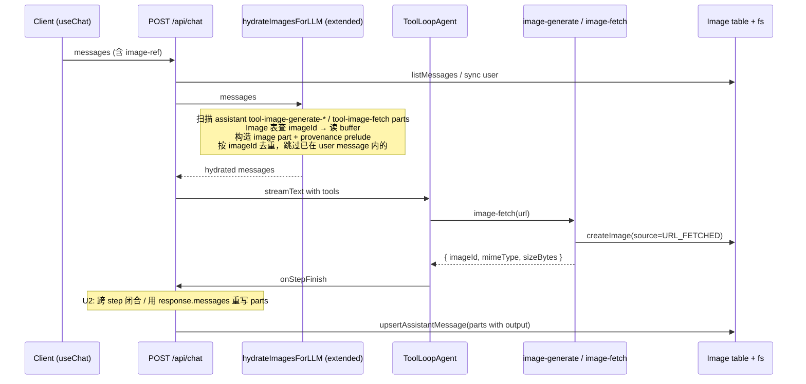

# feat: 多模态图像闭环 + 历史重载图丢失修复

## Overview

为 Agent 接通「画完→自检→调整」闭环：让会话内全部已落盘图像（用户上传、生图产物、URL 抓回）默认对下一轮 LLM 多模态可见；新增 `image-fetch` 工具把 `image-search` 候选 URL 转为可见图像；同时修复两条独立的 UI 重渲染 bug——刷新后用户参考图与生图结果不再消失。

按 origin 的 Shipping order 拆 Phase A（Class II UI bug 独立先发）+ Phase B（Class I 多模态闭环）两个 milestone，对应同一 plan 内的连续 PR。

---

## Problem Frame

仓库存在一条单向膜：`hydrate-images.ts` 仅扫描 user message 的 `image-ref`，**不处理** assistant 的 `tool-image-generate` 输出，导致 Agent 在下一轮看不到自己产出的图，无法 prompt 改写自检；`image-search` 返回的 URL 也无法转为图像字节。叠加两条 UI 重渲染 bug，刷新后图整个消失。详见 origin。

---

## Requirements Trace

- **R-I-1**（全量图像可见性 + 注入约束）→ U5
- **R-I-2**（image-fetch 工具）→ U3 + U4
- **R-I-3**（注入实现细化：服务端注入、provenance、provider 兼容子集）→ U5
- **R-I-4**（URL_FETCHED 持久化 + 级联删除）→ U3
- **R-I-5**（Vision 不可用兜底走 R16）→ U5（错误传播）
- **R-II-1**（SSR 重载保留 user parts）→ U1
- **R-II-2**（assistant tool 调用持久化保留 output）→ U2

**Origin actors:** A1（终端用户）、A2（Agent）  
**Origin flows:** F1（生图自检闭环）、F2（候选图谱拉回）、F3（历史会话重载）  
**Origin acceptance examples:** AE1（R-I-1 + R-I-3）、AE2（R-I-2 + R-I-3 + F2）、AE3（R-I-2）、AE4（R-I-2 + R-I-4）、AE5（R-I-1 + R-I-5 + R7 + R16）、AE6（R-II-1）、AE7（R-II-2）

---

## Scope Boundaries

- 不引入新的 Model 类型；不改 R3 / R9 工具暴露规则；不改 R15 生图确认行为
- 不实现 `image-fetch` 批量入参（origin Deferred）
- 不实现 multi-part tool result 注入路径（origin Deferred）
- 不实现 token 估算 / 滑窗 / compact（origin Deferred「图像窗口策略」）
- 不实现 image 内容审核 / NSFW 过滤（origin Outside identity）
- 不为 ssrf-guard 增加 DNS 解析（保留现有字面量校验，作为单机 toy 残余风险）

### Deferred to Follow-Up Work

- Phase A 与 Phase B 拆两个 PR：Phase A（U1+U2，UI bug）独立可上线，不依赖 Phase B；Phase B（U3-U5）作为后续 PR 跟进

---

## Context & Research

### Relevant Code and Patterns

- **现有 hydrate 路径**：`lib/ai/hydrate-images.ts` —— 仅扫描 user.parts 的 `image-ref`；U5 在此扩展
- **生图工具产物形态**：`lib/image-provider-factory.ts:103-112` —— `createImage` 落盘 + DB 行；output `{ imageId, mimeType, sizeBytes }`
- **SSRF 校验**：`lib/tools/ssrf-guard.ts:assertPublicHttpUrl` —— 字面量私有 IP 拒绝；U4 复用并补 redirect 每跳
- **MIME 嗅探**：`lib/images/mime.ts:detectMime` —— 已存在 buffer-based 检测；U4 用作 magic-byte 校验
- **图像存储**：`lib/images/storage.ts` —— `writeImage` / `readImageBuffer` / `imagePath`；U4 复用
- **现有工具样式**：`lib/tools/web-fetch.ts` —— `redirect: 'manual'`、`AbortSignal.timeout`、`AbortSignal.any` 组合；U4 同形态
- **图像 DB 操作**：`lib/db/images.ts:createImage` —— 接受 `source: ImageSource`；U3 扩展 enum 后此处自动支持
- **SSR initialMessages**：`app/conversations/[id]/page.tsx:53-61` —— U1 修复点
- **assistant parts 持久化**：`lib/ai/step-to-parts.ts` + `lib/db/messages.ts:upsertAssistantMessage` —— U2 修复点
- **chat orchestration**：`app/api/chat/route.ts:84-128` —— `hydrateImagesForLLM` 调用入口、`onStepFinish` 持久化；U2/U5 在此对接
- **工具注册**：`lib/tools/tool-registry.ts` —— `web-fetch` / `image-search` / `web-search` 同档；U4 注册点
- **System prompt**：`lib/ai/system-prompt.ts` —— `buildSystemPrompt(descriptors)`；U4 增 image-fetch 描述符后此处自动反映

### Institutional Learnings

- 项目无 `docs/solutions/` 历史条目（M1/M2/M3 plans 已落地相关基础设施，参考 `docs/plans/2026-04-29-002-feat-agent-tools-m2-engineering-plan.md` 与 `2026-04-29-003-feat-image-gen-m3-engineering-plan.md` 的工具与图像存储模式）

### External References

- **AI SDK v5 image parts**：`node_modules/ai/docs/02-foundations/03-prompts.mdx`（Image Parts 章节）—— 接受 `Buffer` / base64 / URL 三种形态；可挂 `experimental_download` 自定义下载器
- **ToolResultOutput types**：`node_modules/@ai-sdk/provider-utils/dist/index.d.ts:695-810` —— v1 不用 multi-part tool result 路径，但保留参考
- **AGENTS.md TDD 章节**：默认 TDD 哲学；Class II bug 走 characterization-first，Class I 走 test-first

---

## Key Technical Decisions

- **Class II 与 Class I 拆 PR**：U1+U2 一个 PR、U3-U5 一个 PR。U1+U2 与 Class I 无文件重叠，Phase A 独立可发；保 Class I plan 阶段问题不拖 bug 修复
- **U2 修复路径选 (b)：依赖 AI SDK 提供的 `responseMessages` / `response.messages`**（plan 阶段决策，待 U2 实现时验证 v5 当前 API 形态；若不可用回 (a) 跨 step 维护 callId→toolName 缓冲）。理由：自维护跨 step 状态机错误面大，权威源由 SDK 给出更可靠
- **U5 注入位置**：批量塞到**最末一条 user message 之前**作为额外 user image part（与 origin 多个候选中此项最简、与现有 `convertToModelMessages` 默认管线兼容；逐图展开 synthetic user message 与 Anthropic 严格交替不友好）
- **provenance prelude 形态**：每张注入图前置一段 `text` part，措辞如「以下图像来自上一轮工具调用产出（imageId: xxx）」/「以下图像来自 image-fetch URL 抓取（原 URL: yyy）」/「以下图像来自用户上传的参考图」。让 Agent 在生成与自检时区分语义来源
- **去重真源**：基于 imageId 去重；user message 内已 `image-ref` 出现的图像不再被服务端注入为额外 part（避免 R-I-1 重复注入）
- **image-fetch 边界数值**：响应体 `≤ 10 MB`、整体超时 `30_000 ms`（与 web-fetch 对齐）、redirect 跳数 `≤ 3`（含 0）、支持 MIME `image/png|jpeg|webp|gif`
- **provider 验证白名单**：plan 验证子集 = OpenAI（`gpt-4o`-类）、Anthropic（`claude-3.5-sonnet`-类）、通义 qwen-vl-max、Moonshot vision。U5 实现完成后跑通即认为「覆盖率最广子集」满足

---

## Open Questions

### Resolved During Planning

- **U2 究竟用 (a) 还是 (b)**：选 (b)，前提 AI SDK v5 暴露稳定的 response.messages；若实现时验证不到，回 (a)
- **U5 注入位置**：用户 message 末尾前 batched
- **image-fetch 大小/超时/跳数**：`10 MB / 30s / 3 hops`

### Deferred to Implementation

- **prelude 文字最终措辞**：可能在 U5 实现时根据 vision LLM 实测理解度微调；当前措辞作为初始版
- **AI SDK v5 `responseMessages` 的具体属性名**（`response.messages` vs `responseMessages` vs other）：U2 实现时通过读 `node_modules/ai/src/generate-text/` 现场确认
- **当生成图同一 step 内 tool-result 已就位的 happy path 是否回退到原同 step 闭合分支**：U2 实现时再决定是否保留双分支，还是统一收敛到一条新路径

---

## High-Level Technical Design

> *以下示意图说明意图，非实现规范。*



数据流要点：
- **图像可见性真源**：`Image` 表（DB）+ 文件系统；`Message.parts` 中的 `tool-image-*` 仅作为 reference，由 hydrate 解析为真正 image part
- **去重锚**：imageId（同一 imageId 在同一 LLM 请求中至多一次）
- **失败语义**：单图读取/解码失败 → log + skip；不阻断该轮请求

---

## Implementation Units

### Phase A — Class II UI Bug 修复（独立 PR，与 Phase B 无文件重叠）

- [ ] U1. **修复 SSR 重载丢失 user.parts**

**Goal:** SSR 转换 `initialMessages` 时 user message 也优先用 DB 持久化的 `m.parts`，与 assistant 路径一致；用户上传参考图刷新后仍显示。

**Requirements:** R-II-1 (Covers AE6)

**Dependencies:** None

**Files:**
- Modify: `app/conversations/[id]/page.tsx`
- Test: `tests/conversations/conversation-page-initial-messages.test.ts`（新建；若已有 `tests/conversations/` 同向测试文件可合并）

**Approach:**
- 删除 `if (role === 'user') { ... text-only ... }` 早返；user / assistant 共用同一段 `m.parts !== null ? m.parts : [{ type:'text', text: m.content }]` 兜底
- 类型断言处复用现有 `UIMessage<ChatMessageMetadata>[]`

**Execution note:** characterization-first —— 先写一条捕获当前坏行为的失败测试（user message DB 中存了 `image-ref` part 但 SSR 后 `parts` 只剩 text），再修。

**Patterns to follow:**
- 同文件第 58-60 行 assistant 路径（直接复用其 ternary）

**Test scenarios:**
- Covers AE6. Happy path：DB 中 user message 持久化为 `parts: [{ type:'text', text:'foo' }, { type:'image-ref', imageId:'abc' }]` → SSR 后 `initialMessages[0].parts` 应保留两个 part 不被塌成 text-only
- Edge case：user message DB `parts` 为 `null` 且 `content` 非空 → fallback 到 `[{ type:'text', text: m.content }]`，不抛错
- Edge case：user message DB `parts` 为空数组 `[]` → 直接传 `[]`（不 fallback 到 text，因为 `parts !== null`）

**Verification:** 运行 `bun test` 该测试通过；手测：上传一张参考图发送，刷新页面，参考图缩略图仍在 user 气泡内显示。

---

- [ ] U2. **修复 assistant tool-image-generate 持久化丢失 output**

**Goal:** `tool-image-generate-*` 在 DB 持久化的最终 `state` 为 `output-available` 且包含完整 `output.imageId(s)`，与流式期间 `useChat` 内部状态一致；刷新后 `ImageGenerateBlock` 仍能渲染生图结果。

**Requirements:** R-II-2 (Covers AE7)

**Dependencies:** None（与 U1 可并行）

**Files:**
- Modify: `lib/ai/step-to-parts.ts`（或废弃改用新路径，见 Approach）
- Modify: `app/api/chat/route.ts`（onStepFinish 调用点可能改）
- Test: `tests/ai/step-to-parts.test.ts`（已存在则扩展；不存在则新建）
- Test: `tests/api/chat-assistant-persistence.test.ts`（集成测，新建）

**Approach:**
- **首选 (b)**：实现时先在 `node_modules/ai/src/generate-text/` 与 `node_modules/ai/docs/03-agents/` 确认 AI SDK v5 是否在 `onStepFinish` step 对象上提供 `response.messages` 或等价权威 messages 数组（含跨 step 已就位的 tool-result）。若是 → 把 `runningParts` 推导从手动累积改为基于该字段重写；丢弃 `appendStepToParts` 中"同 step 找 result"的耦合
- **回退 (a)**：若无权威字段 → 在 chat route 维持跨 step 的 `Map<toolCallId, { name, input, partIndex }>`，step N+1 收到 `tool-result` 时定位并 patch `runningParts[index]` 的 `state` + `output`，再 upsert
- 任一路径下，最后一次 `onStepFinish`（已无未决 call）的 upsert 必须把所有 `tool-image-generate-*` part 写为 `output-available`

**Execution note:** characterization-first —— 先写集成测试模拟「Agent 调一次主生图工具，成功落盘」，断言 DB 中该条 assistant message 的 `parts` 末尾有一个 `tool-image-generate-primary` part 且 `state === 'output-available'` 与 `output.imageId` 非空。当前实现下该测试应失败。

**Technical design:**
*(directional, not specification)*

```text
路径 (b)（首选）：
  onStepFinish(step) {
    runningParts = derivePartsFromAuthority(step.response?.messages ?? fallback)
    upsertAssistantMessage({ id: runId, parts: runningParts, ... })
  }

路径 (a)（回退）：
  pendingCalls = Map<callId, { name, partIndex, input }>
  onStepFinish(step) {
    for content in step.content:
      if tool-call → push input-available part, record pendingCalls[callId]
      if tool-result → entry = pendingCalls.get(callId); patch runningParts[entry.partIndex] to output-available with output
      if tool-error → similar patch to output-error
    upsertAssistantMessage(...)
  }
```

**Patterns to follow:**
- 现有 `lib/ai/step-to-parts.ts:30-67` 的同 step 闭合分支（happy path 仍保留作为优化）
- `app/api/chat/route.ts:104-123` 的 `onStepFinish` 调用形态

**Test scenarios:**
- Covers AE7. Happy path：mock 一次主生图工具，断言 onStepFinish 完成后 DB 中 assistant message 的最末 tool part 有 `state: 'output-available'` 与非空 `output.imageId`
- Edge case：跨 step 场景——step 1 仅有 tool-call，step 2 仅有 tool-result；最终 part 仍是 `output-available`
- Error path：工具执行失败（mock 抛错）→ part 写为 `state: 'output-error'`，`errorText` 非空
- Error path：approval 被用户拒绝 → 工具未执行，part 形态需保持 origin 既定（与 R15 兼容；不退化为 output-available）
- Integration：跑完整 chat 路由（test 用 in-memory prisma），刷新后用 `listMessages` 读出的 parts 通过 `ImageGenerateBlock` 渲染分支选择 `state === 'output-available'`

**Verification:** 运行 `bun test`；手测：让 Agent 生成一张图，UI 显示后刷新页面，生图结果块仍渲染原图。

---

### Phase B — Class I 多模态闭环（PR 2）

- [ ] U3. **新增 `Image.source = URL_FETCHED` 枚举值与 Prisma 迁移**

**Goal:** 数据层支持新来源类型；为 U4 落盘提供承载。

**Requirements:** R-I-2, R-I-4

**Dependencies:** None（可与 U1/U2 并行；但 U4 依赖此）

**Files:**
- Modify: `prisma/schema.prisma`（`enum ImageSource { USER_UPLOAD GENERATED URL_FETCHED }`）
- Create: `prisma/migrations/<timestamp>_add_url_fetched_image_source/migration.sql`（由 `prisma migrate dev --name add_url_fetched_image_source` 自动生成）
- Modify: `lib/db/images.ts` 中 `createImage` 的入参类型（自动通过 Prisma generate 更新）
- Test: `tests/db/images.test.ts`（已存在则扩展；新增 source 类型 round-trip）

**Approach:**
- SQLite 下枚举存储为 TEXT，扩枚举对历史数据无破坏；不需要 data backfill
- `Image` 表已有 `originalUrl: String?` 字段则直接复用；否则在同一迁移内 `originalUrl String?` 与 enum 扩展一并加入（plan 阶段不预设 schema 细节，实现时确认）

**Execution note:** test-first —— 先写一条针对 `createImage({ source: 'URL_FETCHED', ... })` 能成功插入并 round-trip 的失败测试（当前 enum 不含该值，应失败）。

**Patterns to follow:**
- `prisma/migrations/` 现有迁移命名与目录结构
- AGENTS.md 中 Prisma migrate 指令：`bun --bun run prisma migrate dev`

**Test scenarios:**
- Happy path：`createImage` 接受 `source: 'URL_FETCHED'` + `originalUrl` 字段（若引入），写入后 `getImage` 读回 source 与 url 一致
- Edge case：传入未知 source 值 → Prisma type error 在编译期捕获

**Verification:** `prisma generate` 不报错；`bun test` 通过；`prisma migrate status` 干净。

---

- [ ] U4. **新增 `image-fetch` 工具**

**Goal:** Agent 调用 `image-fetch(url)` 把 `image-search` 候选 URL 转为可见图像（`imageId`），覆盖 R-I-2 的 SSRF / MIME / 跳数 / 大小 / 超时 全部约束。

**Requirements:** R-I-2 (Covers AE2, AE3, AE4), R-I-3 (注入将由 U5 完成)

**Dependencies:** U3

**Files:**
- Create: `lib/tools/image-fetch.ts`
- Modify: `lib/tools/tool-registry.ts`（注册新 descriptor + 工具实例）
- Modify: `lib/ai/system-prompt.ts`（若 system-prompt 按 descriptor 自动展开，则无需改；否则补一段 image-fetch 用法说明）
- Test: `tests/tools/image-fetch.test.ts`

**Approach:**
- 入参：`z.object({ url: z.string().url() })`
- 流程：`assertPublicHttpUrl` → 自定义 `fetchWithRedirectGuard(url, { maxHops: 3, timeoutMs: 30_000, abortSignal })` 内循环 fetch + `redirect: 'manual'`，3xx 时读 `Location` 头并对绝对/相对 URL `new URL(loc, currentUrl)` 后**重过 `assertPublicHttpUrl`** → 命中 200 后读 `Content-Type` 校验 ∈ 白名单 MIME → `arrayBuffer()` 并校验 `byteLength <= 10 MB`（`AbortController` 在 size 超限时中止读取） → `detectMime(buffer)` magic-byte 校验，与 `Content-Type` 的家族（image/*）一致 → `writeImage` + `createImage({ source: 'URL_FETCHED', originalUrl, ... })` → 返回 `{ imageId, mimeType, sizeBytes }`
- `needsApproval: false`（与 web-fetch / image-search 同档；origin Key Decisions 已决）

**Execution note:** test-first —— 每条 acceptance scenario 先做一条失败测试。

**Technical design:**
*(directional)*

```text
async function fetchWithRedirectGuard(url, opts) {
  let current = assertPublicHttpUrl(url)
  for (let hop = 0; hop <= opts.maxHops; hop++) {
    const res = await fetch(current, { redirect: 'manual', signal: opts.signal })
    if (res.status >= 300 && res.status < 400) {
      const loc = res.headers.get('location')
      if (!loc) throw new Error('redirect without location')
      current = assertPublicHttpUrl(new URL(loc, current).toString())
      continue
    }
    return res
  }
  throw new Error('too many redirects')
}
```

**Patterns to follow:**
- `lib/tools/web-fetch.ts` 整体形态（timeout + abortSignal 组合、`redirect: 'manual'`、`User-Agent` 头）
- `lib/tools/ssrf-guard.ts:assertPublicHttpUrl` 复用作为 baseline
- `lib/images/storage.ts:writeImage` 落盘
- `lib/db/images.ts:createImage` DB 行（plan 阶段未预设是否需要扩展支持 `originalUrl`，U3 已统一）

**Test scenarios:**
- Covers AE2. Happy path：mock fetch 返回 PNG bytes + `Content-Type: image/png` + magic-byte 一致 → 工具返回 `{ imageId, mimeType: 'image/png', sizeBytes }`，`Image` 表新增 `URL_FETCHED` 行
- Covers AE3. Error path：mock fetch 返回 `Content-Type: text/html` → 工具失败抛错（"not an image MIME"）
- Error path：`Content-Type: image/png` 但响应体首字节是 HTML → magic-byte 不一致 → 工具失败
- Error path：URL 是 `http://192.168.1.1/foo.png` → SSRF 拒绝（`assertPublicHttpUrl` 抛错）
- Error path：URL 是 `https://evil.com/img.png` 但 fetch 返回 `302 Location: http://10.0.0.1/img.png` → redirect-per-hop 校验拒绝
- Error path：连续 4 次 302 → "too many redirects"
- Error path：响应体 `12 MB` → 超尺寸拒绝
- Error path：fetch 整体超时 35s → AbortSignal.timeout 触发，工具失败（"AbortError"）
- Edge case：URL 协议为 `ftp://` → SSRF 拒绝（"only http/https allowed"）
- Edge case：URL hostname 是 `localhost` → SSRF 拒绝
- Integration：调 image-fetch 后再调 image-generate 工具，把返回的 imageId 作为 referenceImageIds 传入；image-generate 能从 `Image` 表 read buffer 并发送到生图 API（`source: 'URL_FETCHED'` 的图与 `USER_UPLOAD` 同等可作参考图）
- Covers AE4. Integration：用 image-fetch 拉一张图后删除该会话；`data/images/<convId>/` 目录与 DB 行被级联清理

**Verification:** `bun test` 通过；手测：在 Agent 对话中让其调一次 `image-search` + `image-fetch`，时间线显示 `tool-image-fetch` 块成功状态。

---

- [ ] U5. **扩展 `hydrate-images` 注入路径并接通注入约束**

**Goal:** 服务端在每轮 LLM 请求前，收集会话内全部已落盘图像（user 上传 + 生图产物 + URL 抓回）按 imageId 去重并避免重复注入，前置 provenance prelude，作为额外 user message image part 喂给 LLM；单图失败 skip 不阻断；走 Vision 不可用兜底（错误经 R16 回 Agent）。

**Requirements:** R-I-1 (Covers AE1, AE5), R-I-3 (Covers AE1), R-I-5 (Covers AE5)

**Dependencies:** U3（依赖新 source 在 DB 出现，但 hydrate 不直接 case 区分 source；只是通过 Image 表的 imageId 寻址，所以 U3 完成即可）。U4 不阻塞 U5 完成（U5 的实现可独立测试，只要 Image 表里有 URL_FETCHED 行即可——可在测试 fixture 直接构造）

**Files:**
- Modify: `lib/ai/hydrate-images.ts`
- Modify: `app/api/chat/route.ts:84-90`（hydrate 调用点签名可能扩展为接收/返回 provenance 上下文）
- Test: `tests/ai/hydrate-images.test.ts`（已存在则扩展；新增 assistant 端扫描 + 去重 + provenance + URL_FETCHED 来源 case）

**Approach:**
- **扫描范围**：遍历所有 messages 所有 parts，收集形如 `tool-image-generate-*` 的 `output.imageId(s)` 与 `tool-image-fetch` 的 `output.imageId`；同时扫描 user 端已有的 `image-ref` part 收集 imageId（仅为去重计数，不重复注入）
- **去重**：用 `Set<imageId>`；同 imageId 重复出现仅注入一次
- **避免重复**：user message 内已 `image-ref` 形式承载的图像，**不**再被注入为额外 part（依赖前端 user message parts 已通过 R-II-1 修复，DB 持久化的 user.parts 完整可信）
- **注入位置**：在最末一条 user message 的 parts 数组**之前**追加：每个待注入图像两个 part —— 1 个 `text` provenance prelude + 1 个 `image` part（`Buffer` 形态，复用 `readImageBuffer`）
- **失败处理**：单图 `findUnique` 不存在或 `readFile` 失败 → `console.warn` log + skip；不影响其他图与该轮请求
- **provenance 文字**：按 source 区分——`USER_UPLOAD` → "以下图像来自用户上传的参考图"（对应去重场景下其实不再独立注入；保留措辞备用）；`GENERATED` → "以下图像来自上一轮工具调用产出（imageId: <id>）"；`URL_FETCHED` → "以下图像来自 image-fetch URL 抓取（原 URL: <originalUrl>）"
- **Vision 不可用兜底**：不在 hydrate 层做能力检测；让 LLM API 拒绝多模态请求时按 R16 自然回传到 Agent

**Execution note:** test-first —— 每条 acceptance + edge 先写失败测试。

**Patterns to follow:**
- 现有 `hydrate-images.ts:46-72` 的 `image-ref` 解析与 `readFile` 调用形态（直接扩展循环逻辑）
- `app/api/chat/route.ts:84-90` 的 `hydrateImagesForLLM(uiMessages, db)` 调用形态（保签名兼容；扩展返回值若需要 provenance 元数据）

**Test scenarios:**
- Covers AE1. Happy path：mock 一段对话——user A → assistant tool-image-generate(output.imageId=g1) → user B → 调 hydrate；返回的 messages 在最末 user B 的 parts 之前应有 2 个新 part：text "以下图像来自上一轮工具调用产出..." + image with buffer 等于 g1 的实际 bytes
- Happy path：assistant tool-image-fetch(output.imageId=f1) 也被扫描到并注入 prelude 文案为 URL 抓取
- Edge case：连续两轮 assistant 都生图 g1、g2 → hydrate 注入两组 (text + image)，按对话时间线顺序排列
- Edge case：user 上传 imageRef u1 + assistant 生 g1 → 服务端不重复注入 u1，仅注入 g1
- Edge case：同一 imageId 在 assistant 不同轮 tool output 中出现两次 → 去重，只注入一次
- Error path：imageId 在 Image 表查不到 → warn + skip 该 part；其他图正常注入；返回值 messages 不包含该图 part
- Error path：imageId 找到但 `readFile` 抛 ENOENT → warn + skip，同上
- Covers AE5. Integration：走 chat route + mock LLM provider，收到 image-injected messages 后让 mock provider 返回错误（模拟 vision 不支持） → 错误经 onStepFinish / onError 回到 chat route 与 Agent，UI 端能看到该错误 part；本地 messages 不被裁剪
- Integration（手测/E2E 候选）：在真 OpenAI gpt-4o 与 Anthropic claude-3.5-sonnet 与通义 qwen-vl-max 与 Moonshot vision 上各跑一次 AE1 场景；Agent 在第二次生图前的文本响应应能引用上一张图的具体内容（颜色、姿势等）

**Verification:** `bun test` 通过；E2E 手测：在 4 家 provider 上跑通 AE1 + AE2 链路。

---

## System-Wide Impact

- **Interaction graph:** chat route → hydrate-images → AI SDK ToolLoopAgent → tools (image-fetch / image-generate) → onStepFinish persistence；任一环节失败由 R16 回传，UI 可见
- **Error propagation:** 单图注入失败 → log + skip，不阻断该轮；image-fetch 失败 → 工具失败回 Agent，UI 显示工具失败块；vision 不可用 → LLM API 报错 → 经 R16 回 Agent → 文本告知用户
- **State lifecycle risks:** `Image` 表与 `data/images/<convId>/` 必须保持 1:1；删会话时已有 `deleteConversationImages` 清理目录，扩 `URL_FETCHED` 后需确认级联（cascade in Prisma + fs cleanup 都已存在，U3 单测确认）
- **API surface parity:** image-fetch 工具与 web-fetch / image-search 在前端时间线沿用 `ToolCallBlock` 渲染，无需新组件
- **Integration coverage:** hydrate 层扫描 part 需要遵守 useChat 持久化路径（依赖 U2 已写入完整 output）；如果 U2 未先合并，U5 在 v5 跨 step 场景下扫到的 assistant tool part 可能仍是 `input-available`、无 imageId → 注入数量为 0。**这是 Phase A 优先发的实际理由之一**
- **Unchanged invariants:** R3 / R9 工具暴露规则不变；R15 生图确认行为不变；R7「不做文本 compact」不变；`Image.source = USER_UPLOAD / GENERATED` 既有语义不变；`hydrate-images` 函数签名向后兼容（仅扩内部逻辑）

---

## Risks & Dependencies

| Risk | Mitigation |
|---|---|
| AI SDK v5 没有稳定的 `response.messages` 字段，U2 (b) 路径不可行 | U2 Approach 已声明回退 (a)；实现时先验证；不阻塞 |
| provider 兼容子集中某家拒绝注入形态（如要求 image_url 字段） | U5 注入位置选 user message image part 是覆盖最广方案；实测发现差异时可在 plan 之外开短跟进 PR 适配（保留 `experimental_download` 作演进路径） |
| token 暴涨导致单机自用体验明显下降 | origin 已识别并放入 Deferred「图像窗口策略」；若 v1 实测撞墙过快再开窗口策略 follow-up plan |
| ssrf-guard 字面量校验被 DNS rebinding 绕过 | origin 已承认为单机 toy 残余风险；不在本 plan 消化 |
| U4 上游 Image 表无 `originalUrl` 字段 | U3 在迁移时一并补该字段（plan 阶段未预设；实现时确认） |

---

## Documentation / Operational Notes

- 不需要文档更新——本 feature 不暴露用户可见配置；`docs/brainstorms/2026-04-30-multimodal-image-loop-requirements.md` 已是真相源
- 不需要 feature flag——v1 直接生效
- AGENTS.md 中「实现时注意」段落已与 origin 兼容；本 plan 落地后无需更新

---

## Sources & References

- **Origin document:** [docs/brainstorms/2026-04-30-multimodal-image-loop-requirements.md](../brainstorms/2026-04-30-multimodal-image-loop-requirements.md)
- 相关代码: `lib/ai/hydrate-images.ts`、`lib/ai/step-to-parts.ts`、`lib/tools/{web-fetch,image-search,image-generate,ssrf-guard}.ts`、`lib/image-provider-factory.ts`、`app/api/chat/route.ts`、`app/conversations/[id]/page.tsx`、`prisma/schema.prisma`
- AI SDK v5: `node_modules/ai/docs/02-foundations/03-prompts.mdx`、`node_modules/@ai-sdk/provider-utils/dist/index.d.ts:695-810`
- 既往 plan: `docs/plans/2026-04-29-002-feat-agent-tools-m2-engineering-plan.md`、`docs/plans/2026-04-29-003-feat-image-gen-m3-engineering-plan.md`
